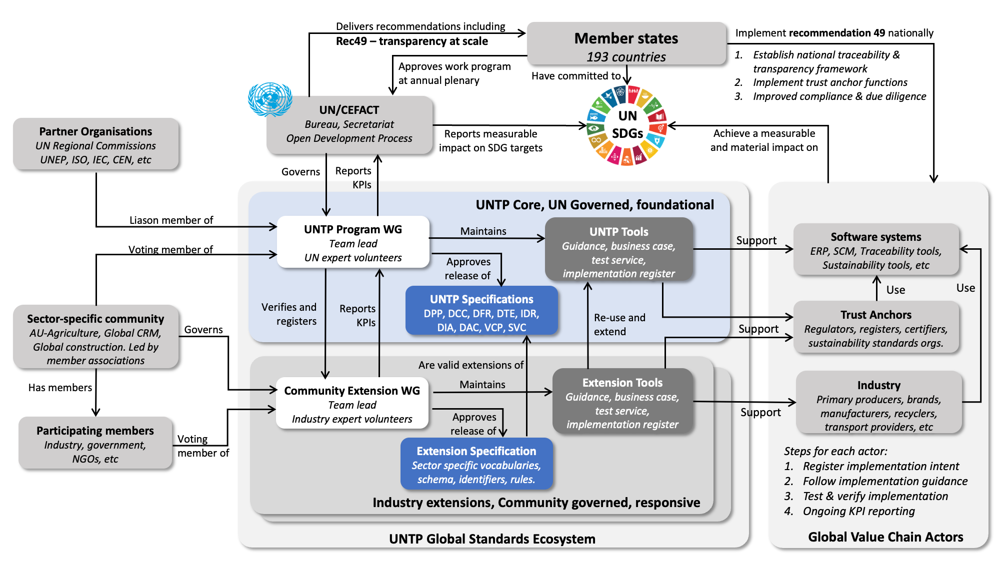

import Disclaimer from '../\_disclaimer.mdx';

<Disclaimer />

The UNTP governance framework follows UN/CEFACT standard governance methodology and is designed to provide implementers with confidence that UNTP:

* is a public good that cannot be captured by any specific commercial interest and is permanently free to use.
* is developed via a consensus based process that ensures it will meet the needs of value chain actors and member states. 
* is specific, testable, and rigorously versioned so that implementers can be confident of stability and interoperability
* is compatible with relevant national and international standards and regulations. 

The governance framework described on this page is designed to meet these criteria.

## UN/CEFACT Governance Framework

[UN/CEFACT](https://unece.org/trade/uncefact) is the United Nations Centre for Trade Facilitation and Electronic Business. It was established as an intergovernmental body in 1996 with a mandate to develop standards and recommendations for the facilitation of digitalised and sustainable trade. Although UN/CEFACT is a global body, secretariat functions are provided by the United Nations Economic Commission for Europe [(UNECE)](https://unece.org/). The UN/CEFACT mandate, terms of reference, program of work, and related governance documentation is available from the UN/CEFACT [policies and procedures](https://unece.org/trade/uncefact/policiesprocedures-and-termsreference). The governance documents are approved by member states at the UN/CEFACT annual plenary.

Standards such as this United Nations Transparency Protocol (UNTP) and recommendations such as Recommendation 49 "Transparency at scale" are developed under the UN/CEFACT Open Development Process [(ODP)](https://unece.org/trade/documents/2023/12/session-documents/open-development-process). All contributing participants in UN/CEFACT working groups must [register as UN experts](https://uncefact.unece.org/display/uncefactpublic/UNCEFACT+Expert+Registration) with the approval of their country head of delegation. All contributing participants must waive their intellectual property rights (IPR) to any contributions under the [IPR policy](https://unece.org/trade/documents/2010/12/session-documents/intellectual-property-rights-policy) so that UN/CEFACT can continue to publish freely usable standards and recommendations.

UN/CEFACT maintains formal liaison arrangements with other UN organisations as well as other global standards bodies such as ISO, ITU, and IEC following a [memorandum of understanding](https://digitallibrary.un.org/record/465895?ln=en&v=pdf).

## UNTP Governance Details

UNTP is one program within the overall UN/CEFACT governance framework. The diagram below shows how UNTP and recommendation 49 fit within the global UN/CEFACT governance framework and also specifically how UNTP extensions fit within the UNTP governance framework. Extensions are designed to accommodate industry or geographic specific needs of a specific community of implementers and are typically governed by a member association. To be formally [registered as  UNTP extension](../extensions), the extension must also be freely available under a [Creative Commons Attribution 4.0 International license](https://creativecommons.org/licenses/by/4.0/) and must be interoperable with UNTP specifications. 

The diagram represents the following key governance concepts:

* The UNTP Program Working Group maintains this site and comprises members from UN expert community and sector specific communities. 
* UNTP comprises a suite of version-managed [technical specifications](../specification) as well as some supporting tools that include [implementation guidance](../tools-and-support), [business case](../business-case), [best practices](../design-patterns), [test services](../tools-and-support/TestService.md), and an [implementations register](../implementations).
* The tooling ensures that implementation is as simple and cost effective as possible and also that implementations are interoperable since all implementations must pass the same test cases. 
* UNTP extensions working groups develop industry and/or geography specific extensions of UNTP following a [methodology](../extensions/ExtensionsMethodology.md) that ensures all extensions remain interoperable with UNTP core implementations and any other industry extension. 
* Extensions are governed by the community that creates them, usually led by a representative member association. Extensions will typically include sector specific vocabularies, specific credential schema (eg a livestock passport as an extension of a product passport) and specific rules and constraints such as allowed identifier schemes. 
* Extensions must also provide test services to ensure interoperability between different implementers of the same extension specification. The generic UNTP test and reference implementation tooling is re-usable for this purpose. 
* All implementers that register their system or business on the UNTP website or an extension website are required to provide some basic KPI reporting (eg number of product passports issued) so that performance metrics can be rolled up from implementer to extension community and then up to UN/CEFACT and member states. The performance reporting framework is defined by the UNTP [Value Assessment Framework (VAF)](../business-case/ValueAssessmentFramework.md) and is designed to capture quantifiable performance measures that can be mapped to UN [Sustainable Development Goals](https://sdgs.un.org/goals) and Targets. Anonymised reporting and performance dashboards will be published by the UNTP program. 

The diagram shows three classes of implementers within the global value chain.

* **Software systems**, whether commercial or open-source, provide all other implementers with the core technology capability needed to support UNTP. In many cases the underlying software systems will support any industry or geography sector and so will most likely focus on core UNTP conformity, perhaps also supporting some extensions when they have a concentration of customers in a particular industry or geographic sector. UNTP maintains a register of [software system](../implementations/Software.md) implementations.
* **Industry actors** such as primary producers, manufacturers, brands, recyclers, transport services, and so on will generally occupy specific industry and geography sectors and so are more likely to be implementers of one or more UNTP extensions. Software systems used by industry actors will generally have implemented core UNTP and will provide some flexibility to configure and support specific rules required by industry and/or geography specific UNTP extensions.  
* **Trust anchors** such identity registers are expected to implement core UNTP specifications such as [Identity Resolver](../specification/IdentityResolver.md) and [Digital Identity Anchor](../specification/DigitalIdentityAnchor.md). Certifiers will be issuers of very specific conformity credentials such as  certificates of conformance to specific sustainability standards that will be defined in the context of UNTP extensions. Regulators will issue very specific conformity credentials (eg mine permits) but may need to verify a very wide range of conformity credentials and digital product passports as part of border compliance activities. When all industry / geography variants of product passports are based on the same UNTP core, the task for the border authority is simplified. 

## UNTP Extension Governance

UNTP extensions for a specific industry and/or geography should be designed and implemented at community level following the [community activation program](../business-case/CommunityActivationProgram.md) guidance. This helps to ensure interoperability between members of the community - so, for example, a fabric supplier to multiple fashion brands can implement once for many customers. Consequently there is a need for a governing body to manage the specification development and implementation support on behalf of community members. This task is best suited to existing member associations that already represent the interests of multiple organisations within a sector. 

It is tempting to think that the scope of extensions could be governed by UNTP to ensure that there are no overlaps or gaps. However, the real world is not as simple as that and it is inevitable that different communities will overlap. For example a national government critical minerals office may leverage UNTP to create a national traceability and transparency framework in a specific country. At the same time a global member association for a specific mineral (e.g. copper or lithium) may also extend UNTP to support it's global members. Some members will inevitably face both. The UNTP governance approach aims to minimise duplication and complexity through visibility.

* By categorising every extension by both country (using ISO country codes) and industry sector (using UN ISIC codes), cases where multiple extensions overlap become visible. Conversely visibility of gaps provides opportunities and incentives for relevant member associations to fill the gaps.  
* By requiring that all registered extensions are public and free to use, any communities that find themselves overlapping with an existing industry and/or country sector can see what has already been done and, if appropriate, re-use the existing work without restriction.  
* By providing test services to confirm that each extension remains conformant and interoperable with core UNTP, cross-border and cross-industry interoperability is maintained, thereby reducing the impact of differences between overlapping extensions.

## UNTP Consensus Driven Development Process

UNTP development follows an agile and iterative approach with maximum public visibility and seeks consensus for each change. 

* Anyone can participate as an observer simply by watching development on this UNTP website and by joining the informal chat channel.  
* Anyone can formally join the UNTP working group as a contributing member once they have completed the UN/CEFACT [expert registration process](https://uncefact.unece.org/display/uncefactpublic/UNCEFACT+Expert+Registration) which includes formal acceptance of [IPR policy](https://unece.org/trade/documents/2010/12/session-documents/intellectual-property-rights-policy). 
* Contributing members who wish to propose changes to existing content or contribute new content should [raise a new issue](https://github.com/uncefact/spec-untp/issues) using the GitHub issue workflow - that describes the change. Any other contributing member can comment on the issue.  In this way, the issue can be used as a permanent record of working group discussion around the specific issue. Some issues like this one on [identifiers](https://github.com/uncefact/spec-untp/issues/137) can be long running whilst others like this one on [context file versions](https://github.com/uncefact/spec-untp/issues/149) can be short and quick to resolve. 
* Once the creator of the issue is confident that there has been sufficient exposure and discussion, then a formal request to change content should be lodged - using the GitHub pull request workflow. All pull requests require at least one reviewer to approve the proposed changes and all approved pull requests are discussed at fortnightly meetings. If there are no objections then the changes are merged into the main website. All pull requests [remain visible](https://github.com/uncefact/spec-untp/pulls?q=is%3Apr+is%3Aclosed) for public scrutiny. 
* If there are objections then they are discussed and, hopefully, resolved with full consensus. In the rare case of objections that cannot be resolved by consensus then meeting chair will hold a vote. A simple majority is required to accept the change. 
* All meetings are recorded, transcribed, summarised, and published to the [UNTP meetings](https://uncefact.github.io/spec-untp/docs/about/Meetings) page.
* A google group mailing list is also maintained and can be used by any observer or contributing member. All group emails are archived and searchable. 

For participants less familiar with GitHub tools and processes, there is a [guidance page](https://github.com/uncefact/spec-untp#spec-untp) on how to write content and how to request changes via the pull request workflow. 

## UNTP Version and Release Management

Within the UNTP business governance framework, there also needs to be some technical governance to ensure quality and stability of UNTP technical deliverables.

### Version Management

All UNTP artifacts are rigorously versioned following [semver](https://semver.org/) best practices. 

* Version numbers are indicated as a dot-separated triple `{major}.{minor}.{patch}`.  For example version 2.3.4.
* `{patch}` version number increments indicate non-breaking bug fixes that do not add new capabilities of features. For example, implementers should see no difference between version 1.4.5 and version 1.4.6.
* `{minor}` version number increments indicate non-breaking enhancements. For example, implementations of version 1.4.5 are still compatible with version 1.5.0 but may not take advantage of new features.
* `{major}` version number increments indicate significant and breaking releases. For example implementations of version 1.5.0 will be incompatible with version 2.0.0 and may fail in unpredictable ways.

Note that 0.x.y versions do not strictly follow semver and may include breaking changes in minor versions. However all versions after 1.0.0 first formal release will strictly observe this versioning process. 

### Release Management

Every version change is automatically published to the UNTP test end point following a defined URL structure

**Linked data vocabulary (test)**

* Pattern:  `https://test.uncefact.org/vocabulary/untp/{vocab-name}/{major-version}/{artefact}`
* Example: `https://test.uncefact.org/vocabulary/untp/dpp/0/Product`

**Schema and context files (test)**

* Pattern: `https://test.uncefact.org/vocabulary/untp/{credential-type}/{versioned-file-name}`
* Example: https://test.uncefact.org/vocabulary/untp/dpp/untp-dpp-schema-0.5.0.json

When a given version meets criteria to justify a production release then the governance process will approve a release. Not all versions will be released to production. Production releases will be published as follows.

**Linked data vocabulary (production)**

* Pattern : `https://vocabulary.uncefact.org/untp/{vocab-name}/{major-version}/{artefact}`
* Example : `https://vocabulary.uncefact.org/untp/dpp/1/Product`

**Schema and context files (production)**

* Pattern: `https://vocabulary.uncefact.org/untp/{credential-type}/{versioned-file-name}`
* Example: `https://vocabulary.uncefact.org//untp/dpp/untp-dpp-schema-1.1.0.json`

