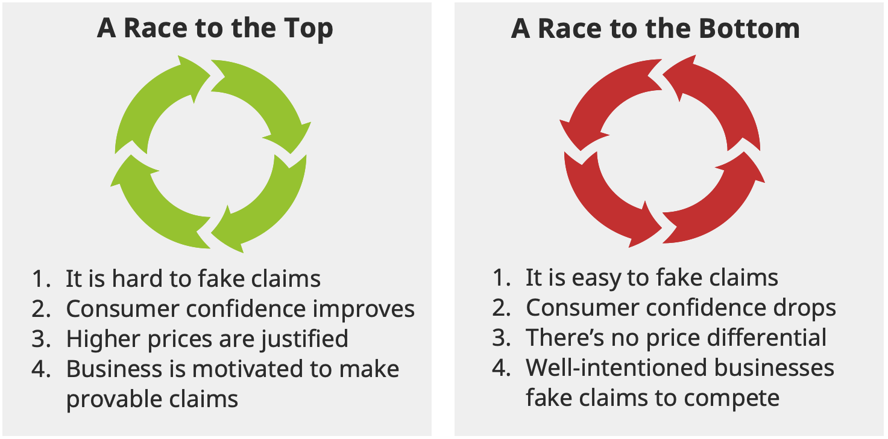
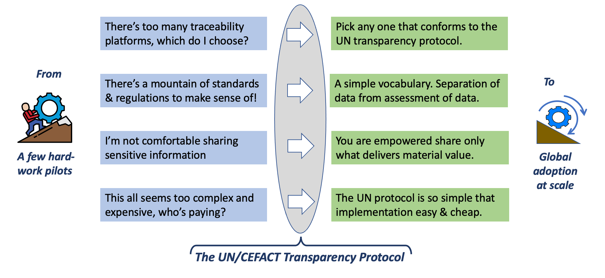

import Disclaimer from '../\_disclaimer.mdx';

<Disclaimer />

The United Nations Transparency Protocol (UNTP) aims to support governments and industry with practical measures to counter greenwashing by implementing supply chain traceability and transparency at the scale needed to achieve meaningful impacts on global sustainability outcomes.

## Incentives for sustainable supply chains are increasing

Incentives for sustainable supply chains are increasing fast. 

* Regulations such as the European [Regulation on Deforestation](https://environment.ec.europa.eu/topics/forests/deforestation/regulation-deforestation-free-products_en) (EUDR) and [Carbon Border Adjustment Mechanism](https://taxation-customs.ec.europa.eu/carbon-border-adjustment-mechanism_en) (CBAM) will present market access barriers or increased border tariffs for non-sustainable produce. 
* These regulations impose [due diligence obligations](https://commission.europa.eu/business-economy-euro/doing-business-eu/corporate-sustainability-due-diligence_en) on entire supply chains, not just final products. Penalties for repeated non-compliance can be as high as 4% of global revenue.
* Financial institutions are rapidly moving to ensure that capital is preferentially focussed on ESG assets. [According to Bloomberg](https://www.bloomberg.com/professional/blog/esg-assets-may-hit-53-trillion-by-2025-a-third-of-global-aum/), within a few years, around $50 Trillion or one third of all global assets under management will be ESG assets. 
* Consumer sentiment is driving purchasing decisions to favour sustainable products. At the same time, consumers are increasingly mistrustful of unverifiable claims and look for third party certification based on trusted standards.  

## But endemic greenwashing risks devaluing the incentives

Greenwashing is a term used to describe a false, misleading, or untrue action or set of claims made by an organization about the positive impact that a company, product or service has on the environment or on social welfare. Just as the incentives described above provide a strong motivation for genuine sustainability in products, so they also provide stronger motivations for greenwashing. 

The evidence from multiple research activities is that greenwashing is already endemic with around 60% of claims being proven to be false or misleading. This presents a significant threat to sustainability outcomes. But there is room for optimism because around 70% of consumers expect higher integrity behaviour and are willing to pay for it. There are two plausible pathways ahead of us.

To win the race to the top, fake claims need to be hard to make. The best way to achieve that is to make supply chains traceable and transparent so that unsustainable practices have nowhere to hide. But, to have any impact, the traceability and transparency measures must be implemented at scale. 

## Challenges 

The world's supply chains must reach to the point where digital verifiable traceability and transparency information are available to meet regulatory compliance, satisfy investors, and motivate consumers for the majority of products on the market. However, achieving transparency at that scale presents some challenges.

* **Which software to choose?** There are many traceability & transparency solutions on the marketplace. Many expect all actors in a given value chain to subscribe to the same platform in order to collect the data for end-to-end traceability. However, just as expecting your customers and suppliers to create accounts at your bank so that you can pay them is not rational or practical (that's why inter-bank payment standards exist), so the adoption of all actors in value chains to one platform is also not feasible or scalable. The UNTP is a standard protocol, not a platform, and assumes that supply chain data remains with each natural owner. So the answer to "which software to choose?" is "pick any, so long as it conforms to the UNTP".
* **Coping with a growing mountain of ESG standards and regulations.** The current count of ESG standards and regulations around the world runs into the thousands. Some are specific to particular commodities, jurisdictions, or ESG criteria and some cover multiple dimensions. There is very significant overlap between them and very little formal mutual recognition. The consequence is that it becomes very challenging for supply chain actors that sell to multiple export markets to know which criteria matter and how to demonstrate compliance. There is a risk that too much of the available ESG incentive is spent on demonstrating compliance and too little is left for implementing more sustainable practices. The UNTP does not add to the complexity by defining more ESG standards. Rather it seeks to minimise cost of cost of compliance by making it simpler to test on-site ESG processes and data against multiple ESG criteria. Essentially this is about implementing a sustainable practice once and then re-using it to satisfy multiple overlapping criteria.
* **Protecting confidential information.** "Sunlight is the best auditor" and so verifiable transparency is the best greenwashing counter-measure. However, increased supply chain transparency for ESG purposes also risks exposure of commercially sensitive information. A viable transparency protocol must allow supply chain actors to share ESG evidence whilst protecting sensitive information. Rather than dictate what must be shared and what should not, the UNTP includes a suite of confidentiality measures that allow every supply chain actor to choose their own balance between confidentiality and transparency. The basic principle is that actors should be empowered to share only what delivers value.
* **Making a business case for implementation.** Each supply chain actor (or their software provider) will need to make a viable business case for implementation of the UNTP. The transparency incentives discussed in this section represent the benefit side of the equation. To keep the cost side as low as practical, UNTP has a strong "keep it simple" focus and offers a suite of implementation tools to further reduce cost. Some sample business case templates are provided to help actors make their case for action.

## The United Nations Transparency Protocol (UNTP)

The UNTP provides a solution to the transparency challenges facing the world's supply chains. By implementing a simple protcool that can be supported by existing business systems, stakeholders will realise immediate benefits and will become visible contributors to the sustainability of global supply chains.

## Presentations & Videos

* Short UNTP Presentation [PDF](../../files/Short-UNTP-Presentation.pdf) [PPT](../../files/Short-UNTP-Presentation.pptx)
* Longer UNTP Presentation [PDF](../../files/UNTP-Presentation.pdf) [PPT](../../files/UNTP-Presentation.pptx)
* Video presentation (15 mins) (Youtube)[https://youtu.be/dJFryZS2UII]

