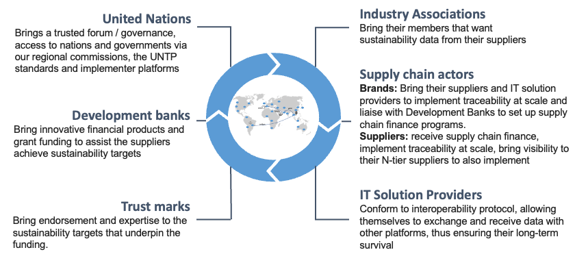
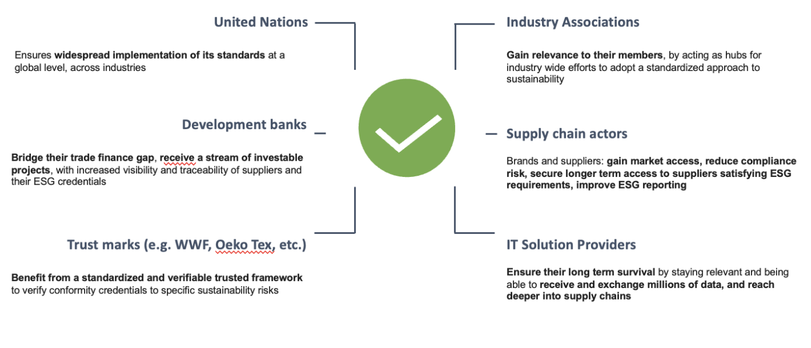
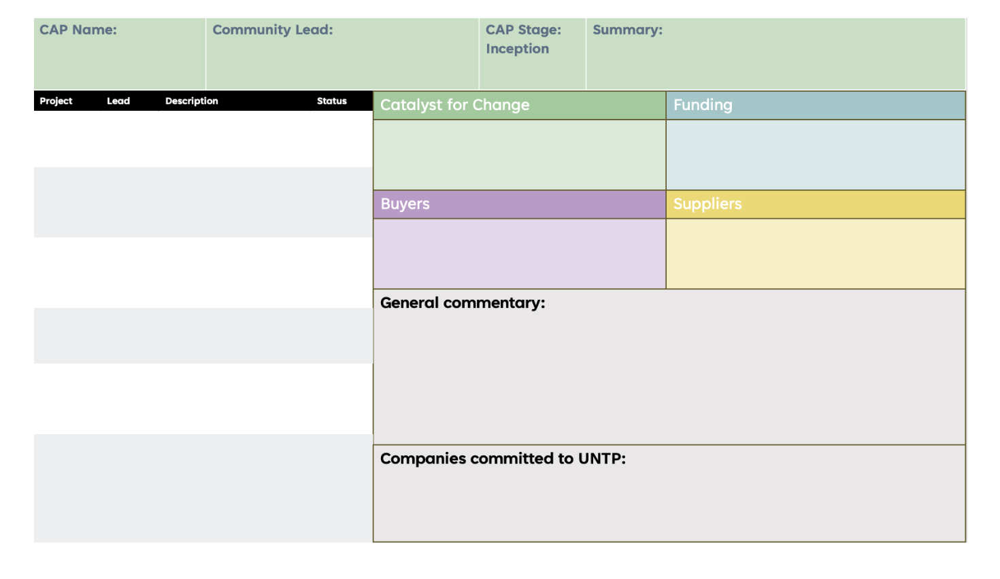
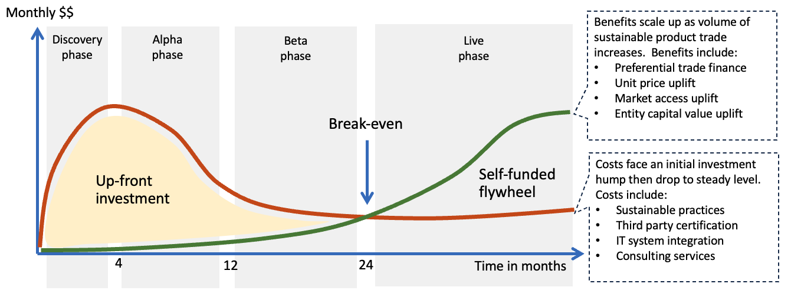

import Disclaimer from '../\_disclaimer.mdx';

<Disclaimer />

## Introduction 

Implementing UNTP initiatives often requires industry-wide collaboration due to concerns about interoperability and costs. While individual companies may be hesitant to act alone, widespread adoption can lead to significant benefits. For instance, the use of common software platforms and standards can reduce costs and improve efficiency for all businesses in an industry. The CAP (Community Activation Program) provides a framework for businesses to collaborate on UNTP implementation and assess the potential benefits.

## The vision: a Community Activation Flywheel

Introduction

If we project ourselves into the future, we expect to see communities develop beyond buyer and supplier relationships, and beyond industry associations. International organisations such as the United Nations, Development Banks, Trust Marks and IT Solution providers all have their valid and unique reasons to participate in these programs, resulting in the establishment of a virtuous circle and a flywheel that starts spinning as a self-perpetuating mechanism driven by its members, driving momentum and growth within the community. 

### The United Nations

The United Nations provides a trusted platform for the development of international standards on traceability and transparency, as well as an impartial governance and collaboration framework, connecting industry associations, governments, and regional commissions through the UNTP standard and implementer platforms.

### Development Banks

In recent years, the development of Sustainable Supply Chain Finance tools by Regional Development Banks provide an incentive for suppliers to access preferential finance via lower interest loans (compared to market rate), which are tied to the credit rating of their buyer and to the achievement of certain sustainability targets. These programs often include the disbursement of financial incentives for suppliers, upon achievement of certain sustainability criterias which lowers the barrier and cost on implementing ESG measures required by the market.

### Trust Marks

Trust Marks are a crucial element in fostering trust, transparency, and accountability within supply chains. They serve as endorsements or certifications that validate a company's commitment to sustainability and target and underpin funding initiatives. Trust marks lend credibility and legitimacy to a company's sustainability claims. They signal to consumers, investors, and other stakeholders that companies have undergone rigorous assessments and meet established standards.

### Industry Associations

Industry associations are being asked by their members to take an increasing role in guiding them to navigate the world of traceability, transparency and trust, the value of different standards and technology available as well as the ambiguity in crafting a common path. By their mandate and by bringing together members of different sectors, they can help gather the needs and requirements to develop industry specific extensions which facilitates data exchange between buyer and suppliers.

### Supply Chain Actors

Participating buyers and suppliers in most cases already exchange some data and are looking for ways to increase that data exchange if and when that brings value to them.

Brands play a pivotal role by bringing their suppliers and IT solution providers together to implement traceability at scale. They also work with Development Banks to establish supply chain finance programs based on their sustainability targets and to facilitate the implementation of ESG measures within their supply chains.

Suppliers benefit from receiving sustainable supply chain finance incentives, adopt ESG improvement measures and proving those improvements via increased traceability and transparency, and extended visibility to their tier-N suppliers.

### IT Solution Providers

IT Solution Providers bring their expertise and technical know-how in developing and implementing interoperable traceability frameworks, ensuring seamless data exchange among different platforms and long-term viability from a technical perspective. 

Once they flywheel is turning it brings distinct benefits to the community and various categories of members participating in it

By working together, members can share the costs of market access, compliance and implementation, decrease the risk of partial adoption, increase consumer confidence towards the industry and facilitate mass balance audits, leading to a more sustainable and equitable global marketplace.

Each member also has its own distinct benefits in participating in the flywheel. A more detailed description of costs and benefits can be found in the Business Case section below, and relevant link to the UNTP Business Case Template.

What is essential for communities, and industry associations representing them, is to figure out whether the minimum requirements are met to kick start the flywheel.

## What is required to kick start the flywheel: the building blocks of a Community Activation Program

To move towards that vision, communities should first ensure that core building blocks to kickstart a community activation program are met:

Firstly there needs to be a catalyst for adoption. This can be either via regulation (e.g. EUDR, Carbon Border Adjustment Mechanism) or a national or sectoral traceability strategy.

Secondly there need to be buyers which require information from their suppliers if that makes their products more valuable, or reduce their risk of non compliance.

Thirdly there need to be suppliers who are willing to share information with their customers, and this will happen if this make them save or make money.

Lastly there needs to be a funding mechanism to kick start the early phases of the activation program

**Community Activation Scorecard**

A community activation scorecard can help communities identify if the minimum requirements are met in order to initiate a program, and constitute the first and essential elements for a flywheel to start spinning.

## The Community Level Business Case

An upfront investment will be required by the community to start making the flywheel spin which may include enhancing sustainability practices, IT system integration and third party certification on top of consulting services. The break-even point where benefits outweigh the costs will be dependent on each use case and need to be addressed in the cost benefit model provided below.

**Business Case Template**

To move forward with implementing UNTP, a strong business case is required to justify the investment. The [UNTP Business Case Template](https://uncefact.github.io/spec-untp/docs/business-case/) is under development and aims to offer a framework for developing such a business case. It includes a general cost-benefit model, followed by a discussion on how it applies to particular roles and industries.

##Industry Cost Benefit Model

The figure below shows a high level model of the business case template which breaks benefits into three categories and costs into two categories.

- Benefits accrue through increasing revenue and/or decreasing cost. Improved margins that result from that of course contribute to corporate value but there are also less tangible benefits at the corporate level such as brand reputation.

- Costs are incurred through changes to production processes to achieve greater sustainability and the implementation of traceability & transparency systems to communicate that verifiable sustainability.

Actual benchmarks for benefits and costs by industry sector and geographic region will become increasingly available over time through the [UNTP Value Assessment Framework (VAF)](https://uncefact.github.io/spec-untp/docs/business-case/ValueAssessmentFramework/). At this point in time, benefits and costs are described qualitatively and supported with metrics from public research.

## Implementation Program Model​

Once these requirements have been validated, an implementation plan can be established, consisting of four main phases:

1. **Inception**: This phase involves building community consensus, identifying key stakeholders, and developing funding strategies.

2. **Discovery**: This phase aims to gain a comprehensive understanding of current traceability practices and identify barriers to scalability.

3. **Alpha**: This phase involves testing the DPP system in a controlled environment and gathering feedback.

4. **Beta**: This phase expands the use of the DPP system to a wider range of products and stakeholders.

The last phase, is when the live phase, where the DPP system is adopted by a large part of the community

### Inception Phase (Observe)

**Objective**:

- Build community consensus, identify key buyer and suppliers and define funding streams for Discovery phase

**Key Activities**:

1. Build consensus

- Identify the community that you are working to activate
- Build coalition of Buyers and Suppliers
- Build community consensus on catalyst for adoption of UNTP

2. Identify and develop funding streams for next phase

- Identify potential funding streams
- Develop funding requests for “Discovery” phase 

**Deliverables**:

- Community Collaboration agreements
- Marketplace Assessment
- Theory of Value Creation
 (most likely tied to Funding and Catalyst for Adoption)

### Discovery Phase (Crawl)

**Objective**:

- Gain a comprehensive understanding of current traceability practices and identify barriers to scalability.

**Key Activities**:

1. Map existing traceability work and initiatives:
- Identify relevant traceability projects and initiatives within the industry and among participating organisations.
- Assess the scope, methodologies, and challenges associated with these initiatives.
2. Prioritise products and ESG focus areas:
- Select high-impact products for piloting the DPP system based on factors such as market relevance, environmental impact, and stakeholder interest.
- Identify key environmental, social, and governance (ESG) focus areas that the DPP should address.
3. Evaluate existing IT infrastructure:
- Assess the capabilities and limitations of existing IT systems and data management tools.
- Identify potential integration challenges and opportunities for leveraging existing infrastructure.
4. Conceptualize DPP functionality:
- Develop initial ideas for the user interface and core functionalities of the DPP app.
- Consider the data requirements, data flow, and user experience needs.

**Deliverables**:

- As-Is Mapping Report: Documents stakeholder relationships, processes, tools, and current information flows.
- Prioritised Focus Areas Document: Outlines chosen pilot products, selection criteria, and key ESG focus areas.
- Mock DPP App Outlines: Low-fidelity visual representations of potential user interfaces for accessing DPP data.
- Catalogue of Software Systems: Details existing IT systems, functionalities, data types managed, and compatibility with DPP solutions.

Overall, the discovery phase aims to lay the groundwork for DPP implementation by gathering essential information, identifying key priorities, and conceptualising the system's functionality.

### Alpha Phase (Walk)

**Objective**:
- Test the DPP system in a controlled environment and gather feedback for improvement.
**Key Activities**:
1. Focus on high-priority functionalities:
- Prioritise functionalities identified as critical during the discovery phase for inclusion in the alpha prototype.
2. Build a basic prototype:
- Develop a working prototype that incorporates core functionalities for data input, tracking, and reporting.
- Ensure compatibility with existing IT systems for data exchange.
3. Establish a small group of stakeholders:
- Select key internal departments (e.g., supply chain, product management) and a limited number of trusted suppliers to participate in the alpha testing.
4. Engage suppliers in providing digital product passports:
- Request suppliers to provide digital product passports for their products, or alternatively, create mock data.
5. Map supplier inputs to sustainability reporting output requirements:
- Define how digital product passport data will be integrated into sustainability reporting processes.
6. Conduct scalable pilots:
- Repeat the alpha testing with a limited number of real technical providers and suppliers to assess scalability and identify potential technical hurdles.
**Deliverables**:
- Functionalities Alpha Prototype: A basic DPP prototype with core functionalities validated through user testing.
- Alpha Testing Report: A comprehensive report with user feedback and recommendations for further development.
- Updated Implementation Plan: A revised plan outlining the roadmap for beta testing and full-scale rollout.

Overall, the alpha phase aims to validate the DPP system's functionality, gather user feedback, and identify areas for improvement before proceeding to the beta phase.

### Beta Phase (Run)

**Objective**:
- Expand the use of the DPP system to a wider range of products and stakeholders.
**Key Activities**:
1. Invite a wider audience:
- Engage a broader group of suppliers, representatives from brands, and end users (customers) to participate in the beta phase.
2. Scale up and adapt ERP systems:
- Integrate the DPP system with existing enterprise resource planning (ERP) systems to streamline data flow and automate processes.
3. Identify and resolve scalability and interoperability issues:
- Address any challenges related to scaling the DPP system and ensuring compatibility with various systems and data formats.
4. Develop dashboards and reporting tools:
- Create user-friendly dashboards and reporting tools to track key performance indicators (KPIs) related to traceability, compliance, and sustainability.
5. Gather feedback and improve user experience:
- Collect feedback from DPP end users to enhance the user interface design and reporting requirements.
6. Continue pushing adoption:
- Promote DPP adoption through training, workshops, and other outreach efforts.
**Deliverables**:
- Enhanced Beta Prototype: A refined version of the digital product passport with improved functionalities and user experience.
- Beta Testing Report: A comprehensive report with user feedback and recommendations for further development.
- Updated Implementation Plan: A revised plan outlining the roadmap for full-scale rollout.

Overall, the beta phase aims to scale up the DPP system, gather additional feedback, and prepare for full-scale deployment.

## Live phase (Fly)

- Achieve widespread adoption of the DPP system within the industry.

- Leverage the momentum and value proposition to encourage adoption by a significant portion of the community.

