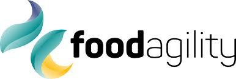

import Disclaimer from '../\_disclaimer.mdx';

<Disclaimer />

## Extensions Register

Summary list of UNTP Extensions

|Extension Name |Extension Owner|Geographic Scope|Industry Scope|Status|
|--|--|--|--|
|[Australian Agriculture Traceability Protocol (AATP)](#australian-agriculture-traceability-protocol)|[Food Agility CRC](https://www.foodagility.com/)|Australia|Agriculture|draft| 
|[UN Critical Raw Materials Transparency Protocol (CRMTP)](#critical-raw-materials-transparency-protocol)|[UN/CEFACT](https://unece.org/trade/uncefact)|Global|Critical minerals mining & processing|draft| 

## Extension Details

### [Australian Agriculture Traceability Protocol](https://gs-gs.github.io/aatp/)

* Extension Launched:  Feb-2024
* Release Date: TBA
* Industry: Agriculture
* Geography: Australia

|Logo|Implementation Statement|
|--|--|
||The AATP is an adaptation of the UN Transparency Protocol and is designed to help Australian producers meet emerging environmental, social, and governance (ESG) regulatory and consumer requirements. Operating as a governance framework, the AATP facilitates the interaction between multiple certifiers, farm systems, and enterprise systems. Interoperability and traceability tools help the Australian agriculture sector attain higher quality information about the value of Australian-made products. |

** Credential Extensions **

|Credential|Description|Extension of|
|Digital Livestock Passport|Quality and sustainability characteristics of cattle including bovine characteristics and veterinary treatment history|DPP|
|Deforestation Credential|A farm-level attestation of conformity to EU Deforestation Regulation|DCC|

### [Critical Raw Materials Transparency Protocol](https://uncefact.github.io/project-crm/)

* Extension Launched:  Jan-2024
* Release Date: TBA
* Industry: Critical Minerals Mining & Processing
* Geography: Global

|Logo|Implementation Statement|
|--|--|
||In line with the United Nations (UN) Sustainable Development Goals (SDGs) and building on the success of the UNECE Textile & Leather traceability project, this project seeks to empower the Critical Raw Material (CRM) industry with practical, low cost tools for digital data exchange to achieve product differentiation, maximize the value of existing permitting and ESG compliance efforts, counter green-washing, and support a more sustainable global economy. This project supports the UN focus on extractive industries and leverages the UN Center for Trade Facilitation and Electronic Business' (UN/CEFACT) role and capabilities to deliver digital standards for sustainable supply chains. |

** Credential Extensions **

|Credential|Description|Extension of|
|--|--|--|
|Copper Passport|Quality & sustainability characteristics of copper concentrate|DPP|
|TSM Credential|[Towards Sustainable Mining](https://mining.ca/towards-sustainable-mining/) Mine-site sustainability performance credential |DCC|

