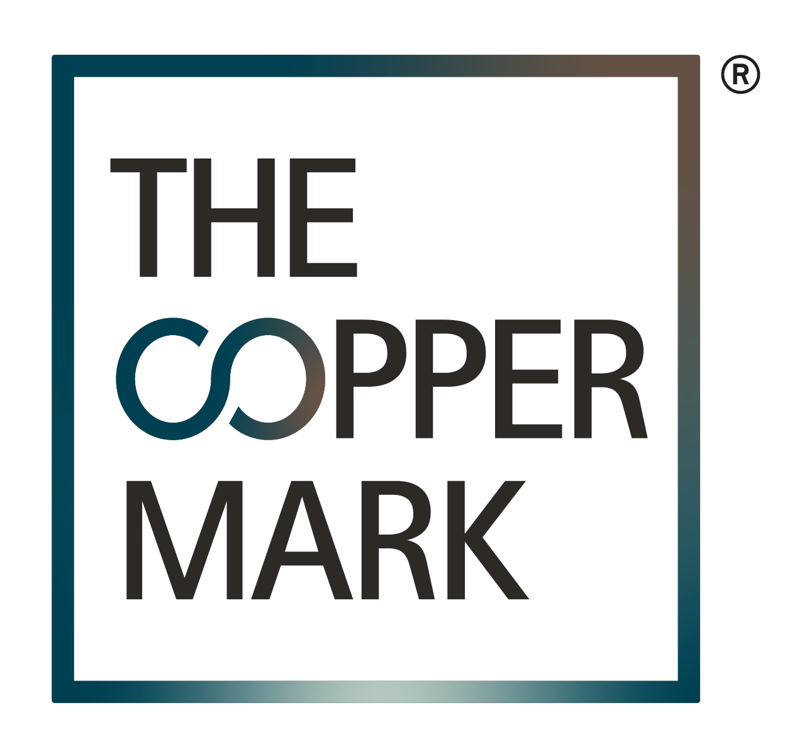

## Implementation Register

Summary list of conformity assessment bodies that have implemented or plan to implement UNTP specifications to support their customers with verifiable evidence of product or process conformity against relevant standards. 

* Product category is defined by [UN CPC](https://unstats.un.org/unsd/classifications/Econ/cpc)
* Conformity topic is defined from [UNTP conformity topic](https://test.uncefact.org/vocabulary/untp/core/0/conformityTopicCode)

|Organisation Name |Accreditation|Geographic footprint|UNTP Scope|Status|
|--|--|--|--|--|
|[ACRS (Australasian Certification Authority for Reinforcing and Structural Steel)](#acrs)|Global MRA|AU, NZ|DPP, DCC|planned| 
|[The Copper Mark](#the-copper-mark)|Industry|GLobal|DCC|planned| 

## Implementation Details

### [ACRS](https://steelcertification.com)

**Australasian Certification Authority for Reinforcing and Structural Steel**

* UNTP commitment made on:  14-Sept-2024
* Registration Country: Australia
* Operating Countries: Australian & New Zealand
* Participate in pre-release UNTP Pilots? : Yes

|Logo|Implementation Statement|
|--|--|
| | ACRS is the leading CAB for reinforcing and structural steel in Australia. We have committed to implement UNTP to support the local steel industry and to help facilitate the transition to a more transparent supply chain that adds value to the building and manufacturing industries. |

**Scheme Information**

|Conformity Scheme|Description|Topic|UNTP Scope|Test Report|
|--|--|--|--|--|
|[Steel Products](https://steelcertification.com/sustainability-certification)|The Product Certification Scheme certifies steel construction products are manufactured to Australian and New Zealand Standards and other nominated technical standards. It provides users with certainty that steel manufacturers and producers of fabricated materials adhere to necessary specifictions across the construction sector|Safety|DPP, DCC v0.5, v1.0|TBA |

### [The Copper Mark](https://coppermark.org/)

**Responsibly produced copper**

* UNTP commitment made on:  11-Oct-2024
* Registration Country: United Kingdom
* Operating Countries: Global
* Participate in pre-release UNTP Pilots? : Yes

|Logo|Implementation Statement|
|--|--|
| | The Copper Mark is the leading assurance framework promoting responsible practices in the copper, molybdenum, nickel, and zinc value chains. It intends to implement the UNTP to support the piloting of a full value chain approach, promoting transparency and ensuring the highest levels of integrity in their standards. |

**Scheme Information**

|Conformity Scheme|Description|Topic|UNTP Scope|Test Report|
|--|--|--|--|--|
|[Coppermark Assurance Framework](https://coppermark.org/standards/core-documents/)|Coppermark Criteria, Due Diligencem and Chain of Custody standards|Human rights and environment|DCC v0.5, v1.0|TBA |

