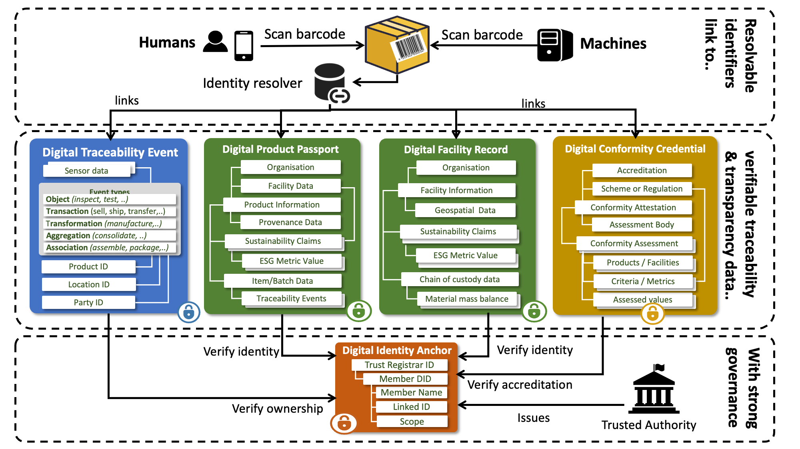
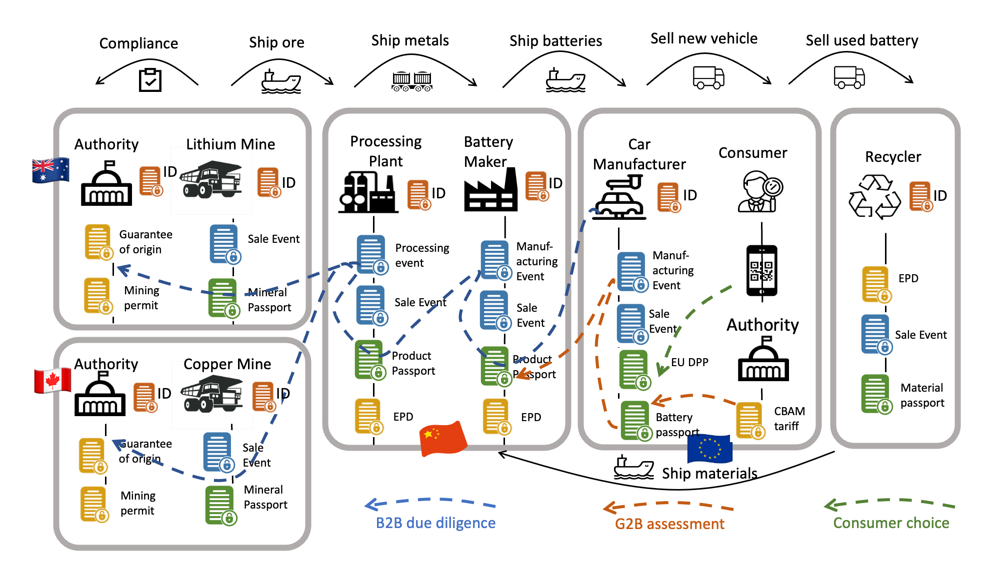

import Disclaimer from '../\_disclaimer.mdx';

<Disclaimer />

## Overview

The architecture is the blueprint for all the components of the specification and how they work together. It defines the **design principles** which underpin the UNTP and shows the components working together from the perspective of a **single actor** and across the **entire value-chain**. The UNTP is a fundamentally **decentralised architecture** with no central store of data.

## Principles
- Be good
- Be friendly

## Each Actor

## Entire Value Chain

