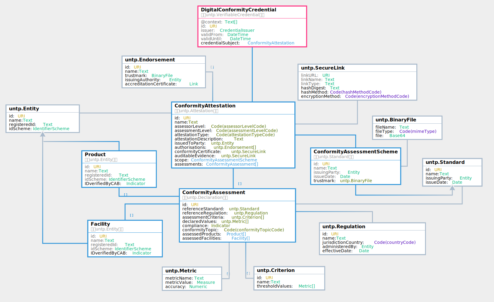

import Disclaimer from '../\_disclaimer.mdx';

<Disclaimer />

## Versions

|DPCC Version|Date|status|change log|JSON-LD Context|JSON Schema|
|--|--|--|--|--|--|
|0.3.0|01-07-2024|Raw |rebuilt on untp-core vocabulary| DPP context - TBA |DPP schema - TBA |


## Overview

Conformity credentials are usually issued by independent third parties and provide a **trusted assessment** of product ESG performance against credible **standards or regulations**. As such the credential provides trusted verification of the ESG claims in the passport. Since the passport may make several independent claims (eg emissions intensity, deforestation free, fair work, etc) there may be many linked conformity credentials referenced by one passport. As an additional trust layer, the conformity credential may reference an **accreditation** credential that attests to the authority of the third party to perform the specific ESG assessments. The conformity credential data model has been developed by a separate UN/CEFACT project on digital conformity that has expert membership from accreditation authorities and conformity assessment bodies.

## Conceptual Model


## Requirements

The digital product conformity credential (DPCC) is designed to meet the following detailed requirements as well as the more general [UNTP Requirements(https://uncefact.github.io/spec-untp/docs/about/Requirements)]

|ID|Name|Requirement Statement|Solution Mapping|
|--|--|--|--|
|DPCC-01|Authorised source|The DPCC MUST be verifiable as issued by an authorised source, typically a conformity assessment body (CAB) |DPCC MUST be issued as a digital [verifiable credential](VerifiableCredentials.md) signed by the CAB|
|DPCC-01|Assurance level|The DPCC MUST the identify the nature of any authority or support for attestation, such as formal recognition by a Governmental authority or an Accreditation Body| Attestation. accreditation property|
|DPCC-03|Subject of conformity|The DPCC MUST unambiguously identify the subject of the conformity assessment, whether a product or facility.|Assessment. assessedProducts, Assessment. assessedFacilities|
|DPCCE-04|Reference standard or regulation|The DPCC MUST identify the reference standard(s) and/or regulation(s) that specify the criteria against which the conformity assessment is made. If appropriate this must include specific measurable trhesholds (eg minimum tensile strength)| ConformityAssessment. referenceStandard and ConformityAssessment. assessmentCriterion|
|DPCC-05|Conformity Attestation|The DPCCE MUST unambiguosly state whether or not the subject of the assessment is conformat to the reference standard or regulation criteria|ConformityAssessment. compliance|
|DPCC-06|Measured metrics|The DPCCE SHOULD include actual measured values (eg emissions intensity, tensile strength, etc) with the conformity assessment|ConformityAssessment. declaredValues|
|DPCC-07|Evidence|The DPCCE MAY include references to auditable evidence (eg instrument recordings, satellite images, etc) to support the assessment. If so then the hash of the evidence fileset SHOULD be included (so that an auditor can be sure that the evidence data has not changed).  The evidence data MAY be encrypted with decryption keys provided on request|ConformityAttestation. auditableEvidence|
|

## Logical Model




## Data Definitions

### Core Types

The [UNTP core types vocabulary](https://test.uncefact.org/vocabulary/untp/core/about) defines the uniquely identified linked data entities such as Product, Location, Facility, Party, Standard, Regulation, Criteria, Declaration, Attestation, Endorsement. These entities provide the buuilding blocks for construction of Digital Product Passports and Digital Conformity Credentials.

### DCC Classes

[DCC class & property definitions](https://jargon.sh/user/unece/ConformityCredential/v/working/artefacts/readme/render#data-definitions-conformitycredential-domain)

### DCC Code Tables


[DCC code tables](https://jargon.sh/user/unece/ConformityCredential/v/working/artefacts/readme/render#code-tables-conformitycredential-domain)

## Sample

```
{
  "@context": [
    "https://www.w3.org/ns/credentials/v2",
    "https://test.uncefact.org/spec-untp/untp-v1"
  ],
  "type": ["VerifiableCredential", "ConformityCredential", "ExampleCredential"],
  "id": "https://example.com/credentials/123",
  "issuer": {
    "id": "did:web:issuer.example.com"
  },
  "validFrom": "2022-04-01T00:00:00Z",
  "validUntil": "2027-04-01T00:00:00Z",
  "evidence": {
    "type": ["ConformityAttestationEvidence"],
    "evidenceRootHash": "string",
    "description": "string",
    "evidenceData": [
      {
        "fileHash": "string",
        "fileLocation": "http://example.com",
        "fileType": "string",
        "EncryptionMethod": "none"
      }
    ],
    "decryptionKeyRequest": "http://example.com"
  },
  "credentialSubject": {
    "type": ["Organization"],
    "id": "did:web:producer.example.com",
    "hasAttestation": {
      "id": "http://example.com",
      "assessorLevel": "Self",
      "assessmentLevel": "GovtApproval",
      "type": "certification",
      "description": "string",
      "scope": {
        "id": "http://example.com",
        "name": "string",
        "trustmark": {
          "fileHash": "string",
          "fileLocation": "http://example.com",
          "fileType": "string",
          "EncryptionMethod": "none"
        },
        "issuingBody": {
          "identifiers": [
            {
              "scheme": "http://example.com",
              "identiferValue": "string",
              "identifierURI": "http://example.com",
              "verificationEvidence": {
                "format": "w3c_vc",
                "credentialReference": "http://example.com"
              }
            }
          ],
          "name": "string"
        },
        "dateOfIssue": "2019-08-24"
      },
      "assessments": [
        {
          "referenceStandard": {
            "id": "http://example.com",
            "name": "string",
            "issuingBody": {
              "identifiers": [
                {
                  "scheme": "http://example.com",
                  "identiferValue": "string",
                  "identifierURI": "http://example.com",
                  "verificationEvidence": {
                    "format": "w3c_vc",
                    "credentialReference": "http://example.com"
                  }
                }
              ],
              "name": "string"
            },
            "issueDate": "2019-08-24"
          },
          "referenceRegulation": {
            "id": "http://example.com",
            "name": "string",
            "issuingBody": {
              "identifiers": [
                {
                  "scheme": "http://example.com",
                  "identiferValue": "string",
                  "identifierURI": "http://example.com",
                  "verificationEvidence": {
                    "format": "w3c_vc",
                    "credentialReference": "http://example.com"
                  }
                }
              ],
              "name": "string"
            },
            "effectiveDate": "2019-08-24"
          },
          "assessmentCriterion": {
            "id": "http://example.com",
            "threshold": [
              {
                "name": "string",
                "value": {
                  "value": 0,
                  "unit": "string"
                },
                "minimumValue": {
                  "value": 0,
                  "unit": "string"
                },
                "maximumValue": {
                  "value": 0,
                  "unit": "string"
                }
              }
            ],
            "name": "string"
          },
          "attestedProducts": [
            {
              "identifiers": [
                {
                  "scheme": "http://example.com",
                  "identiferValue": "string",
                  "identifierURI": "http://example.com",
                  "verificationEvidence": {
                    "format": "w3c_vc",
                    "credentialReference": "http://example.com"
                  }
                }
              ],
              "marking": "string",
              "name": "string",
              "classifications": [
                {
                  "scheme": "http://example.com",
                  "classifierValue": "string",
                  "classifierName": "string",
                  "classifierURL": "http://example.com"
                }
              ],
              "testedBatchId": "http://example.com",
              "verfifiedByCAB": true
            }
          ],
          "attestedLocations": [
            {
              "type": [],
              "identifiers": [
                {
                  "scheme": "http://example.com",
                  "identiferValue": "string",
                  "identifierURI": "http://example.com",
                  "verificationEvidence": {
                    "format": "w3c_vc",
                    "credentialReference": "http://example.com"
                  }
                }
              ],
              "name": "string",
              "classifications": [
                {
                  "scheme": "http://example.com",
                  "classifierValue": "string",
                  "classifierName": "string",
                  "classifierURL": "http://example.com"
                }
              ],
              "geolocation": "http://example.com",
              "verfifiedByCAB": true
            }
          ],
          "measuredResults": [
            {
              "name": "string",
              "value": {
                "value": 0,
                "unit": "string"
              },
              "minimumValue": {
                "value": 0,
                "unit": "string"
              },
              "maximumValue": {
                "value": 0,
                "unit": "string"
              }
            }
          ],
          "compliance": true,
          "sustainabilityTopic": "environment.energy"
        }
      ],
      "accreditation": {
        "number": "string",
        "authorityEvidence": {
          "format": "w3c_vc",
          "credentialReference": "http://example.com"
        },
        "trustmark": {
          "fileHash": "string",
          "fileLocation": "http://example.com",
          "fileType": "string",
          "EncryptionMethod": "none"
        },
        "authority": {
          "identifiers": [
            {
              "scheme": "http://example.com",
              "identiferValue": "string",
              "identifierURI": "http://example.com",
              "verificationEvidence": {
                "format": "w3c_vc",
                "credentialReference": "http://example.com"
              }
            }
          ],
          "name": "string"
        }
      },
      "regulatoryApproval": {
        "number": "string",
        "authorityEvidence": {
          "format": "w3c_vc",
          "credentialReference": "http://example.com"
        },
        "trustmark": {
          "fileHash": "string",
          "fileLocation": "http://example.com",
          "fileType": "string",
          "EncryptionMethod": "none"
        },
        "authority": {
          "identifiers": [
            {
              "scheme": "http://example.com",
              "identiferValue": "string",
              "identifierURI": "http://example.com",
              "verificationEvidence": {
                "format": "w3c_vc",
                "credentialReference": "http://example.com"
              }
            }
          ],
          "name": "string"
        }
      },
      "certificate": {
        "fileHash": "string",
        "fileLocation": "http://example.com",
        "fileType": "string",
        "EncryptionMethod": "none"
      }
    }
  }
}
```


