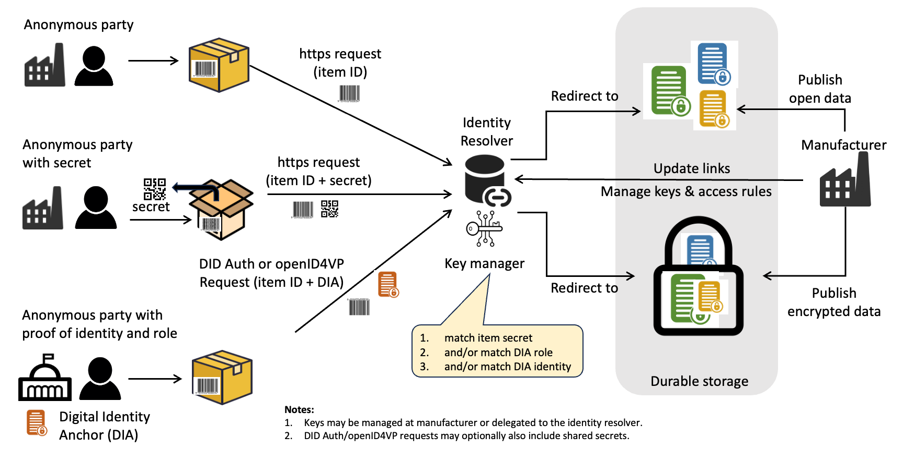
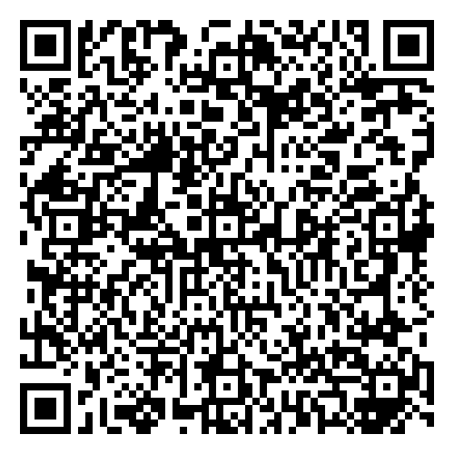

import Disclaimer from '../\_disclaimer.mdx';

<Disclaimer />

## Overview

There is a balance between the demands of transparency (more supply chain visibility means it's harder to hide green-washing) and confidentiality (share too much data and you risk exposing commercial secrets). A key UNTP principle is that every supply chain actor should be able to choose their own balance between transparency and confidentiality. To achieve this, UNTP defines data confidentiality patterns with different degrees of data protection so that they can be appropriately combined to meet the confidentiality goals of each party. 

The ability to enforce access control to non-public data is a critical capability for any traceability and transparency framework. But when the non-public data is distributed across thousands of different systems and needs to be accessed by authorised parties previously unknown to the holder of the data, traditional access control systems will not work. A decentralised data architecture also needs a decentralised access control mechanism. 

## Conceptual Model

The conceptual model for decentralised access control is relatively simple. All non-public credentials are encrypted with a unique key for each credential. Access to encrypted data then boils down to the mechanism by which authorised parties acquire decryption keys from a data holder that may not know the requestor. There are only two ways to prove rights to encrypted data.

1. **You already have the key:** The key is passed by the data holder to the data requestor by a separate channel. For example, to empower access to non-public data by the legitimate purchaser of the goods, the key could be located inside the packaging of the product. 
2. **You have a right to the key:** The key is made available to any data requestor that can prove their authorised role to the data holder via an authentication mechanism such as [DID Authentication](https://w3c-ccg.github.io/vp-request-spec/#did-authentication). 

Each uniquely identified item will have a unique encryption key. Therefore the keys provided by either of the above methods is usable only to decrypt the data about a single item. Similarly, for confidential data about products or facilities each will have it's own unique encryption key. 

Shared secrets and DID Authentication can be used in conjunction - for example a data holder may allow anonymous users to read non-public data with just a secret but may require both the secret (to prove item ownership) and DID Authentication (to confirm identity or role of the data requestor) to update item data.



The decryption of previously issued and encrypted verifiable credentials is preferred over any dynamic service because 

* The same encrypted UNTP credential is used for both the shared secret and DID authentication access models.
* The access control is easily delegated to Identity Provider services and can continue to work even after the original issuer is no longer in business.

## Requirements

* **data holder** is the party that created and maintains the information about a product or facility. Typically the product manufacturer or brand. The holder maintains both public and non-public data about the product or facility.
* **data requestor** is the party seeking access to product data held and maintained by the data holder. 

|ID|Name|Requirement|Solution Mapping|
|--|--|--|--|
|DAC-1|Anonymous access|As a data requestor that requires access to public product information, I should be able to access the information without any registration or identification - so that my privacy remains protected. |[Anonymous public access](#anonymous-public-access)|
|DAC-2|Access by legitimate owner|As the legitimate owner or user of a specific serialised item, I should be able to access non-public information such as usage and maintenance history about my item and also be able to update post-sale life-cycle events without any need to register or identify myself to the data holder.|[Anonymous access with secret](#decryption-key-as-shared-secret)|
|DAC-3|Access with verifiable role|As an authorised actor such as an accredited recycling plant or a government authority, I should be able to access and update non-public product information according to my authorised role even if I am otherwise unknown to the data holder.|[Decentralised authentication - role](#decentralised-authentication-workflow) `registrationScopeList` property|
|DAC-4|Access with verifiable identity|As a known and trusted data requestor party I should be able to prove my identity to the data holder and be granted access according to my permissions. |[Decentralised authentication - ID](#decentralised-authentication-workflow) `registeredId` property or any [federated identity](#authenticated-workflow) protocol|
|DAC-5|Confidential supply|As a buyer who received credentials from my suppliers that provide confidence in the sustainability or quality of my upstream supply chain, I would like to pass on the sustainability or quality confidence to my customers without revealing the identity of my suppliers. |[N-tier supplier visibility](#n-tier-supplier-visibility) |
|DAC-6|Discoverability|As any data requestor that queries available data about a product or facility from an identity resolver service, I would like to understand not only what public data is available but also what confidential data is available and what evidence I need to provide to access the confidential data.|[Discoverability of encrypted content](#confidential-data-discovery) |
|DAC-7|Durability| As a data requestor seeking information about a product or facility, I want to access the necessary data according to my role even if the original manufacturer is no longer in business and whether or not the data is open or confidential.|[Durable storage options](#durable-storage)|
|DAC-8|Limit impact|The confidential data access scope associated with a specific secret key should be limited to one product or item so that the consequence of un-authorised access to confidential data minimised|[Encryption granularity](#confidential-data-encryption) |
|DAC-9|Small footprint|Where space is tight (eg under a wine bottle cap) then a small format secret key option is available.|[Secret key carrier](#small-footprint-codes)

## Decentralised Access Control

The simple matrix below will assist the reader to understand the context of the access control guidance and when to use each access model. 

|Security context| no secret key| access with secret key|
|--|--|--|
|**no authentication**|publicly discoverable data |item specific confidential data (eg service history) for the legitimate product owner |
|**authenticated & authorised role**|authorised role access to confidential data about multiple items (eg a customs authority) |authorised role access to specific item data only (eg repair facility update to item history) or facility level confidential data.|

The following paragraphs provide guidance on how to secure data and grant access for various scenarios. 

### Anonymous public access

Anonymous access to public data is the default UNTP access pattern. It is already described in the [identity resolver](IdentityResolver.md) specification. From a security and resilience perspective, the only requirements are 

* That data providers MUST NOT **require** personal identifying information from the data requestor as a condition of providing public information.
* That data SHOULD remain available for the lifetime of the product, irrespective of whether the original manufacturer still exists. 

Both of these requirements are met using the [identity resolver](IdentityResolver.md) specification. 

### Item identifier as shared secret

Most item identifiers are relatively short numbers and are issued sequentially. So, for example, if `https://example.com/product/11223/serial/44556` is a known product and serial identifier then it is likely that the next serialised item ID could be `https://example.com/product/11223/serial/44557` or that the next product and serial in the range could be `https://example.com/product/11224/serial/00001`. When identifiers are easily guessed then information about the products is easily discovered even when the data requestor is not in possession of an actual product or serialised item.

However, if the product and serial numbers are issued as **genuinely random** large numbers then they become un-guessable and so any public (ie non-encrypted) data linked to the ID can be considered to be accessible only to the party in possession of the item. For example `https://example.com/product/11223/serial/44FDB2AFC91B898893CF36CB18863D26` is a product with a 32 character hexadecimal (128 bit) serial number and, provided the serial number is genuinely random, is computationally impractical to guess (1 billion guesses per second would still take many universe lifetimes). 

Large random serial numbers are not common practice in industry and so are more likely to be considered for new rather than existing identifier schemes.  However, depending on the sensitivity of the data, shorter serial numbers such as the 20-character GS1 SGTIN (eg `https://example.com/01/0952400005919/21/419A2845FD8050A0DD56`) may provide adequate confidentiality provided they are issued randomly and not sequentially. For example, if serial number `419A2845FD8050A0DD56` were one of a million serialised items of product ID `0952400005919` then it would still take a few years to guess one matching serial number at 1 billion guesses per second.

When non-guessable large identifiers are used as a security mechanism to access non-encrypted sensitive data, then;

* the access mechanism is no different to [anonymous public access](#anonymous-public-access). 
* the identifiers MUST be **genuinely random** strings 
* the data MUST NOT be index-able by search engines.
* the web repository that holds the data MUST NOT be searchable or expose lists of stored file.

### Confidential data encryption

In many cases, relying on an un-guessable identifier is not possible or not sufficiently secure. In such cases, confidential data SHOULD be encrypted.

* Encryption MUST be done with a symmetric encryption algorithm such as [AES](https://en.wikipedia.org/wiki/Advanced_Encryption_Standard) with a minimum of 128 bit key length.
* Each distinct identified entity (i.e. facility, product, product batch, or serialised item with a unique IDR path) MUST use a separate and unique encryption key.  
* Where there are multiple different authorised roles that require access to different non-public data then a unique encryption key SHOULD be used for each role.
* Where there are multiple non-public documents or credentials for a given unique entity and authorised role then they SHOULD be encrypted with the same key.

These encryption requirements will result in an optimal granularity of encryption where one or more encrypted objects about a specific item and for access by a specific authorised role are all encrypted with the same key. But data for other roles or other items are not accessible with the given key. 

### Decryption key as shared secret

When confidential data about serialised items is encrypted then decryption keys SHOULD be included with the product and be optimised for easy use. 

* The key SHOULD be presented as a QR code (either included with the product or, for bulk/raw materials, sent separately)
* The code MUST resolve to an [Identity Resolver](IdentityResolver.md) query URL for the given item and with the symmetric key secret as a `key` parameter.
* For cases with limited space such as a QR under a wine bottle cap, implementers MAY use a shorter URL that redirects to the same full identity resolver URL. The short URL SHOULD include 128 bit entropy so that it is sufficiently un-guessable.

For example, for a 128 bit AES key in a query to a resolver about product ID 90664869327 that returns only encrypted link targets for anonymous access the resolver URL would be `https://resolver.product-register.com/01/90664869327?key=2b7e151628aed2a6abf7158809cf4f3c&accessRole=untp%3AaccessRole%23Anonymous`


### Small footprint codes

A 128 bit short redirect URL (in capitals because that creates smaller QR codes) can be used for cases where there is limited space for QR codes.  For example `HTTPS://REDIRECT.IO/E05778C659733E222758AC5179AE4611` could redirect to the same full URL `https://resolver.product-register.com/01/90664869327?key=2b7e151628aed2a6abf7158809cf4f3c&accessRole=untp%3AaccessRole%23Anonymous`

The full and short URLs would produce the following QR codes

|Full resolver URL|Short redirect URL|
|--|--|
|||

### Federated authentication workflow

In some cases access to (and update of) confidential data requires more than a shared secret that proves ownership of a serialised item but also requires evidence that the data requestor has an authorised role such as a competent authority, a recycling plant, or accredited auditor. When the data requestor is already known and registered with the data provider then a conventional "sign-in-with" federated authentication and authorisation mechanism such as [OAuth 2.0](https://oauth.net/2/) or [OIDC](https://openid.net/specs/openid-connect-core-1_0.html) can be used. UNTP does not impose any restrictions on how a data provider authenticates and authorises access to protected data for users that are already known to the provider. 

However, these kind of protocols require a relying-party relationship between the data provider that requires evidence of identity (eg a product passport issuer) and an identity provider that is the manager of the identity (eg a regulatory authority). Although this "sign-in-with" protocol is easy to implement with social network identity providers who deliberately place low barriers to relying parties, more authoritative registers such as national business registers, land registers, trademark registers, and so on are much more conservative. They mostly either don't offer federated identity or even if they do, they are very restrictive about allowed relying parties. 

### Decentralised authentication workflow

Decentralised protocols provide a much simpler and more scalable authentication and authorisation approach for decentralised architectures that avoids any need for direct collaboration or dependencies between data providers and identity providers. For example, consider an access rule defined by a China based battery manufacturer that says "to update battery status to `recycled` the requestor must be an accredited recycling establishment operating in a recognized jurisdiction (eg Australia). The workflow would be 

* Australian recycling plant "Sample Recyclers" is accredited under the Australian Government Department of Environment [stewardship scheme](https://www.dcceew.gov.au/environment/protection/waste/product-stewardship/product-schemes/voluntary-product-stewardship) and has obtained a [Digital Identity Anchor](DigitalIdentityAnchor.md) credential that links their DID to their government accreditation status.
* Sample Recyclers receives a battery for recycling after 7 years of use that was originally made by "China Batteries Sample Co".  It has a serialised item specific QR secret printed on the battery.
* Sample Recyclers scans the QR (which includes presentation of the secret), receives a IDR link-set response that includes a UNTP standard link that defines an authenticated method and URL to add a recycled event to the battery history that requires evidence of accredited recycler status.
* Sample Recyclers authenticates to the specified endpoint using DID-Authentication and presents their Australian Government issued DIA credential as a verifiable presentation.
* China Sample Batteries Co verifies the presentation (which confirms DID control) and checks that the issuer (AU government) is on their trusted white-list, and then adds the recycled event to the item history. 

### Decentralised authentication protocol options.

UNTP does not define any new protocols for decentralised authentication but rather supports the use of any of the existing standards listed below.

* DID Auth specification link : https://w3c-ccg.github.io/vp-request-spec/#did-authentication 
* DID SIOP specification link : https://openid.net/specs/openid-connect-self-issued-v2-1_0.html 
* OID4VP specification link : https://openid.net/specs/openid-4-verifiable-presentations-1_0.html 

| Aspect               | DID Authentication | DID-SIOP    | OpenID4VP  |
|---------------------------|-------------------|-------------|-------------------|
| **Primary Purpose**       | DID-based authentication with credential integration   | Decentralized login using OIDC        | Credential presentation in OIDC      |
| **Workflow Complexity**   | Moderate                                                             | Moderate                              | Complex                              |
| **OIDC Integration**      | No                                                                   | Yes                                   | Yes                                  |
| **Use Case Focus**        | Proving DID control with credential attachment                        | Decentralized login                   | Claim verification and presentation  |


The best choice will eventually be the specification(s) that demonstrate the widest market implementation. At this time, the UNTP recommendation is that implementers SHOULD use **DID-Authentication** but MAY also use either **DID-SIOP** or **OpenID4VP**.

### Confidential data discovery

identity resolvers MUST include information to indicate when a link target is encrypted. Resolvers MUST also provide information about how to POST update events, where appropriate.

* When a link target is encrypted, the `encryptionMethod` custom property MUST be included with a value drawn from the [UNTP encryption method code list](https://test.uncefact.org/vocabulary/untp/core/0/encryptionMethodCode).
* When a link target is encrypted, the `accessRole` custom property MUST be included. The allowed values are an array of URIs that will be used to match against `registrationScopeList` in digital identity anchor credentials. 
* To indicate that access is allowed by any party that holds a secret key, the accessRole `untp:accessRole#Anonymous` MUST be included.
* To indicate that the link target is an update service, the `method":"POST"` property is required, together with the `accessRole` needed for the update to be accepted. 

For example 

```json
{
    "linkset": [
        {
            "anchor": "https://resolver.product-register.com/01/90664869327",
            "https://vocabulary.uncefact.org/untp/linkType#digitalTraceabilityEvent": [
                {
                    "href": "https://sample-credential-store.com/credentials/dte-90664869327.json",
                    "title": "Battery maintenance event",
                    "type": "application/ld+json",
                    "lang": ["en"],
                    "encryptionMethod": "AES-128",
                    "accessRole":["untp:accessRole#Anonymous"]
                 },
                {
                    "href": "https://api.sample-credential-store.com/credentials",
                    "title": "Battery recycling event",
                    "type": "application/ld+json",
                    "lang": ["en"],
                    "method": "POST",
                    "accessRole":["untp:accessRole#Recycler"]
                 }
            ]
        }
    ]
} 
```


## Implementation Considerations

To do - add guidance relevant to decentralised access control for common concerns and use-cases.

### Linked confidential data

Data about a value chain comprises multiple credentials about products and facilities in a linked-data graph. Any of the credentials in the graph may be considered confidential and therefore be protected by an appropriate access control method. This will present challenges for verifiers such as supply chain traceability systems that need to traverse long graphs for their customers. A typical scenario might work as follows:

* A verifier encounters a serialised product ID and performs an IDR lookup which returns a link-set which contains:
	* link to an un-encrypted Digital Product Passport (DPP) which also contains an ID of the facility that manufactured the item
	* links to an encrypted Digital Traceability Event (DTE) with `"encryptionMethod": "AES-128"` and `"accessRole":["untp:accessRole#Anonymous"]` properties.
* The verifier has the secret key for the given item and so decrypts the DTE to find that it is a transformation event that lists the identifiers and quantities of input products. 
	* For some of the input product ID, the verifier is able to resolve link-sets from relevant IDRs and access public data (eg DPPs) about the input products.
	* The input product IDR process also returns encrypted links but they cannot be decrypted because the verifier has no access to the secret key for supplier input products.
* The verifier resolves the facility ID found in the DPP to a new link-set that contains links to both public and private data about the facility.
	* A link to a public digital facility record (DFR) includes precise geo-location information as well as some public sustainability claims.
	* A set of links to facility level conformity credentials (DCC) that are encrypted and have `"accessRole":["untp:accessRole#Customer"]` property. The verifier uses DID-Authentication to connect to the DCC end points and presents a Digital Identity Anchor (DIA) that proves the verifier ID which matches a facility customer list. Decryption keys are provided with a new link-set of the authorised customer.

In general, when a verifier hits a graph node that in encrypted and does not have access keys, then graph traversal cannot proceed beyond that node. Perhaps the most common scenario will be transformation events that reveal the input products (and suppliers) in a manufacturing process. 

### N-tier supplier visibility

To do - guidance about how to handle upstream product / supplier data that is considered sensitive. There are likely to be four "levels" of transparency that implementers may choose:

* Make it all public
* Make your suppliers visible only to your direct customers (eg if the ID in your DIA matches the destination party ID in a transaction event)
* Use a trusted third party to assess to your supply chain sustainability without revealing supplier identities - and issue a more public digital conformity credential that attests to qualities without identities.
* Make it all private and never share anything.

### Durable storage

To do - write some words about how to manage protected data even after the supplier / publisher is no longer in business.
