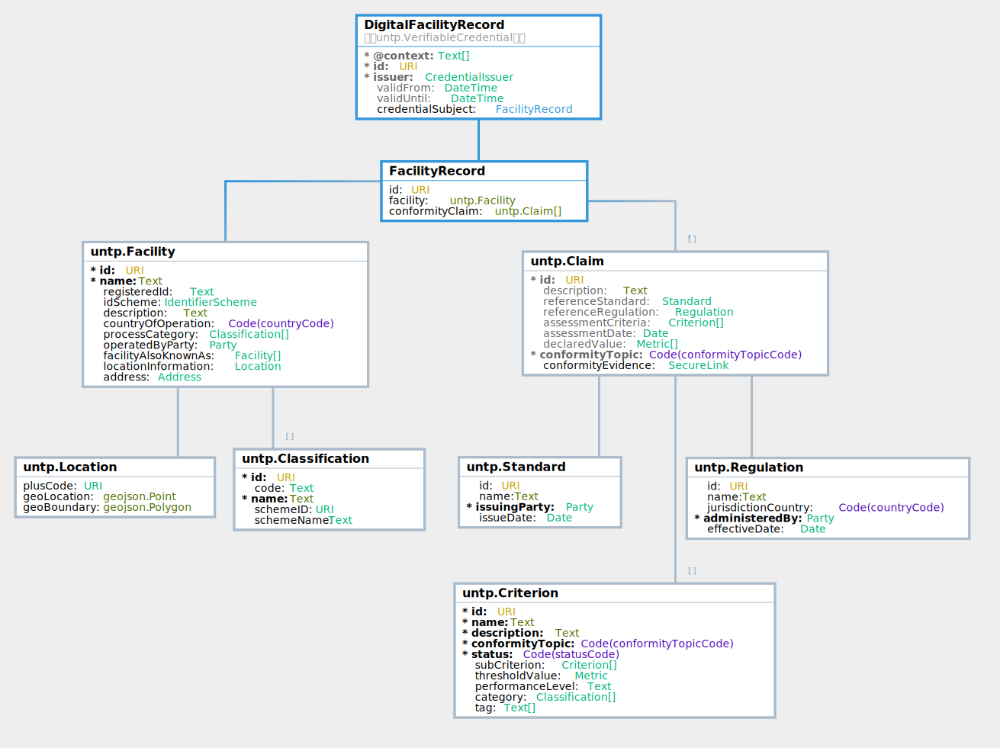

import Disclaimer from '../\_disclaimer.mdx';

<Disclaimer />

## Artifacts 

Are maintained at https://test.uncefact.org/vocabulary/untp/dfr/0/about

### Stable Releases For Implementation

Version 1.0 stable release for production implementation is due in June 2025 after formal public review 

### Release for Pilot Testing

Version 0.5.0 release artifacts can be used for pilot testing.  

* [JSON-LD @context](https://test.uncefact.org/vocabulary/untp/dfr/0.5.0/)
* [JSON Schema](https://test.uncefact.org/vocabulary/untp/dfr/untp-dfr-schema-0.5.0.json)
* [Sample Instance](https://test.uncefact.org/vocabulary/untp/dfr/untp-dfr-instance-0.5.0.json)

### Latest Development Version

Latest development versions are used to reflect lessons learned from pilots but should not be used for either pilot testing or production purposes. 

### Ontology
The ontology for the Digital Facility Record is available in JSON-LD format and can be retrieved via content negotiation from:

[https://test.uncefact.org/vocabulary/untp/dfr/0/](https://test.uncefact.org/vocabulary/untp/dfr/0/)

  Example:
  ```bash
  curl https://test.uncefact.org/vocabulary/untp/dfr/0/ -H 'Accept: application/ld+json'
  ```

### Version History

History of releases is available from the **[Version history](https://test.uncefact.org/vocabulary/untp/dfr/0/versions)** page.


### Default Render Template

A UNTP digital facility record may be rendered in any format desired by the issuer. However a default **[Template Design](../../samples/DigitalFacilityRecordRender.png)** is provided here and includes mapping of visual rendering elements to the [Logical Data Model](#logical-model).

### Sample Credential 

|URL|QR|Description|
|--|--|--|
|[Sample Battery Manufacturing Facility Record](https://untp.showthething.com/verify/?q=%7B%22payload%22%3A%7B%22uri%22%3A%22https%3A%2F%2Funtp-verifiable-credentials.s3.amazonaws.com%2F936fe321-94ad-4b0b-8690-f6b25da1fc7f.json%22%7D%7D)||A sample digital facility record as a JWT envelope signed Verifiable Credential. The URL (or QR scan) resolved to a hosted verifier that displays a human readable version. Raw JSON data can be viewed via the `JSON` tab and the full credential can be dlownloaded via the download button.|

## Overview

The digital facility record (DFR) is issued by the owner or operator of a production or manufacturing facility and is the carrier of **facility data and sustainability information** for an identified facility in the value chain. It is very similar to the digital product passport except that it describes a facility rather than a product. The DFR is discoverable in the same way as a DPP - namely by resolving the facility ID to an Identity Resolver service that will return links to facility records. The sustainability performance metrics are also at the facility annual total level rather than at the product level. In many value chains, facility level information may be sufficient to meet the due diligence requirements of buyers and so the facility record can be used independently of the product passport. However product passports should reference the facility at which the product was produced. Where both facility and product information are available, verifiers can perform an approximate mass-balance assessment for quantity based criteria such as GHG emissions. For example, the total individual emissions recorded in all products shipped from a facility should approximately equal the reported annual emissions of the facility. 

## Conceptual Model

TBA

## Requirements

The digital facility record is designed to meet the following detailed requirements as well as the more general [UNTP Requirements](https://uncefact.github.io/spec-untp/docs/about/Requirements)

| ID | Name  | Requirement Statement   | Solution Mapping  |
| ------ | ---- | --------- | ---------- |
| DFR-01 | Resolvable ID | Each facility must have at least one resolvable identifier that can be used in digital product passports and other data exchanges so that verifiers can always access the latest facility data. | Facility.id |
| DFR-02 | Process categories  | The DFR should support any number of industry process classifications using codes from a defined classification scheme (eg UN-CPC) | The classifications property |
| DFR-03 | Geo-Location | The DFR should should provide a means to specify both a geo-location point (aka pin) and a boundary geometry (aka polygon) so that verifiers can geo-locate supplier facilities  | The Location class meets this need.|
| DFR-04 | Owner / operator| The DFR should specify the owner and/or operator entity of the facility using one or more globally unique and resolvable entity identifiers.| Facility.OperatedByParty is a UNTP Entity structure that meets this need. |
| DFR-05 | Declarations  | The DFR MUST provide a means to include any number of conformity declarations so that it can provide simple single point to aggregate all claims about the facility in one place  | The "conformityDeclarations" array is designed to meet this need  |
| DFR-06 | Conformity Topic | The DFR MUST provide a simple mechanism to express the sustainability/circularity/conformity topic for each claim so that similar claims can be grouped and the high level scope easily understood.    | The ConformityTopic code list is designed to meet this need|
| DPP-07 | Metrics  | The DFR MUST provide a simple mechanism to quantify a conformity claim (eg carbon intensity, water consumption, etc) and to express any accuracy range.  | The "Metric" class is designed to meet this need  |
| DPP-08 | Criteria  | The DPP MUST provide a means to reference a standard or regulation as well as the specific criteria within that standard or regulation - so that claims can be understood in terms of the criteria against which they are made. | Declaration.referenceRegulation, Declaration.referenceStandard, Declaration.referenceCriteria|
| DPP-09 | Evidence  | The DPP MUST provide a means to reference independent conformity assessments that support and verify the claims being made. The related evidence SHOULD be digitally verifiable but MAY be a simple document or web page. The confidence level attached to the evidence should be clear. | The Declaration.conformityEvidence property references a relevant digital conformity credential   |

## Logical Model

The Digital Facility Record is an assembly of re-usable components from the UNTP core vocabulary. 



### Core Vocabulary Documentation

The [UNTP core types vocabulary](https://jargon.sh/user/unece/untp-core/v/0.5.0/artefacts/readme/render) defines the uniquely identified Linked Data entities such as Product, Location, Facility, Party, Standard, Regulation, Criteria, Declaration, Attestation, Endorsement. These entities provide the building blocks for construction of the Digital Facility Record.


### DFR Documentation

The [DFR documentation](https://jargon.sh/user/unece/DigitalFacilityRecord/v/0.5.0) provides a technology-neutral definition of classes, properties and code lists in the DFR model.

## Implementation Guidance

This section provides sample JSON-LD snippets for each DFR component with guidance on their purpose and usage.

### Verifiable Credential

Digital Facility Records are issued as Vierifiable credentials. Please refer to [DPP VC Guidance](DigitalProductPassport.md#verifiable-credential) for information about the use of the verifiaible credentials data model for UNTP.  THe issuing party for the VC should be the facility owner or operator. 

### Facility

The facility object is the `credentialSubject`. It comprises

* An identifier for the facility.  This could be a self-issued DID, or an ID managed by an industry association such as a member / facility register, or a global location scheme such as a GS1 GLN.  Whatever the facility identifier scheme, facility IDs should be resolvable and verifiable.
* An industry process category, preferably using a global standard classificaiton scheme such as UN ISIC.
* The `operatedByParty` for the facility, typically identified using a national business register or a glbal business identifier scheme.
* The semi-strucutred address for the facility.
* The geolocation information for the facility (using PlusCodes adn GeoJSON - see below)
* The confirmity claims about the facility made by the facility owner or operator - following the same `Declaratoion` structure as used by the UNTP Digital Product Passport.

```json
  "credentialSubject": {
    "type": [
      "Facility"
    ],
    "id": "https://samplefacilityregister.org/1234567",
    "registeredId": "1234567",
    "description": "LiFePO4 Battery plant number 7",
    "name": "Example facility 7",
    "idScheme": {
      "type": [
        "IdentifierScheme"
      ],
      "id": "https://samplefacilityregister.org",
      "name": "A facility register"
    },
    "countryOfOperation": "AU",
    "processCategory": [
      {
        "type": [
          "Classification"
        ],
        "id": "https://unstats.un.org/unsd/classifications/Econ/isic/2611",
        "code": "2611",
        "name": "Manufacture of solar cells, solar panels and photovol",
        "schemeID": "https://unstats.un.org/unsd/classifications/Econ/isic",
        "schemeName": "UN Standard Industry Classification"
      },
      {...}
    ],
    "operatedByParty": {
      "type": [
        "Identifier"
      ],
      "id": "https://abr.business.gov.au/ABN/View?abn=90664869327",
      "name": "Sample Company Pty Ltd.",
      "registeredId": "90664869327",
      "idScheme": {
        "type": [
          "IdentifierScheme"
        ],
        "id": "https://abr.business.gov.au",
        "name": "Australian Business Number"
      }
    },
    "otherIdentifier": [..],
    "address": {
      "streetAddress": "level 11, 15 London Circuit",
      "postalCode": "2601",
      "addressLocality": "Acton",
      "addressRegion": "ACT",
      "addressCountry": "AU"
    },
    "locationInformation": {..},
    "conformityClaims": [..]
  }
}
```

### Location

Facility location is a value object (ie it does not have a unique identifier). It's purpose it to locate the facility in a geographic area with whatever degree of resolution required. A location object must include at leaqst one of the following geolocation properties:

* An open location code (also know as [Plus Codes](https://maps.google.com/pluscodes/)). Plus codes are essentially a grid reference and can define an small area that is virtually a pin location (eg https://plus.codes/8CGRC78W+MM) or a much larger area (eg Roughly Madrid city - https://plus.codes/8CGRC700+) by removing digits after the "+" and replacing grid digits with an even number of trailing zeros. 
* A geoLocation as a [GeoJSON Point](https://datatracker.ietf.org/doc/html/rfc7946#appendix-A.1) as a decimal lattitude / longditude pair.  
* A geoBoundary as a [GeoJSON Polygon](https://datatracker.ietf.org/doc/html/rfc7946#appendix-A.3) that defines any closed boundary (or collection of closed boundaries) as a sequence of lat/long pairs where the first and last pair represent the same point.

```json

    "locationInformation": {
      "plusCode": "https://plus.codes/8CGRC78W+MM",
      "geoLocation": {
        "type": "Point",
        "coordinates":[
            40.416688,
            -3.703313,
          ]
      },
      "geoBoundary": {
        "type": "Polygon",
         "coordinates": [
              [
                 [100.0, 0.0],
                 [101.0, 0.0],
                 [101.0, 1.0],
                 [100.0, 1.0],
                 [100.0, 0.0]
             ]
          ]
      }
```

### Confomrity Claims

Conformity information is included in the Digital Facility Record as an array of UNTP Declaration structures. The same structure is re-used for confomrity Information in Digital Product Passports nad for third party assessments in UNTP Digital Conformity Credentials (DCC). Please refer to the [DPP COnformity Information](DigitalProductPassport#conformity-information) section for further information and examples.


