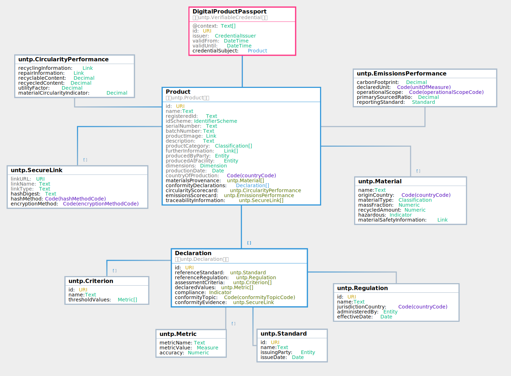

import Disclaimer from '../\_disclaimer.mdx';

<Disclaimer />

## Versions

|DPP Version|Date|status|JSON-LD Context|JSON Schema|
|--|--|--|--|
|0.3.0|25-03-2024|Raw (not for implementation)|[DPP context](../../schema/digitalProductPassport.v0.3.0.JSONLDContext.jsonld)|[DPP schema](../../schema/digitalProductPassport.v0.3.0.JSONSchema.json)|
|0.4.0|08-04-2024|Raw (for review)|[DPP context](../../schema/digitalProductPassport.v0.4.0.JSONLDContext.jsonld)|[DPP schema](../../schema/digitalProductPassport.v0.4.0.JSONSchema.json)|

The current version of this specification is v0.4.0

## Overview

The digital product passport (DPP) is issued by the shipper of goods and is the carrier of **product and sustainability information** for every serialised product item (or product batch) that is shipped between actors in the value chain. It is deliberately **simple and lightweight** and is designed to carry the minimum necessary data at the **granularity** needed by the receiver of goods - such as the scope 3 emissions in a product shipment. The passport contains links to **conformity credentials** which add trust to the ESG claims in the passport. The passport also contains links to **traceability events** which provide the "glue" to follow the linked-data trail (subject to confidentiality constraints) from finished product back to raw materials. The UNTP DPP does not conflict with national regulations such as the EU DPP. In fact, it can usefully be conceptualised as the **upstream B2B feedstock** that provides the data and evidence needed for the issuing of high quality national level product passports.

## Conceptual Model


## Requirements

The digital product passport is designed to meet the following detailed requirements as well as the more general [UNTP Requirements(https://uncefact.github.io/spec-untp/docs/about/Requirements)]

|ID|Name|Requirement Statement|Solution Mapping|
|--|--|--|--|
|DPP-01|product, batch, item|The DPP should support use at either product level or at batch level or at individual serialised item level. |Claims are made at the passport level, which MUST have a related product and MAY have a related batch and item|
|DPP-02|Classification|The DPP should support any number of product classifications using codes from a defined classificaton scheme (eg UN-CPC) |The classifications property|
|DPP-03|Materials provenance|The DPP should provide a simple structure to allow issuers to breakdown the material composition of their products by mass fraction and origin country so that raw material provenance requirements are easily assessed and met.|The DPP "materialsProvenance" structure is designed to meet this need.|
|DPP-04|Manufactured at|The DPP should provide a simple structure to describe the manufacturing facility at which the product was made. The facility identifier SHOULD be resolvable and verifiable and SHOULD link to cadastral boundary information.|The "Facility" structure incliding the locationEvidence credential property is designed to meet this need|
|DPP-05|Dimensions|The DPP must support the definision of key product dimensions such as length, width, height, weight, volume so that conformity claims made at the unit level (eg Co2 intensity in Kg/Kg) can be used to calculate actual values for the shipped product|Dimensions class|
|DPP-06|Traceability|The DPP should provide a means to follow links to further DPPs and conformity credentials of constituent products so that (subject to confidentiality constraints), prevenance claims can be verified to any arbitrary depth upt o primary production|The links to EPCIS traceability event credentials from the productBatch class is designed to meet this need|
|DPP-07|characteristics|The DPP should allow issuer to provide descriptive information about the product (image, description, etc) that is extensible to meet industry specific needs.|Characteristics property as an industry extnesion point|
|DPP-08|Verifiable Party|The DPP should provide DPP issuer, product manufacturer, and facility operator identification inclding a name, a resolvable and verifiable identifier, and proof of ownership of the identifier|The Party structure inclding the "verification Evidence" property of the identifier class link meets this need|
|DPP-09|Claims|The DPP MUST provide a means to include any number of conformity claims within one DPP so that it can provide simple single point to aggregate all claims about the product in one place|The "conformityClaims" array is designed to meet this need|
|DPP-10|Conformity Topic|The DPP MUST provide a simple mechanism to express the sustainability/circularity/conformity topic for each claim so that similar claims can be grouped and the high level scope easily understood.|The ConformityTopic code list is designed to meet this need|
|DPP-11|Metrics|The DPP MUST provide a simple mechanism to quantify a conformity claims (eg carbin intensity, water consumption, etc) and to express any accuracy range and also to compare the claimed value to a relevant benchmark such as a standard/regulation requirement or an industry average|The "Metric" class is designed to meet this need|
|DPP-12|Criteria|The DPP MUST provide a means to reference a standard or regulation as well as the specific criteria within that standard or regulation - so that claims can be understood inter terms of the criteria against which they are made.|The standardorRegulation property points to the standard document and the "criteria" property points to the specific rule or clause within that standard or regulation.|
|DPP-13|Evidence|The DPP MUST provide a means to reference independent conformity assessments that support and verify the claims being made. The related evidence SHOULD be digitally verifiable but MAY be a simple document or web page. The confidenc elevel attached ot the evidence should be clear.|The "Evidence" class is designed to meet this need, together with the evidence type and assirance lvel code lists.|


## Logical Model 





## Data Definitions

### ProductPassport

> The ProductPassport is a comprehensive data structure that encapsulates various details pertaining to a product, including its identification details, who issued it, batch information, and different scores relating to sustainability and trustworthiness.

Property | Definition | Type
--- | --- | ---
id | A unique identifier (URI) assigned to the product passport. | URI
issuedBy | The Party that issued the product passport. | [Party](#party)
product | Detailed information about the product encapsulated in a ProductInformation object. | [Product](#product)
guaranteeOfOriginCredential | A conformity credential issued by a trusted authority that confirms some or all of the claims made in this product passport | URI
trustScore | An aggregate numeric metric that represents the level of trustworthiness associated with the product. This score is derived based on the credibility and reliability of the issuing bodies that substantiate the claims being made about the product. The calculation rules are defined in the UNTP trust graph specification. | Numeric
sustainabilityScore | An aggregate numeric metric calculated based on the various sustainability claims vs benchmarks associated with the product. It amalgamates scores assigned to individual sustainability claims, which are validated by various issuing bodies. The score provides a comprehensive view of the product's overall sustainability performance, giving users a quantifiable measure of the product's environmental and social impacts. | Numeric


### Party

> The Party class represents an entity such as an organization, or a company that manufactured the product.

Property | Definition | Type
--- | --- | ---
identifiers | A unique identifier (URI) assigned to the organization or company. (Link Resolver - GS1 company prefix?) | [Identifier](#identifier)
name | The name of the organization or company, represented as a text string. | Text


### Facility

> The Facility class embodies information about a specific facility, which manufactured the product.

Property | Definition | Type
--- | --- | ---
identifiers | A unique identifier (URI) assigned to the facility. (Link Resolver - GS1 GLN?) | [Identifier](#identifier)
name | The name of the facility, represented as a text string. | Text
location |  | URI
operatedBy | The Party entity responsible for operating the facility. | [Party](#party)


### Product

> The ProductInformation class encapsulates detailed information regarding a specific product, including its identification details, manufacturer, and other pertinent details.

Property | Definition | Type
--- | --- | ---
productIdentifiers | An array of unique identifiers assigned to the product or model.  | [Identifier](#identifier)
batchIdentifiers | Information regarding the specific production batch of the product. | [Identifier](#identifier)
itemIdentifiers | An array of identifiers representing a specific serialised item of the product. | [Identifier](#identifier)
classifications | A code representing the product's class, typically using the UN CPC (United Nations Central Product Classification) https://unstats.un.org/unsd/classifications/Econ/cpc | [Classification](#classification)
modelName | The model name or number of the product, represented as text. | Text
image | A unique identifier (URI) pointing to an image of the product. | URI
description | A textual description providing details about the product. | Text
furtherInformation | A URL pointing to further human readable information about the product. | URI
manufacturedDate | The ISO 8601 date on which the product batch was manufactured. | Date
dimensions | The physical dimensions of the product. Not every dimension is relevant to every products.  For example bulk materials may have wieght and volume but not length, with, or height. | [Dimension](#dimension)
charcteristics |  | [Characteristic](#characteristic)
manufacturer | The Party entity that manufactured the product. | [Party](#party)
manufacturedAt | The Facility where the product batch was manufactured. | [Facility](#facility)
materialsProvenance | An array of Provenance objects providing details on the origin and mass fraction of components or ingredients of the product batch. | [Material](#material)
conformityClaims | An array of claim objects representing various product conformity claims about the product / batch.  These can be sustainability claims, circularity claims, or any other claim type within the conformity topic list. | [Claim](#claim)
recyclingInstructions | A URI pointing to information regarding the recycling aspects of the product. | URI
traceabilityInformation | An array of TraceabilityEvent objects detailing EPCIS events related to the traceability of the product batch. | [TraceabilityEvent](#traceabilityevent)


### Claim

> The SustainabilityClaim class represents specific claims regarding the sustainability of a product, providing details about the metrics, thresholds, and evidences supporting the claim.

Property | Definition | Type
--- | --- | ---
topic | A code representing the topic of the sustainability claim. E.g. environment.deforestation, environment.ghg-emission-intensity, etc..  Drawn from a standard code list.   | Code (conformityTopic)
standardOrRegulation | The standard or regulation against which this conformity claim is made. Expressed as a URI and should match a value in the UN catalogue of reference vocabularies.  | URI
criteriaReference | A URI pointing to the specific criteria within the standard or regulation against which this claim is made. | URI
claimedValues | One or more actual measures supporting the claim. For example for GHG emissions there may be a metric for total emissions intensity and also a metric for amount of offsets included. | [Metric](#metric)
benchmarkValue | A benchmark value against which the claimed value can be assessed. THis could be a value specified by a standard or regulation or could be an industry benchmark. | [Metric](#metric)
benchmarkReference | A refernce to evidence to support the benchmark value. | URI
conformance | and indicator (boolean) that expresses whether or not this product has achieved compliance against the criteria.  for example, if the topic is environment.deforstation and the criteria is EU.2023.1115 then the product is conformant if it has not touched any facility throughout it's lifecycle that is not deforestation free since dec 2020. | Indicator
conformityEvidence | A URI pointing to the evidence supporting the claim. Most likely in the form of a verifiable credential. | [Evidence](#evidence)


### Metric

> A specific measure of performance against the criteria that governs the claim.  Expressed as an array of metric (ie unit of emasure) / value (ie the actual numeric value) pairs.  

Property | Definition | Type
--- | --- | ---
name | A human readable name for this metric | Text
value | A numeric value representing the measurement or evaluation outcome for the claim. | Numeric
accuracy | A percentage represented as a numeric between 0 and 1 indicating the rage of accuracy of the claimed value (eg 0.05 means that the actual value is within 5% of the claimed value.) | Numeric
unit | The unit of measure. for example, emissions intensity in Kg Co2e per kWh produced. Or Kg Co2e per Kg of livestock gross weight.   | Code (unitOfMeasure)


### TraceabilityEvent

> The TraceabilityEvent class represents a specific EPCIS event in the traceability chain of a product, including details about the event type and reference.

Property | Definition | Type
--- | --- | ---
eventReference | A URI pointing to the detailed information about the EPCIS event. Most likely in the form of a verifiable credential. | URI
eventType | A code representing the type of EPCIS event. ObjectEvent, AggregationEvent, TransactionEvent, TransformationEvent, ObjectEvent. | Code (eventTypeCode)


### Material

> The material class encapsulates details about the origin or source of raw materials in a product, including the country of origin and the mass fraction.

Property | Definition | Type
--- | --- | ---
originCountry | A ISO 3166-1 code representing the country of origin of the component or ingredient. | Code (countryCode)
materialType | The type of this material - as a value drawn from a controlled vocabulary eg textileexchange.org/materials/rm01014 - representing organic cotton. | [Classification](#classification)
massFraction | A numeric value representing the mass fraction of the product represented by this material. The sum of all mass fraction values for a given passport should be 100. | Numeric
recycled | Indicator is true if this material input is from a recycled source. | Indicator
hazardous | Indicates whether this material is hazardous. If true then  | Indicator


### Evidence

> Evidence to support a conformity or identity claim. 

Property | Definition | Type
--- | --- | ---
format | Format of the evidence (verifiable credential, document, website, etc) | Code (evidenceFormat)
assuranceLevel | The assurance level of the evidence (self declaration, 2nd party, 3rd party, accredited auditor) | Code (assuranceLevelCode)
credentialReference | The URL of the evidence credential. Should be a hashlink to avoid post-issue tampering. | URI


### Dimension

> Overall (length, width, height) dimensions and weight/volume of an item.

Property | Definition | Type
--- | --- | ---
weight | the weight of the product | [Measure](#measure)
length | The length of the product or packaging | [Measure](#measure)
width | The width of the product or packaging | [Measure](#measure)
height | The height of the product or packaging | [Measure](#measure)
volume | The displacement volume of the product. | [Measure](#measure)


### Classification

> A classification scheme and code / name representing a category value for a product, entity, or facility.

Property | Definition | Type
--- | --- | ---
scheme | Classification scheme  - eg https://unstats.un.org/unsd/classifications/Econ/cpc  | URI
classifierValue | classifier value within the scheme - eg "01211" in UN CPC | Text
classifierName | Name of the classifier - eg "Asparagus" for code "01211" in UNCPC | Text
classifierURL | Linked data URL to a web vocabulary entery for this classificaiton code. When this property is provided, the scheme, value, and name properties of the classifer are not required.  eg https://vocabulary.uncefact.org/unlocode?country=au#AUBNE represensign the port of Brisbane in the UN/LOCODE classification scheme. | URI


### Identifier

> An identifier of a party, product, or facility that is defined by an identifier scheme and idenfier value and, optinally, verification evidence 

Property | Definition | Type
--- | --- | ---
scheme | the identifier scheme as defined by the registrar that manages the identifier registry. If the identifier scheme is registered with UNTP then this URI can use used to dicsover the resolution method (to get more data) and the verification method (to prove ownership). | URI
identiferValue | The value of the identifier within the scheme | Text
identifierURI | The fully qualified URI representing the globally unique record for this identifier. | URI
verificationEvidence | Link to evidence that attests to the validity and ownership of the identifer.  | [Evidence](#evidence)


### Measure

> The measure class defines a numeric measured value (eg 10) and a coded unit of measure (eg KG).

Property | Definition | Type
--- | --- | ---
value | The numeric value of the measure | Numeric
unit | Unit of measure drawn from the UNECE rec20 measure code list. | Code (unitOfMeasure)


### Characteristic

> Product specific characteristics.  This class is an extension point for industry specific product characteristics or performance information such as clothing size or battery capacity.


## Code Tables

### conformityTopic

|Name | Description|
|--- | ---|
|environment.energy | claims supporting clean energy transition|
|environment.emissions | claims supporting GHG emissions reduction|
|environment.water | claims supporting minimising water usage impact|
|environment.waste | claims supporting waste processing and reduction|
|environment.deforestation | claims supporting native forest restoration|
|environment.biodiversity | claims supporting improved biodiversity outcomes|
|circularity.content | claims supporting the use of recycled content in products|
|circularity.design | claims supporting product design for circularity outcomes|
|social.labour | claims supporting labour rights including fair wages|
|social.rights | claims supporting human rights and anti-discrimination|
|social.community | claims supporting local community development|
|social.safety | claims supporting process and product safety|
|governance.ethics | claims supporting ethical conduct and corporate governance|
|governance.compliance | claims supporting regulatory compliance including taxation and community protection|
|governance.transparency | claims supporting transparency and traceability|


### unitOfMeasure

```
Code values for this table can be found here:
https://vocabulary.uncefact.org/UnitMeasureCode
```


### eventTypeCode

|Name | Description|
|--- | ---|
|aggregation | event describing the grouping of products such as placing bales of cotton on a pallet|
|transformation | event describing the consumption of input products to create output products in a manufacturing process such as spinning thread from cotton bales.|
|object | event describing an action on a single product such as an inspection or test|
|transaction | event describing commercial transactions such as the sale of a collection of products from seller to buyer|
|association | event describing the creation of relationships between products such as a bill of material of components in an assembly|


### countryCode

```
Code values for this table can be found here:
https://vocabulary.uncefact.org/CountryId
```


### evidenceFormat

|Name | Description|
|--- | ---|
|w3c_vc | A W3C Verifiable Credential|
|iso_mdl | an ISO 108013 identity credential|
|document | a binary document for human consumption such as a PDF|
|website | a reference to an entry on a public website.|
|other | some other representation|


### assuranceLevelCode

|Name | Description|
|--- | ---|
|Self |  self-assessment|
|Commercial |  conformity assessment by related body or under commercial contract|
|Buyer |  conformity assessment by potential purchaser|
|Membership |  conformity assessment by industry representative body or membership body|
|Unspecified |  conformity assessment by party with unspecified relationship |
|3rdParty |  3rd party (independent) conformity assessment|


## Sample

Note - this sample describes the digital product passport payload only - ie the subject of the verifiable credetial without the envelope. Needs some more realistic data.

```
{
  "id": "http://example.com",
  "issuedBy": {
    "identifiers": [
      {
        "scheme": "http://example.com",
        "identiferValue": "string",
        "identifierURI": "http://example.com",
        "verificationEvidence": {
          "format": "w3c_vc",
          "assuranceLevel": "Self",
          "credentialReference": "http://example.com"
        }
      }
    ],
    "name": "string"
  },
  "product": {
    "productIdentifiers": [
      {
        "scheme": "http://example.com",
        "identiferValue": "string",
        "identifierURI": "http://example.com",
        "verificationEvidence": {
          "format": "w3c_vc",
          "assuranceLevel": "Self",
          "credentialReference": "http://example.com"
        }
      }
    ],
    "batchIdentifiers": [
      {
        "scheme": "http://example.com",
        "identiferValue": "string",
        "identifierURI": "http://example.com",
        "verificationEvidence": {
          "format": "w3c_vc",
          "assuranceLevel": "Self",
          "credentialReference": "http://example.com"
        }
      }
    ],
    "itemIdentifiers": [
      {
        "scheme": "http://example.com",
        "identiferValue": "string",
        "identifierURI": "http://example.com",
        "verificationEvidence": {
          "format": "w3c_vc",
          "assuranceLevel": "Self",
          "credentialReference": "http://example.com"
        }
      }
    ],
    "classifications": [
      {
        "scheme": "http://example.com",
        "classifierValue": "string",
        "classifierName": "string",
        "classifierURL": "http://example.com"
      }
    ],
    "modelName": "string",
    "image": "http://example.com",
    "description": "string",
    "furtherInformation": "http://example.com",
    "manufacturedDate": "2019-08-24",
    "dimensions": {
      "weight": {
        "value": 0,
        "unit": "string"
      },
      "length": {
        "value": 0,
        "unit": "string"
      },
      "width": {
        "value": 0,
        "unit": "string"
      },
      "height": {
        "value": 0,
        "unit": "string"
      },
      "volume": {
        "value": 0,
        "unit": "string"
      }
    },
    "charcteristics": {},
    "manufacturer": {
      "identifiers": [
        {
          "scheme": "http://example.com",
          "identiferValue": "string",
          "identifierURI": "http://example.com",
          "verificationEvidence": {
            "format": "w3c_vc",
            "assuranceLevel": "Self",
            "credentialReference": "http://example.com"
          }
        }
      ],
      "name": "string"
    },
    "manufacturedAt": {
      "identifiers": [
        {
          "scheme": "http://example.com",
          "identiferValue": "string",
          "identifierURI": "http://example.com",
          "verificationEvidence": {
            "format": "w3c_vc",
            "assuranceLevel": "Self",
            "credentialReference": "http://example.com"
          }
        }
      ],
      "name": "string",
      "location": "http://example.com",
      "operatedBy": {
        "identifiers": [
          {
            "scheme": "http://example.com",
            "identiferValue": "string",
            "identifierURI": "http://example.com",
            "verificationEvidence": {
              "format": "w3c_vc",
              "assuranceLevel": "Self",
              "credentialReference": "http://example.com"
            }
          }
        ],
        "name": "string"
      }
    },
    "materialsProvenance": [
      {
        "originCountry": "string",
        "materialType": {
          "scheme": "http://example.com",
          "classifierValue": "string",
          "classifierName": "string",
          "classifierURL": "http://example.com"
        },
        "massFraction": 0,
        "recycled": true,
        "hazardous": true
      }
    ],
    "conformityClaims": [
      {
        "topic": "environment.energy",
        "standardOrRegulation": "http://example.com",
        "criteriaReference": "http://example.com",
        "claimedValues": [
          {
            "name": "string",
            "value": 0,
            "accuracy": 0,
            "unit": "string"
          }
        ],
        "benchmarkValue": {
          "name": "string",
          "value": 0,
          "accuracy": 0,
          "unit": "string"
        },
        "benchmarkReference": "http://example.com",
        "conformance": true,
        "conformityEvidence": {
          "format": "w3c_vc",
          "assuranceLevel": "Self",
          "credentialReference": "http://example.com"
        }
      }
    ],
    "recyclingInstructions": "http://example.com",
    "traceabilityInformation": [
      {
        "eventReference": "http://example.com",
        "eventType": "aggregation"
      }
    ]
  },
  "guaranteeOfOriginCredential": "http://example.com",
  "trustScore": 0,
  "sustainabilityScore": 0
}
```

## Examples from pilot projects

|Project|DPP Version|Description|Credential|Rendered View|
|--|--|--|--|--|
|AATP |0.1.0|Packaged Meat DPP |[sample DPP VC](../../samples/au-agriculture/vc-dpp-0.1.0-au-meat-product.json) |[DPP VC Viewer](https://web.agtrace.showthething.com/verify?q=%7B%22payload%22%3A%7B%22uri%22%3A%22https%3A%2F%2Fagtrace-processor-verifiable-credentials.s3.ap-southeast-2.amazonaws.com%2F9359502000041%2Fde0ff0c2-cec8-4cca-aa84-fac75c75103c.json%22%7D%7D) |


