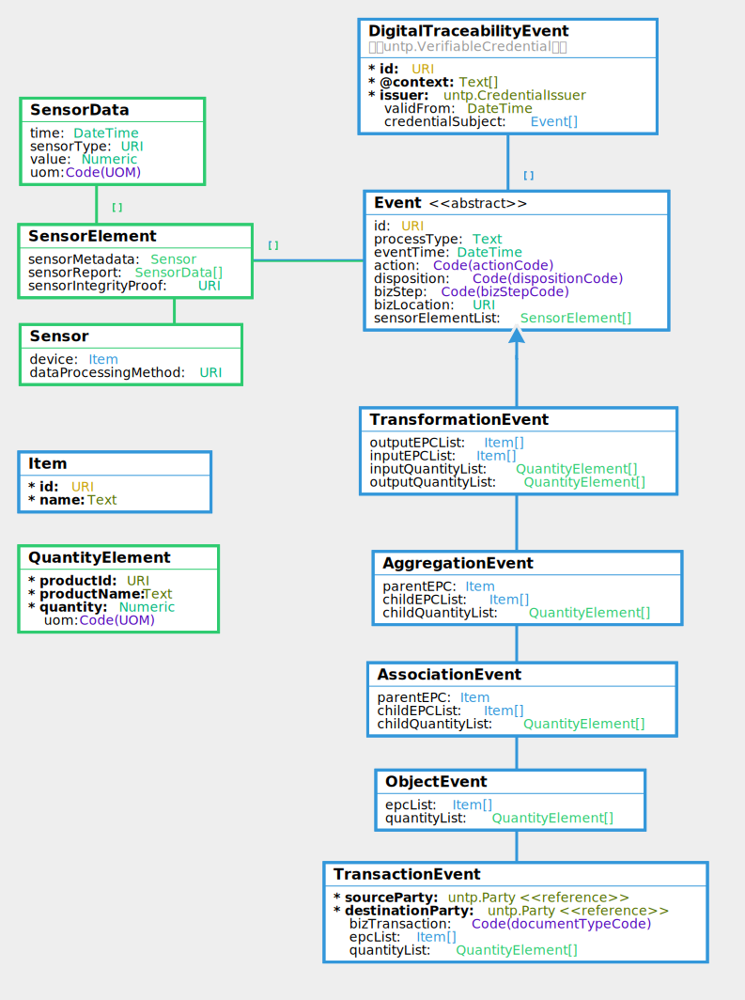

import Disclaimer from '../\_disclaimer.mdx';

<Disclaimer />

* **[Latest JSON-LD @context](https://test.uncefact.org/vocabulary/untp/dte/0/untp-dte-context-0.3.10.jsonld)**
* **[Latest JSON Schema ](https://test.uncefact.org/vocabulary/untp/dte/0/untp-dte-schema-0.3.10.json)**
* **[Sample Instance](../../samples/untp-digital-traceability-events-v0.3.9.json)**

## Versions

|Version|Date|status|changes|JSON-LD Context|JSON Schema|
|--|--|--|--|
|0.3.0|20-04-2024|Raw (for review)|Coming soon - fixing a bug| TBA|TBA|
|0.3.10|28-08-2024|Draft for pilot testing|Aligned with unto core, modified to support multiple events per credential|[context](https://test.uncefact.org/vocabulary/untp/dte/0/untp-dte-context-0.3.10.jsonld)|[schema](https://test.uncefact.org/vocabulary/untp/dte/0/untp-dte-schema-0.3.10.json|


## Overview

Traceability events are very lightweights collections of identifiers that specify the “what, when, where, why and how” of the products and facilities that constitute a value chain. The UNTP is based on the [GS1 EPCIS](https://www.gs1.org/standards/epcis) standard for this purpose because it is an existing and proven mechanism for supply chain traceability. Note that UNTP supports but does not require the use of GS1 identifiers. The basic idea behind the traceability event structure is that any supply chain of any complexity can always be accurately modeled using a combination of four basic event types. An **object** event describes an action on specific product(s) such as an inspection. A **transaction** event describes the exchange of product(s) between two actors such as sale of goods between seller and buyer. An **aggregation** event describes the consolidation or de-consolidation of products such as stacking bales of cotton on a pallet for transportation. An **association** event describes the assembly of sub-components to make a composite product. Finally, a **transformation** event describes a manufacturing process that consumes input product(s) to create new output product(s). The UNTP uses these events in a decentralised architecture as the means to traverse the linked-data "graph" that represents the entire value-chain.

## Conceptual Model


## Requirements

The traceability event is designed to meet the following detailed requirements as well as the more general [UNTP Requirements(https://uncefact.github.io/spec-untp/docs/about/Requirements)]

|ID|Name|Requirement Statement|Solution Mapping|
|--|--|--|--|
|TEV-01|Sub-components|The traceability event MUST provide a mechanism to trace from a DPP representing a product assembly to the individual DPPs of each sub-assembly component part|[Association Event](#associationevent)|
|TEV-02|Consumed materials|The traceability event MUST provide a mechanism to trace a manufactured product DPP back to the DPPs representing batches of input materials that are consumed in manufacturing one or more output products.|[Transformation Event](#transformation-event)|
|TEV-03|Aggregated bundles|When a DPP represents an aggregated bundle of similar items (eg a pallet of cotton bales) then the traceability event MUST provide a means to allocate the aggregate measures to each individual item (ie each bale)|[Aggregation Event](#aggregationevent)|
|TEV-04|Transportation|when a product (or consolidated consignment) is shipped from one physical location to another, the traceability event MUST provide a means to record the movement and associate sustainability measures such as transport emissions to the shipped bundle|[Transaction event](#transactionevent)|
|TEV-05|items or quantities|Traceability events MUST work equally well whether the input or output items are individually serialised items or measured quantities (mass or volume) of a product class.|[Items](#item) [Quantity](#quantityelement)|
|TEV-06|IoT Sensor data|Traceability events will often be generated by or associated with physical sensor readings. In such cases, the traceability event SHOULD support the association of sensor data with the event|[Sensor element](#sensorelement)|
|TEV-07|Time & Location|Traceability events MUST always record the timestamp and physical location of the event so that multiple events can be be connected in time and space|[Event](#event)|


## Logical Model



### Core Vocabulary Documentation

The [UNTP core types vocabulary](https://jargon.sh/user/unece/untp-core/v/0.3.10/artefacts/readme/render) defines the uniquely identified Linked Data entities such as Product, Location, Facility, Party, Standard, Regulation, Criteria, Declaration, Attestation, Endorsement. These entities provide the building blocks for construction of Digital Product Passports and Digital Conformity Credentials.


### DTE Documentation

The [UNTP Digital Traceability Events Vocabulary](https://jargon.sh/user/unece/traceabilityEvents/v/0.3.10/artefacts/readme/render) defines the core traceability event and it's variants including aggregation event, transformation event, association event, transaction event, and object event.

## Implementation Guidance

### Verifiable Credential

Please refer to [DPP VC Guidance](DigitalProductPassport.md#verifiable-credential)

### Traceability Event (Abstract)


### Transformation Event

```json
  "credentialSubject": [
    {
      "type": [
        "TransformationEvent",
        "Event"
      ],
      "id": "https://events.sample.com/b681df10-c682-454a-b11b-d0b9374c01bd",
      "eventTime": "2024-09-01T12:00:00",
      "action": "Add",
      "disposition": "https://ref.gs1.org/cbv/Disp-active",
      "bizStep": "https://ref.gs1.org/cbv/BizStep-commissioning",
      "bizLocation": "https://id.gs1.org/414/9520123456788",
      "sensorElementList":[..],
      "outputEPCList":[..],
      "inputQuantityList":[..],
      "processType": "https://textileIndustry.org/spinning"
  }
]
```

### Association Event


### Aggregation Event


### Transaction Event


### Object Event

```json
   "credentialSubject": [
    {
      "type": [
        "ObjectEvent",
        "Event"
      ],
      "id": "https://events.sample.com/b681df10-c682-454a-b11b-d0b9374c01bd",
      "eventTime": "2024-09-01T12:00:00",
      "action": "Add",
      "disposition": "https://ref.gs1.org/cbv/Disp-active",
      "bizStep": "https://ref.gs1.org/cbv/BizStep-commissioning",
      "bizLocation": "https://id.gs1.org/414/9520123456788",
      "sensorElementList":[..],
      "epcList":[..],
      "quantityList":[..]
  }
]
```

### Item

```json
      "epcList": [
        {
          "type": [
            "Item",
            "Entity"
          ],
          "id": "https://id.gs1.org/01/09520123456788/21/12345",
          "name": "EV battery 300Ah.",
          "registeredId": "90664869327",
          "idScheme": {
            "type": [
              "IdentifierScheme"
            ],
            "id": "https://id.gs1.org/01/",
            "name": "Global Trade Identification Number (GTIN)"
          }
        },
```

### Quantity Element

```json
      "quantityList": [
        {
          "product": {
            "type": [
              "Entity"
            ],
            "id": "https://id.gs1.org/01/09520123456788/21/12345",
            "name": "EV battery 300Ah.",
            "registeredId": "90664869327",
            "idScheme": {
              "type": [
                "IdentifierScheme"
              ],
              "id": "https://id.gs1.org/01/",
              "name": "Global Trade Identification Number (GTIN)"
            }
          },
          "quantity": 20,
          "uom": "KGM"
        },
```

### Sensor Element

```json
      "sensorElementList": [
        {
          "sensorMetadata": {
            "device": {
              "type": [
                "Item",
                "Entity"
              ],
              "id": "https://id.gs1.org/01/09520123456788/21/12345",
              "name": "EV battery 300Ah.",
              "registeredId": "90664869327",
              "idScheme": {
                "type": [
                  "IdentifierScheme"
                ],
                "id": "https://id.gs1.org/01/",
                "name": "Global Trade Identification Number (GTIN)"
              }
            },
            "dataProcessingMethod": "https://standards.org/sensorMethod#1234"
          },
          "sensorReport": [
            {
              "time": "2024-07-24T12:00:00",
              "sensorType": "https://samplesensors.com/model1234",
              "value": 25,
              "uom": "KGM"
            },
            {
              "time": "2024-07-24T12:00:00",
              "sensorType": "https://samplesensors.com/model1234",
              "value": 25,
              "uom": "KGM"
            }
          ],
          "sensorIntegrityProof": "https://jargon.sh"
        }
      ],
```

## Samples

