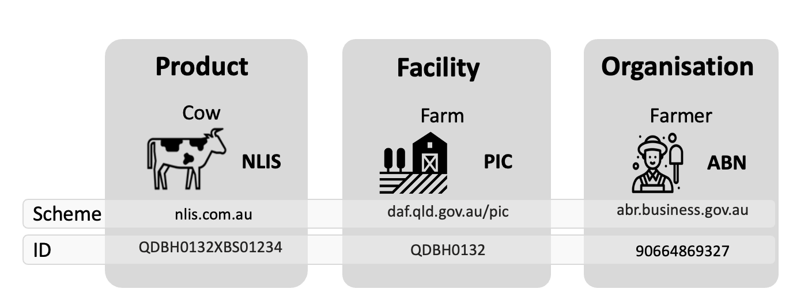
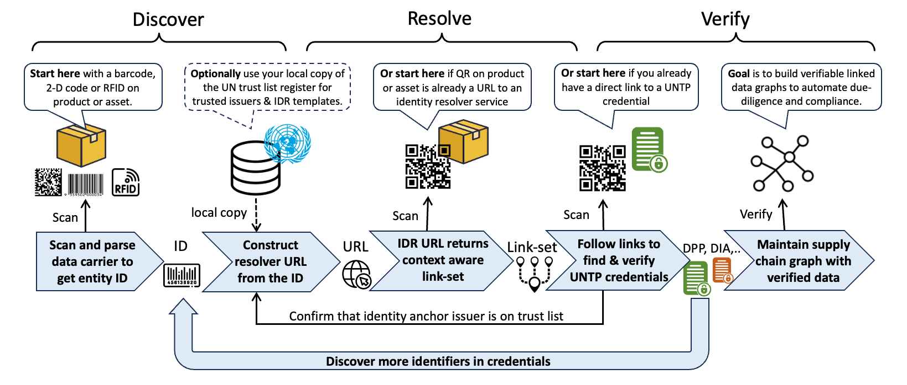
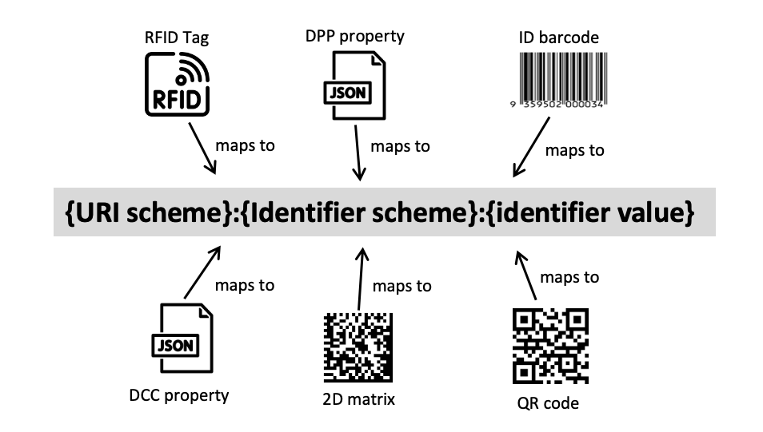

import Disclaimer from '../\_disclaimer.mdx';

<Disclaimer />

## Overview

Identifiers of **businesses** (eg tax registration numbers), of **locations** (eg google pins or cadastral/lot numbers), and of **products** (eg GS1 GTINs or other schemes) are ubiquitous throughout supply chains and underpin the integrity of the system. The diagram shows an example of a global and a local scheme for three types of entity. These are just a few of thousands of existing identifier schemes. UNTP builds upon existing identifier schemes without precluding the use of new schemes so that existing investments and high integrity registers can be leveraged. 

UNTP requires four key features of identifier schemes and, for those that don't already embody these features, provides a framework to uplift the identifier scheme to meet UNTP requirements. Identifiers used in UNTP implementations should be 

* **unique** so that there is no risk of collision with identifiers across different schemes,
* **discoverable** either as structured data in documents or easily read by scanning a barcode, QR code, or RFID, 
* **resolvable** so that, given an identifier, there is a standard way to find more data about the identified thing, and 
* **verifiable** so that ownership of the identifier can be verified so that actors cannot make claims about identifiers they don't control. 

## Conceptual Model

A fundamental UNTP principle is "given an ID of a thing, I can find verifiable data about that thing". This Identity Resolver (IDR) specification describes how this is achieved.

A typical IDR workflow is as follows.

1. Each item in an inbound shipment of supplies to a manufacturing facility is barcoded - using the same well known barcode scheme that has been in use for many years (so nothing special for UNTP). A barcode reader captures the identifier of an item - eg `1234567`.
2. The scanner system may already know how to construct a URL from the ID (eg following ISO-18975) or may lookup the scheme in a local copy of the UN global register of schemes. A resolver template such as `https://resolver.sample-scheme.org/{id}` can be used to replace `{id}` with the actual identifier to get `https://resolver.sample-scheme.org/1234567`.  
3. Calling the URL `https://resolver.sample-scheme.org/1234567` returns an [IETF link-set](https://datatracker.ietf.org/doc/rfc9264/) that includes many different links (also URLs), each with a specific type that may include a product safety data sheet, instruction manual, brand homepage, a digital product passport (DPP), and a digital conformity credential (DCC) link type. 
4. Following the DPP link yields a UNTP DPP credential which is verified to confirm integrity. The DPP includes several sustainability claims including the emissions footprint of the product, which the manufacturing facility can use to calculate the contribution of the received item to their scope 3 total. Following the DCC link type yields a conformity credential issued by a third party certifier that attests to the carbon intensity of the product. 
5. The DPP and DCC both include an issuer DID like `did:web:sample-supplier.com` and `did:web:sample-certifier.com` which resolve to DID documents that link to [digital identity anchor](DigitalIdentityAnchor.md) credentials confirming the identity of the supplier and certifier. The DPP also contains the ID of the manufacturing facility which can be resolved in the same way as the product ID (step 2) and therefore can be used to find facility level credentials such as fair work certificates. In this way a due-diligence [transparency graph](../design-patterns/TrustGraphs.md) can be created by the manufacturer, providing strong evidence of regulatory compliance and sustainability performance. 

The process is very flexible

* If instead of a barcoded item arriving at a manufacturing plant, it were a cow arriving at a processing plant, the same process would work using the livestock identifier encoded in the RFID tag on the cow's ear. The link-set would include a livestock passport which would, in turn, include the ID of the farm which could be used to find a deforestation credential for the farm. 
* If the supplier of goods to the manufacturer switched from 1D barcodes to QR codes at any time, then this just means that step 2 is not needed because the QR is already an IDR URL that will return a link-set.  
* If the barcode or QR is on a finished product and is scanned by a consumer in the EU using a smartphone then the link resolver can use `http` header user context information to return the DPP by default (with additional links as options) and in the language of the user settings. 

In this way, a single data carrier, whether a traditional barcode or a QR code, provides access to a wealth of further information which can be tailored to suit the user context - irrespective of whether the user is a human or a machine.

## Requirements

This section defines the formal requirement statements for Identity Resolver implementations. 

* **Scheme** means an identifier scheme such as a national business identifier scheme.
* **Carrier** means a machine readable device such as a barcode, QR code or RFID tag that encodes an identifier issued under a scheme.
* **Link** means a URL that points to a page or document or credential that contains further information related to the identifier.
* **Target** means the document or credential that the link references. 
* **link-set** means a collection of links with meta-data that describe each link.
* **Resolver** means an implementation of this specification that returns a link-set about a given identifier.

|ID|Name|Requirement|Solution Mapping|
|--|--|--|--|
|IDR-01|Global uniqueness|All identifiers, whether for products, assets, facilities, or businesses used in UNTP credentials MUST be globally unique so that they can be unambiguously referenced and resolved. |[Globally Unique Identifier Representation](#globally-unique-identifier-representation) |
|IDR-02|One carrier, many links|One data carrier on a physical product or asset MUST be able to reference any amount of linked data or documents so that user or system confusion from multiple carriers on products can be avoided|IDR Link-set |
|IDR-03|Leverage existing schemes|Existing identifier schemes MUST be usable for UNTP IDR functions so that existing investments can be leveraged and UNTP rollout can be accelerated because there is no need to re-tool existing identifier infrastructure.|ID Scheme register|
|IDR-04|Leverage existing carriers|Existing data carriers, whether 1D barcodes on products or RFID tags on livestock are entrenched and unlikely to change quickly. Therefore identity resolvers MUST be able to work with existing carriers so that digitalisation can proceed at pace without the need to re-tool existing physical scanning infrastructure.| |
|IDR-05|Seamless transition to 2D|As industry transitions from 1D barcodes to 2D/QR codes, the UNTP identity resolver process MUST work equally well with either so that implementers can transition at their own pace| |
|IDR-06|Understanding link-sets|When a link-set is returned by a resolver, each link MUST include sufficient meta-data so that user systems can understand the purpose and usage of each link as well as the relationship between links| |
|IDR-07|Filtering link-sets|Resolvers MUST allow users to request specific links, all links, or (if unspecified) then receive a default link - so that user experience can be optimised.| |
|IDR-08|Responsive links|Resolvers SHOULD leverage available user information such as language preferences to return tailored link-sets and default links - so that user experience is optimised.| |
|IDR-09|Logical grouping of links|Link-set meta-data SHOULD provide an ability to group related link targets such as a product passport and related traceability events - so that user experience can be optimised. | |
|IDR-10|Versioning of link targets|When multiple version of link targets exist (eg multiple version of a product passport) then resolvers MUST include version information in link metadata and MUST ensure that any defaults reference the latest version - so that users receive current information and can audit historical data| |
|IDR-11|Resolver redirection|Resolvers SHOULD, where available, include links that reference secondary resolvers so that product/facility owners can maintain additional document and credential links in their own resolvers. A typical example is the case where a global scheme maintains identifiers only at product class level but the manufacturer manages identifiers and related data at serialised item level. In such cases the primary resolver would say "here's what I know about the product and here's a link to another resolver that can tell you about the serialised item"| |
|IDR-12|Self-issued product identifiers|This specification MUST support self-issued identifiers so long as they are equally discoverable, resolvable, and verifiable - so that each value chain actor is free to make their own choice between third party product registers and self-managed product registers without any lock-in.| |
|IDR-13|Existing standards|This specification SHOULD use existing standards such as ISO-18975 or IETF RFC 9264 so that implementers can maximise re-use of existing infrastructure and maintain interoperability.| |

## Globally Unique Identifier Representation

Linked data architectures, of which UNTP is an example, depend on unique and consistent identifiers of entities such as product and facilities. For this reason [URIs](https://en.wikipedia.org/wiki/Uniform_Resource_Identifier) are heavily used as identifiers of entities throughout UNTP credential types. However, many existing identifier schemes do not have formally rigorous URI schemes. Most identifier schemes have a well defined structure for the identifier - for example an Australian Business Number is always an 11 numeric digit number including a check digit. A globally unique URI is conceptually easy to make by prefixing the registered ID with a unique scheme ID. However most identifier schemes do not have a consistent scheme identifiers. Furthermore, the same identifier can be represented in many different ways in data carriers, on paper, or in structured data. For example

* A 2D Matrix code might yield the string `0107332402265910211234567890240+A01=442.001-UP001T91456498765498765465432132168753` where `733240226591` is the product ID (with company prefix) and `1234567890` is the serial number
* An RFID Tag for the same product might yield a string like `urn:epc:tag:sgtin-96:1.7332402.026591.1234567890` where `7332402.026591` is the product ID and `1234567890` is the serial number.
* A QR code may may yield `https://id.sample-resolver.com/01/733240226591/21/1234567890` where `733240226591` is the product ID (with company prefix) and `1234567890` is the serial number.
* A structured document may contain properties such as `"productID":"733240226591"` and `"serialNumber":"1234567890"`.

The challenge is to ensure that all these different representations are mapped to a consistent globally unique identifier when building value chain transparency graphs. Failure to do so is likely to result in situations such as a product passport (DPP) making a sustainability claim about a specific product and a separately issued conformity credential (DCC) making third party assessments of the same product - but if the DPP and DCC represent the product URI differently then the claim and the independent assessment will not match. 

In this section, we define conventions for the representation of identifiers as URIs in UNTP credentials. 

### Uniform resource name (URN)

### Issuing Agencies
Issuing Agencies act as a root that manages an identifier space. Examples include the internet domain name system, Digital Object Identifiers (DOIs), Legal Entity Identifiers (LEIs) and GS1 identifiers. In all these examples, the eventual identifier is created by appending a locally-defined string on the end of a prefix that is managed by the issuing agency that takes *its* authority from a central root. A well-known example is ICANN, which is the root authority for the internet domain name system. By renewable contract, they issue ".com" to Verisign who then license individual domain names under .com to others (usually via intermediaries). The licensee then creates their URLs under that domain name. Because ICANN is solely responsible for the internet's domain name system, global uniqueness is assured.

The same principle applies in all managed identifiers. For LEIs, GLEIF acts as the root authority that gives prefixes to its Local Operating Unit who then issue specific identifiers and so on.

### ISO/IEC 15459 Issuing Agencies
In the world of Automatic Identification and Data Capture (barcoding etc), the ISO/IEC 15459 series of standards establishes a registry that acts as the root authority. Organisations that wish to issue identifiers that are intended to be encoded in barcodes and/or RFID tags are assigned a unique Issuing Agency Code that ensures their identifiers do not clash with any others. A further standard, ISO/IEC 15418, defines so-called *Data Identifiers* and *Application Identifiers* that "qualify" identifiers. It is this system that enables those Issuing Agencies to efficiently encode globally unique identifiers in optical and radio frequency data carriers without any duplication and for the print and scan industry to be able to create and interpret the barcodes and tags.

For example, the Data Identifier `2B` is for a *Gas Cylinder Container Identification Code assigned by the manufacturer in conformance with U.S. Department of Transportation (D.O.T.) standards*. The Application Identifier `01` is for a *Global Trade Item Number (GTIN)*. Data Identifiers are managed under the auspices of ANSI, Application Identifiers are managed by GS1.

### Generated identifiers
As an alternative to being issued, identifiers can be algorithmically-generated. The best-known example of this is the Universally-Unique Identifier (UUID). This relies on it being *extremely* unlikely, but not impossible, that the same identifier will be generated twice. For many practical applications, that can be "good enough" although there are many instances where duplicates have arisen (known as "collisions").

Decentralised Identifiers (DIDs) are also generated but the methods used vary significantly and typically depend on some piece of data that the originating person owns. This might be their private cryptographic key or some other extremely hard to guess piece of data. Collisions are all-but impossible but the identifiers are usually significantly longer. The most widely used DID method is "DID Web" which uses the owner's internet domain name as the basis for identification, thus mixing the issued and generated philosophies with one advantage being that the resulting DIDs are short. It's important to note though that the primary purpose of a DID is to provide a means of proving control over the identifier and, having done that, retrieving the DID owner's public cryptographic key.

## Discoverability

The term 'data carrier' applies to all 1- and 2-dimensional barcode symbols and radio frequency tags. A very large number of data carriers are in use, including proprietary ones tied to specific apps. For UNTP, the important data carriers are those defined by [ISO/IEC Joint Technical Committee 1, Steering Committee 31](https://www.iso.org/committee/45332.html). These include different types of linear symbol most people think of as 'a barcode', as well as [Data Matrix](https://www.iso.org/standard/80926.html), [QR Code](https://www.iso.org/standard/83389.html) and RFID tags. The standards for those data carriers do not define the type of identifier(s) that can be encoded so that, for practical purposes, it's necessary to also consider the origin and management of the identifiers to be encoded, the syntax to be used for that encoding, the devices and software necessary to print and read the data. It is this multi-layered complexity that makes "Automatic Identification and Data Capture" (AIDC) a professional activity in its own right.

Given this background, 'discoverability' itself has several aspects. It is reasonable to assume that someone inspecting goods in the course of their work will be equipped with a specialist device. This is always necessary for RFID tags, the principal advantage of which is that hundreds, if not thousands, of tags can be scanned within a given volume, even without line of sight. But be aware that the device needs to be running software that can interpret the data it receives. Handheld optical scanners are also in common use and these will typically be able to read a very wide variety of optical symbols. But again, the key question is whether or not the software can interpret the data read from the carrier. 

It hardly needs saying that the more standardized the identifiers and the encoding used, the more widely used the data carrier, and the more ubiquitous the software used to interpret the data read from the carrier, the more interoperable and therefore the more discoverable the identifiers will be. It is this kind of consideration that often leads industry to choose established identifier and data exchange systems such as that offered by GS1. That said, modern smartphones can read any almost any optical barcode and NFC tag *if* the user first opens an app that can interpret the data. This is true for proprietary data carriers and identifiers as well as standardized ones. Installing an app can readily turn a general-purpose smartphone into a specialist device. This opens up the option of using less-established identifier schemes and syntaxes including Decentralized Identifiers (DIDs). Then it's a question of whether the identifiers are equally discoverable at different points along the supply chain.

One case deserves special mention: a URL encoded in a QR Code. Almost all smartphone users can scan a QR Code just using the native camera app and, if the QR Code contains a URL, the Web browser will open the relevant Web page. This kind of identifier is therefore the most discoverable of all. That is, if a URL in the QR code is treated as the identifier then disoverability is a given. However, using a URL itself as the identifier brings some issues of its own. For example, over the medium to long term, many URLs suffer 'link rot' - that is, the URL no longer functions. Or if it does, it may lead to a Web page very different from the one originally intended. Furthermore, existing data exchange systems are likely to be built on short offline identifiers. ISO/IEC 18975 (currently a Draft International Standard) attempts to offer the best of both worlds by providing a means to encode existing identifiers into a data structure that is also a URL. Non-specialist software - notably a smartphone's camera app - can just read it like any URL. But specialist software can parse the URL to extract the identifiers used to identify products, batches and more.

## Resolvability
An identifier is nothing more than a string of characters. In isolation, it has no specific meaning. However, in most cases, the identifier will have a recognisable structure that gives a strong hint about its intended purpose and how it can be processed. In the context of UNTP, what's important is that the identifier can be *resolved* - that is looked-up online - and connected to a source of data, most notably, the identified entity's DPP. Approaches to resolving identifiers vary but a common feature is that it is typically a multi-stage process. Again taking the internet's domain name system as an example, an internet domain *resolves* to an IP address - the actual internet address of the server(s) that provide the content expected from that domain. 

Decentralised Identifiers *resolve* to a "DID Document" - a small piece of data that includes the public cryptographic key for the DID's controller and, optionally, a list of services related to that identitifier. At the time of writing, the established method for DID resolution is being formally standardised at W3C. An app is needed to recognise and resolve a DID, and to process the returned DID Document.

ISO/IEC (FDIS) 18975 defines a framework for resolving any existing identifier that is globally unique in its own right, most notably, those issued under the ISO/IEC 15459 series. It sets out two options for how those identifiers can be encoded in a regular HTTP URI (Web addrress), using Data Identifiers and Application Identifiers, and how that URI can resolve to a set of links to information about the identified entity. That [linkset](https://datatracker.ietf.org/doc/rfc9264/) can be operationalised in a resolver. This defines a framework for creating a simple query interface for any identified entity. ISO/IEC 18975 enables identity issuing agencies to develop conformant standards that specify the following:
* The identifiers can be encoded in a URL within a QR Code printed on a product that can be scanned just using a mobile phone's camera, without any need for a specialist app. The user can select the DPP from the list of available links to information (i.e. manually select the correct link from the linkset).
* The identifiers can be encoded in a URL within a QR Code printed on a product that can be scanned using a specialist app that queries the resolver and returns the DPP.

The [GS1 Digital Link](https://ref.gs1.org/standards/digital-link/uri-syntax/) and [GS1-Conformant resolver](https://ref.gs1.org/standards/resolver/) standards conform to ISO/IEC (FDIS) 18975.

## Verifiability 

UNTP credentials will include identifiers of products, locations or businesses.  UNTP credentials will also include ESG performance claims like emissions intensity values. But how can a verifier of these identifiers or ESG claims be confident that the claims are true and that they are made by the genuine party at a verifiable location? Trust anchors are national or international authorities that typically run existing business or product registration, certification, accreditation, or other high integrity processes. Examples of trust anchors include national regulators that govern things like land ownership or business registrations. Another example are the national accreditation bodies that audit and accredit certifiers to issue third party assessments. UNTP depends on trust anchors to add digital integrity to ESG claims and identities by linking them to the authority under which they are made. In essence, UNTP defines a protocol for existing trust anchors to continue doing what they have always done, but in a digitally verifiable way.
