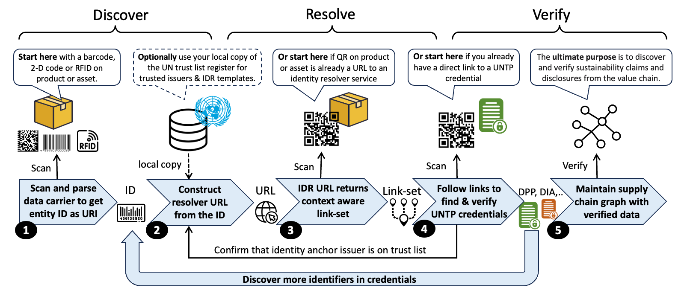
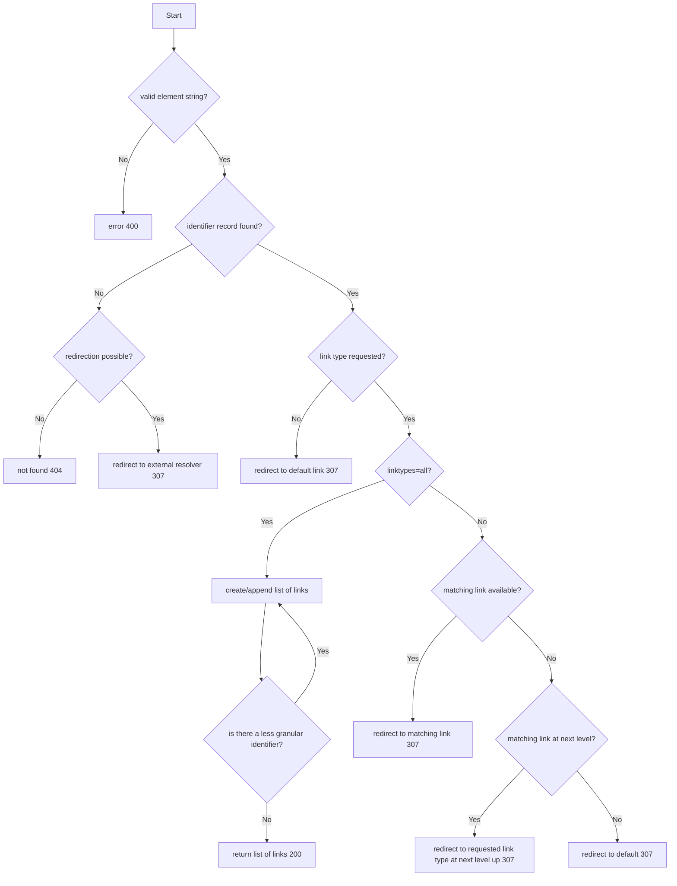

import Disclaimer from '../\_disclaimer.mdx';

<Disclaimer />

## Overview

Identifiers of **businesses** (eg tax registration numbers), of **locations** (eg google pins or cadastral/lot numbers), and of **products** (eg GS1 GTINs or other schemes) are ubiquitous throughout supply chains and underpin the integrity of the system. The diagram shows an example of a global and a local scheme for three types of entity. These are just a few of thousands of existing identifier schemes. UNTP builds upon existing identifier schemes without precluding the use of new schemes so that existing investments and high integrity registers can be leveraged. 


UNTP requires four key features of identifier schemes and, for those that don't already embody these features, provides a framework to uplift the identifier scheme to meet UNTP requirements. Identifiers used in UNTP implementations should be 

* **unique** so that there is no risk of collision with identifiers across different schemes,
* **discoverable** either as structured data in documents or easily read by scanning a barcode, QR code, or RFID, 
* **resolvable** so that, given an identifier, there is a standard way to find more data about the identified thing, and 
* **verifiable** so that ownership of the identifier can be verified so that actors cannot make claims about identifiers they don't control. 

## Conceptual Model

A fundamental UNTP principle is "given an ID of a thing, I can find verifiable data about that thing". This Identity Resolver (IDR) specification describes how this is achieved.



A typical IDR workflow is as follows.

1. Each item in an inbound shipment of supplies to a manufacturing facility is barcoded - using the same well known barcode scheme that has been in use for many years (so nothing special for UNTP). A barcode reader captures the identifier of an item - eg `1234567`.
2. The scanner system may already know how to construct a URL from the ID (eg following ISO-18975) or may lookup the scheme in a local copy of the UN global register of schemes. A resolver template such as `https://resolver.sample-scheme.org/{id}` can be used to replace `{id}` with the actual identifier to get `https://resolver.sample-scheme.org/1234567`.  
3. Calling the URL `https://resolver.sample-scheme.org/1234567` returns an [IETF link-set](https://datatracker.ietf.org/doc/rfc9264/) that includes many different links (also URLs), each with a specific type that may include a product safety data sheet, instruction manual, brand homepage, a digital product passport (DPP), and a digital conformity credential (DCC) link type. 
4. Following the DPP link yields a UNTP DPP credential which is verified to confirm integrity. The DPP includes several sustainability claims including the emissions footprint of the product, which the manufacturing facility can use to calculate the contribution of the received item to their scope 3 total. Following the DCC link type yields a conformity credential issued by a third party certifier that attests to the carbon intensity of the product. 
5. The DPP and DCC both include an issuer DID like `did:web:sample-supplier.com` and `did:web:sample-certifier.com` which resolve to DID documents that link to [digital identity anchor](DigitalIdentityAnchor.md) credentials confirming the identity of the supplier and certifier. The DPP also contains the ID of the manufacturing facility which can be resolved in the same way as the product ID (step 2) and therefore can be used to find facility level credentials such as fair work certificates. In this way a due-diligence [transparency graph](../design-patterns/TrustGraphs.md) can be created by the manufacturer, providing strong evidence of regulatory compliance and sustainability performance. 

The process is very flexible

* If instead of a barcoded item arriving at a manufacturing plant, it were a cow arriving at a processing plant, the same process would work using the livestock identifier encoded in the RFID tag on the cow's ear. The link-set would include a livestock passport which would, in turn, include the ID of the farm which could be used to find a deforestation credential for the farm. 
* If the supplier of goods to the manufacturer switched from 1D barcodes to QR codes at any time, then this just means that step 2 is not needed because the QR is already an IDR URL that will return a link-set.  
* If the barcode or QR is on a finished product and is scanned by a consumer in the EU using a smartphone then the link resolver can use `http` header user context information to return the DPP by default (with additional links as options) and in the language of the user settings. 

In this way, a single data carrier, whether a traditional barcode or a QR code, provides access to a wealth of further information which can be tailored to suit the user context - irrespective of whether the user is a human or a machine.

## Requirements

This section defines the formal requirement statements for Identity Resolver implementations. 

* **Scheme** means an identifier scheme such as a national business identifier scheme.
* **Carrier** means a machine readable device such as a barcode, QR code or RFID tag that encodes an identifier issued under a scheme.
* **Link** means a URL that points to a page or document or credential that contains further information related to the identifier.
* **Target** means the document or credential that the link references. 
* **link-set** means a collection of links with meta-data that describe each link.
* **Resolver** means an implementation of this specification that returns a link-set about a given identifier.

|ID|Name|Requirement|Solution Mapping|
|--|--|--|--|
|IDR-01|Global uniqueness|All identifiers, whether for products, assets, facilities, or businesses used in UNTP credentials MUST be globally unique so that they can be unambiguously referenced and resolved. |[Globally Unique Identifier Representation](#globally-unique-identifier-representation) |
|IDR-02|One carrier, many links|One data carrier on a physical product or asset MUST be able to reference any amount of linked data or documents so that user or system confusion from multiple carriers on products can be avoided|IDR Link-set |
|IDR-03|Leverage existing schemes|Existing identifier schemes MUST be usable for UNTP IDR functions so that existing investments can be leveraged and UNTP rollout can be accelerated because there is no need to re-tool existing identifier infrastructure.|ID Scheme register|
|IDR-04|Leverage existing carriers|Existing data carriers, whether 1D barcodes on products or RFID tags on livestock are entrenched and unlikely to change quickly. Therefore identity resolvers MUST be able to work with existing carriers so that digitalisation can proceed at pace without the need to re-tool existing physical scanning infrastructure.| |
|IDR-05|Seamless transition to 2D|As industry transitions from 1D barcodes to 2D/QR codes, the UNTP identity resolver process MUST work equally well with either so that implementers can transition at their own pace| |
|IDR-06|Understanding link-sets|When a link-set is returned by a resolver, each link MUST include sufficient meta-data so that user systems can understand the purpose and usage of each link as well as the relationship between links| |
|IDR-07|Filtering link-sets|Resolvers MUST allow users to request specific links, all links, or (if unspecified) then receive a default link - so that user experience can be optimised.| |
|IDR-08|Responsive links|Resolvers SHOULD leverage available user information such as language preferences to return tailored link-sets and default links - so that user experience is optimised.| |
|IDR-09|Logical grouping of links|Link-set meta-data SHOULD provide an ability to group related link targets such as a product passport and related traceability events - so that user experience can be optimised. | |
|IDR-10|Versioning of link targets|When multiple version of link targets exist (eg multiple version of a product passport) then resolvers MUST include version information in link metadata and MUST ensure that any defaults reference the latest version - so that users receive current information and can audit historical data| |
|IDR-11|Resolver redirection|Resolvers SHOULD, where available, include links that reference secondary resolvers so that product/facility owners can maintain additional document and credential links in their own resolvers. A typical example is the case where a global scheme maintains identifiers only at product class level but the manufacturer manages identifiers and related data at serialised item level. In such cases the primary resolver would say "here's what I know about the product and here's a link to another resolver that can tell you about the serialised item"| |
|IDR-12|Self-issued product identifiers|This specification MUST support self-issued identifiers so long as they are equally discoverable, resolvable, and verifiable - so that each value chain actor is free to make their own choice between third party product registers and self-managed product registers without any lock-in.| |
|IDR-13|Existing standards|This specification SHOULD use existing standards such as ISO-18975 or IETF RFC 9264 so that implementers can maximise re-use of existing infrastructure and maintain interoperability.| |


## Globally Unique Identifier Representation

### Linked Data Needs

Linked data architectures, of which UNTP is an example, depend on unique and consistent identifiers of entities such as product and facilities so that they can be matched across different credentials. For this reason [URIs](https://en.wikipedia.org/wiki/Uniform_Resource_Identifier) are heavily used as identifiers of entities throughout UNTP credential types. But without consistency in the way globally unique identifiers are constructed, there is a high risk that valuable links are not made. For example, consider the same product identified in two credentials:

* A digital product passport issued by a manufacturer with a sustainability claim about product `http://product.sample-register.com/123456789`
* A digital conformity credential with a third party sustainability assessment about product `urn:com:sample-register:product:123456789`

Although these are the same product, the construction of the ID is different and so a validation that attempts to confirm that a product passport claim is genuinely supported by third party assessment may fail.

There are thousands of identifier schemes in active use around the world and only a few have well defined conventions for consistnet representation of their identifiers as globally unique URIs. In this section, we define conventions for the consistent representation of identifiers that can be leveraged by any existing or new identifier scheme, whether the identifiers are managed by an issuing authority or self-managed.

### Uniform Resource Name (URN)

[URNs](https://en.wikipedia.org/wiki/Uniform_Resource_Name) are a type of URI that are designed to be used as globally unique and persistent identifiers that remain available long after a specific resource that they identify ceases to exist or becomes unavailable. URNs MAY be used for any identifier and SHOULD be used as persistent identifiers for long lived entities such as organisations, facilities and long-lived products. 

In patterns below, 

* `{identifier-scheme}` is any string of characters permitted in URN Namespace Specific Scheme (alphanumeric characters, hyphen ,period, underscore, colon). 
* `{identifier-value}` is the string of characters after the last colon (limited to alphanumeric characters, hyphen ,period, underscore).

#### For existing IANA registered URN namespaces 

Use your IANA registered [URN namespace](https://www.iana.org/assignments/urn-namespaces/urn-namespaces.xhtml).

* pattern `urn:{ns}:{identifier-scheme}:{identifier-value}` 
* examples:
  * `urn:epc:id:sgtin:1234567.089123.2`
  * `urn:lei:7LTWFZYICNSX8D621K86`

#### For all other schemes

Either register your own scheme with IANA or use the UN global trust register `gtr` URN namespace (IANA registration pending).

* pattern: `urn:gtr:{identifier-scheme}:{identifier-value}` where `gtr` represents the UN global trust register namespace.
* examples:
  * `urn:gtr:register.business.gov.xx:90664869327` - representing any typical national business registration number
  * `urn:gtr:nlis.com.au:QDBH0132XBS01234` - representing an Australian livestock identifier

The `gtr` namespace represents identifier schemes that are listed in the UN global trust register (GTR). When the `gtr` namespace is used, the `{identifier-scheme}` MUST be a DNS domain name comprising URN allowed or percent-encoded characters (ie no `/` unless encoded as `%2F`).

### Uniform Resource Locator (URL)

[URLs](https://en.wikipedia.org/wiki/URL) are a type of URI that represent addressable web locations. URLs as identifiers have the advantage that they are immediately resolvable but the disadvantage that they may become dead/broken links whenever a document is moved or a web site is restructured or a domain name changes. 

#### IDR URLs as identifiers

When URLs are used as identifiers in UNTP credentials they SHOULD be Identity Resolver URLs that conform to the ISO-18975 structured path syntax without parameters. 

* pattern: `https://{identifier-scheme}/{identifier-value}` where `{identifier-scheme}` is a DNS domain name (without `/` characters unless `%2F` encoded) and `{identifier-value}` is a valid ISO-18975 path (which can include `/` characters to separate class, sub-class, and instance id as defined in ISO-18975) 
* examples:
  * `https://products.sample-company.com/1234567`
  * `https://facilities-register.com/ABC123456`
  * `https://example.com%2F01/733240226591`
  * `https://example.com%2F01/733240226591/21/1234`

When a given identifier scheme uses both URN and URL mechanisms to represent identifiers as URIs then the `{identifier-scheme}` part SHOULD be the same for both. If the identifier scheme is registered in the UN global trust register then the `{identifier-scheme}` MUST match the corresponding scheme ID in the trust register. 

### Decentralised Identifiers (DID)

Decentralised Identifiers [(DIDs)](https://en.wikipedia.org/wiki/Decentralized_identifier) are a type of URI that are resolvable and verifiable by design.  They are self-issued by any party and do not depend on any central register or issuing authority. The general structure of a DID is defined by the [W3C Decentralised Identifiers recommendation](https://www.w3.org/TR/did-core/) as

* DID pattern: `did:{did-method}:{did-method-specific-identifier}`

The allowed structure of the `{did-method-specific-identifier}` depends on the `{did-method}`. There are a number of registered did methods including several blockchain based methods but the most widely used DID method is [did:web](https://w3c-ccg.github.io/did-method-web/)

* DID Web pattern: `did:web:{domain-name}[:{path}]` where `:path` is an optional colon-delimited path to the identifier.
* examples:
  * `did:web:sample-company.com` - representing the DID of sample-company.com
  * `did:web:sample-company.com:products:123456789` - representing the DID of a product made by sample-company.com
 
### Universally Unique Identifier (UUID)

As an alternative to being issued by an issuing agency, identifiers can be algorithm-generated. The best-known example of this is the Universally-Unique Identifier (UUID). This relies on it being *extremely* unlikely, but not impossible, that the same identifier will be generated twice. For many practical applications, that can be "good enough" although there are some instances where duplicates have arisen (known as "collisions"). 

#### UUIDs as the complete identifier

When using a UUID as the identifier for an entity, the syntax would be

* pattern: `uuid:{UUID}`
* example: `uuid:709f3df6-4cdf-4bda-94d9-ce0ec9428616`

Such identifiers have no scheme information which could be used for resolvability and verifiability. Therefore usage SHOULD be limited to cases where there is no need for discovery of further data.  

#### UUIDs as the scheme specific identifier value

UUIDs can be useful as scheme specific identifiers, particularly when there is value in the identifier being un-guessable.  For example as a means to limit visibility of item specific data to the genuine holder of the goods - as described in the [UNTP Decentralised Access Control](DecentralisedAccessControl#item-identifier-as-shared-secret) specification.

* pattern: `{uri-scheme}:{identifier-scheme}[:or/]{UUID}`
* examples: 
  * `urn:gtr:products.sample-register.com:709f3df6-4cdf-4bda-94d9-ce0ec9428616`
  * `https://products.sample-register.com/709f3df6-4cdf-4bda-94d9-ce0ec9428616`

## Discoverability

This section describes the challenges and solutions in the first step of the [identity resolver conceptual model](#conceptual-model) - from an identifier encoded in some kind of data carrier to a consistent URI representation. UNTP does not define any new data carrier standards but rather aims to support any existing or future scheme. 

### Data Carriers

The term "data carrier" covers all 1D and 2D barcode symbols and RFID tags. Many exist, including proprietary ones, but for UNTP, the recommended carriers are those defined by [ISO/IEC JTC 1/SC 31](https://www.iso.org/committee/45332.html), such as linear barcodes, [Data Matrix](https://www.iso.org/standard/80926.html), [QR Codes](https://www.iso.org/standard/83389.html), and RFID. While these standards define the carrier format, they do not dictate identifier types, encoding syntax, or required devices, making "Automatic Identification and Data Capture" (AIDC) a specialized field.

**Discoverability** depends on equipment and software. RFID requires specialist readers, capable of scanning multiple tags without line of sight. Optical scanners can read various barcodes, but their software must interpret the data correctly. The more standardized the identifiers and encoding, the more interoperable and discoverable they are, leading industries to favor established systems.

Modern smartphones can read most optical barcodes and NFC tags via apps, enabling decentralized identifiers (DIDs) and alternative schemes. However, **QR Codes with URLs** are the most discoverable, as native camera apps can instantly open links. Yet, URL-based identifiers pose risks like "link rot" and incompatibility with offline systems. [ISO/IEC 18975](https://www.iso.org/standard/83389.html) addresses this by embedding structured identifiers within URLs, balancing broad accessibility with specialist data use.

In **Automatic Identification and Data Capture (AIDC)**, the **ISO/IEC 15459** series establishes a registry for short codes in data carriers. Organizations issuing barcode and RFID identifiers receive a unique **Issuing Agency Code** to prevent conflicts.  **ISO/IEC 15418** defines **Data Identifiers (DIs)** and **Application Identifiers (AIs)**, which qualify identifiers, ensuring globally unique encoding in optical and RFID data carriers.  

For example:  
- **DI `2B`** identifies gas cylinders per U.S. D.O.T. standards.  
- **AI `01`** represents a **Global Trade Item Number (GTIN)**.  

DIs are managed by **ANSI**, while AIs fall under **GS1**.

### Mapping to consistent URIs

A key challenge is to ensure that all these different data carrier representations are mapped to a consistent globally unique identifier when building value chain transparency graphs. 

* A 2D Matrix code might yield the string `0107332402265910211234567890240+A01=442.001-UP001T91456498765498765465432132168753` where `733240226591` is the product ID (with company prefix) and `1234567890` is the serial number
* An RFID Tag for the same product might yield a string like `urn:epc:tag:sgtin-96:1.7332402.026591.1234567890` where `7332402.026591` is the product ID and `1234567890` is the serial number.
* A QR code may may yield `https://id.sample-resolver.com/01/733240226591/21/1234567890` where `733240226591` is the product ID (with company prefix) and `1234567890` is the serial number.


Existing data carrier schemes are very varied but usually well documented. Therefore it is reasonable to expect that scanners will be aware of the context and will include scheme specific logic to read the data carriers and construct UNTP standard URNs or URIs to match against identifiers using in credentials such as digital product passports.  

For new identifier schemes or existing schemes that have not already defined data carrier specifications, UNTP implementers SHOULD

* directly encode the UNTP URN structure into 2D matrix codes and RFID tags.
* directly encode the UNTP URL structure into QR codes.

## Resolvability

This section describes the challenges and solutions in the second and third steps of the [identity resolver conceptual model](#conceptual-model) - from a consistent URI representation of an identifier to a [link-set](https://datatracker.ietf.org/doc/rfc9264/) about the identified entity. In the context of UNTP, that means easily resolving a product or facility identifier to credentials such as the identified product's DPP or the identified facility's DFR. 

ISO/IEC (FDIS) 18975 defines a framework for resolving any existing identifier that is globally unique in such as those issued under the ISO/IEC 15459 series. It sets out two options for how those identifiers can be encoded in a regular HTTP URI (Web addrress), using Data Identifiers and Application Identifiers, and how that URI can resolve to a set of links to information about the identified entity. That [linkset](https://datatracker.ietf.org/doc/rfc9264/) can be operationalised in a resolver. This defines a framework for creating a simple query interface for any identified entity. 

This UNTP identity Resolver (IDR) specification builds upon these existing standards by defining some specific constraints that improve interoperability and meet UNTP specific requirements.

### Identity Resolver Example

#### IDR Query URL

IDR queries are URLs that take the general form

`https://{domain}/{path}?{query}` where

* `domain` is the web domain of the resolver service, usually operated by the identifier scheme register - eg `resolver.sample-register.com`
* `path` carries the specific ID of the product or facility being queried and may include qualifiers - eg `products/ABCD9876/items/1234`
* `query` contains a list of URL parameters that are used to filter the response - eg `linkType=untp:dpp&language-en`

A typical IDR query might be something like this

`https://resolver.sample-register.com/products/ABCD9876/items/1234?linkType=all` 

which is requesting

* all link types 
* about a product class `ABCD98765`
* issued by identifier scheme `sample-register.com`
* with specific serial number `123456789` 

To get a different response, the query might be modified as follows

* `https://resolver.sample-register.com/products/ABCD9876?linkType=all` to get data about the product class only, not a specific serialised item.
* `https://resolver.sample-register.com/products/ABCD9876/items/1234?linkType=untp:dpp` to get only the DPP for the item.
* `https://resolver.sample-register.com/products/ABCD9876/items/1234?linkType=all&language=de` to get all links to German language targets.
* `https://resolver.sample-register.com/products/ABCD9876/items/1234` to get a redirect to the target of the `default` link.

#### IDR LinkSet Response

The response to an IDR query is an IETF `linkset` which contains one or more `contexts`, each of which contain one or more `targets`.

* a context describes what the links are about using the `anchor` property. Often there is only one `anchor` that represents the requested `identifier`. But as described in the [resolver workflow](#resolver-service-workflow), a resolver may return links about related entities. For example a query about a specific serialised item may return some links about the item, and some links about the product class, and even some links about the manufacturer or brand that sells the product. 
* a target describes a specific link identified with the `href` property together with other properties that provide useful meta-data about the link. 

A typical response the the sample query `https://resolver.sample-register.com/products/ABCD9876/items/1234?linkType=all` might be as shown in the snippet below. 

* there are two `contexts`, one is at serialised item level `"anchor": "https://resolver.sample-register.com/products/ABCD9876/items/1234"` and one is at product class level `"anchor": "https://resolver.sample-register.com/products/ABCD9876"`. 
* the first context has two `targets`, both of which have a linkType "untp:dpp" (UNTP digital product passports) and MIME type "application/vc+jwt" but one is rendered in German and the other in English.
* the second context is at product and has one target which points to the manufacturers product information web page. THis highlights that link resolvers can return all kinds of relevant links, only some of which point to UNTP credentials.

```json
{
    "linkset": [
        {
            "anchor": "https://resolver.sample-register.com/products/ABCD9876/items/1234",
            "link": [
                {
                    "href": "https://sample-credential-store.com/credentials/dpp/90664869327.json",
                    "rel":["untp:dpp"],
                    "type": "application/vc+jwt",
                    "title": "Digital Product Passport",
                    "hreflang":["en"]
                 },
                {
                    "href": "https://sample-credential-store.com/credentials/dpp/90664869311.json",
                    "title": "Digitaler Produktpass",
                    "hreflang":["de"],
                    "type": "application/vc+jwt"
                 }
            ]
        },
        {
            "anchor": "https://resolver.sample-register.com/products/ABCD9876",
            "link": [
                {
                    "href": "https://sample-company.com/productInformation/ABCD9876",
                    "rel": ["gs1:pip"],
                    "type": "text/html",
                    "title": "Product Information"
                 }
            ]
        },
    ]
} 
```

### Creating the IDR Query URL

There are several forms in which an identifier might be discovered (eg as a data carrier on a physical product or as a URI in a structured document). The identifier representation format is often not an IDR query URL and so may need to be translated into an IDR URL query format. As shown in the [conceptual model](#conceptual-model), the generalised process to derive an IDR query URL has two steps

* Map the native format found in a data carrier to a consistent global URI as described in the [globally unique identifier representation](#globally-unique-identifier-representation) section. 
* Map the global URI to an IDR query string as described in the following paragraphs.  

This mapping architecture is designed to ensure that UNTP can accommodate any new or existing identifier scheme and any data carrier and still maintain linked data consistency (ie consistent URI representation) as well as resolvability and verifiability of identifiers.  

#### From a URN to IDR linkset

The UN global trust register will include resolver templates for each scheme and so the UNTP requirement that identifiers be resolvable is met by substituting the URN `{identifier-value}` into the `{id}` placeholder in the resolver template related to the matching `{identifier-scheme}`. For example

* given a URN ID of `urn:gtr:nlis.com.au:QDBH0132XBS01234`, the `{identifier-scheme}` is `nlis.com.au`
* and a resolver template of `https://resolver.nlis.com.au/{id}`  is registered for scheme `nlis.com.au`
* then the resolver URL would be `https://resolver.nlis.com.au/QDBH0132XBS01234` which would return an [IDR LinkSet](#idr-linkset-response)

#### From a URL to IDR linkset

As described in [IDR URLs as identifiers](#idr-urls-as-identifiers), URL identifiers SHOULD already be Identity Resolver URLs that conform to the ISO-18975 structured path syntax without parameters. Client applications may of course add parameters to the URL before calling the resolver service to get more specific link sets. 

#### From a DID to IDR linkset

By design, all DIDs resolve to a URL that addresses a DID document. The way in which a DID resolved to a DID document is specific to the DID method. In the case of DID web, the resolution works by replacing ":" with "/" and appending "did.json".  

* DID : `did:web:sample-company.com:products:123456789` is an example of a product identifier the did:web scheme.
* URL : `https://sample-company.com/products/123456789/did.json` would be the URL of the DID document according to [did:web method specification](https://w3c-ccg.github.io/did-method-web/)

The DID document `did.json` has a standard data model defined by the W3C DID recommendation [core properties](https://www.w3.org/TR/did-core/#core-properties).  It is primarily designed to define the cryptographic methods by which control of a DID can be verified, including associated public keys. The DID [service](https://www.w3.org/TR/did-core/#services) property can be used to reference further information such as UNTP credentials like a digital product passport. The UNTP approach to using a DID document as a resolver service combines conformant use of DID `service` properties with maximum alignment with IETF linksets. 

* The DID document `service.id` property is the same as the linkset `anchor` property with the optional `#fragment` suffix to ensure that `service.id`is unique.
* The DID document `service.type` property is the same as the linkset linkType value.  
* The DID document `service.serviceEndpoint` property is exactly the same as the the linkset `target` object.  

```json
{
  "id": "did:web:sample-company.com:products:123456789",
  ..other did document properties ..
  "service": [{
    "id":"did:web:sample-company.com:products:123456789#untp:dpp",
    "type": "VerifiableCredentialService", 
    "serviceEndpoint": {
          "href": "https://sample-credential-store.com/credentials/dpp/90664869327.json",
          "rel": ["untp:dpp"],
          "title": "Digital Product Passport",
          "hreflang":["en"],
          "type": "application/vc+jwt"
     },
    "id":"did:web:sample-company.com:products:123456789#untp:idr",
    "type": "linkset", 
    "serviceEndpoint": {
          "href": "https://resolver.sample-company.com/products/123456789",
          "rel": ["linkset","untp:idr"],
          "title": "Identity Resolver Service",
          "type": "application/linkset+json"
     }
  }]
}
```

The example above shows two ways of using the DID document serviceEndpoint as an identity resolver service.

* The first target references a UNTP DPP credential directly.
* The second target references a resolver service end point which itself would return a linkset.  

In this way, simple scenarios can be achieved simply by placing link targets directly in the DID document whilst richer and more dynamic link resolver services can also be delivered by including a DID document service which is itself a link resolver. 

### LinkSet Response Variations

This section covers specific linkset use cases that SHIULD be supported by conforming link resolvers. The general approach to solving linkset specific needs is 

* Where possible, always use IETF linkset standard properties and IANA standard link types.
* Where necessary, use custom link types and linkset properties but always define them in a public vocabulary and reference them using a profile link type.

#### Defaults

Default link types allow a resolver to return just the target URL of the default link - which means that client applications (including just a camera on a mobile phone) need not have any knowledge of link resolvers and how they work.  

Link resolver services SHOULD define DEFAULT linktype for each `anchor` which defines the `href` target to which a client will be redirected when no linkType is specified in the matching query URL. In the previous [IDR example](#identity-resolver-example), calling the resolver URL without a linkType parameter;

`https://resolver.sample-register.com/products/ABCD9876/items/1234?linkType=all`

Would redirect the client directly to the target `href` of the default link type

`https://sample-credential-store.com/credentials/dpp-90664869327.json`

#### Automatically Returning The Right Language

HTTP headers often contain `accept` header properties that can be useful hints for link resolver behaviour. For example browsers will normally include a language accept header that matches the users configured preference. This can be used to return only those links that match the users language even if the IDR query string does not specify a preference. For example, consider an IDR that 

* defines a default link type as `untp:dpp`
* maintains DPP links in a dozen languages 

and receives the following HTTP query URL

```http
GET /products/123456789 HTTP/1.1
Host: resolver.sample-company.com
Accept-Language: de
```

Even though there are a dozen DPP links maintained by the IDR service, only one of them is in German and so the IDr can again redirect the client to the specific target URL of the German language DPP. 

`https://sample-credential-store.com/credentials/dpp-90664869311.json`

#### Secondary Resolvers

There are some cases where an identifier scheme owner manages identifiers at a coarse granularity by issuing globally unique prefixes but allows the subject to manage more fine grained identifiers themselves. For example

* GS1 maintains GTIN (product identifiers in a single global register but management of SGTIN (serialised items) is left to the owner of the GTIN.
* IATA issues 3 character carrier identifiers but allows each carrier to add the 7 digit suffix for each cargo consignment to make a globally unique 11 digit consignment number. 
* Australian government manages 8 alpha-numeric character farm identifications codes such as `QDBH0132` and allows each farmer to add a unique suffix to identify each unique livestock animal born on the farm.
* and many more examples exist.

The result is that a client may construct an IDR query to the genuine scheme operator's IDR service but that service may not hold information at the requested granularity. In such cases, a conformant IDR SHOULD return links relevant to the more coarse grained item and, if available, a link to a secondary resolver service (eg hosted by the serialised product manufacturer) that can return more fine grained information. For example the following query to a link resolver about a serialised item

`https://resolver.sample-register.com/products/ABCD9876/items/1234`

May return a link to a secondary resolver that maintains data at serialised item level as well as a link to a DPP at product class level. 

```json
{
    "linkset": [
        {
            "anchor": "https://resolver.sample-register.com/products/ABCD9876/items/1234",
            "link": [
                {
                    "href": "https://resolver.sample-company.com/products/ABCD9876/items/1234",
                    "rel": ["linkset", "untp:idr", "gs1:handledBy"],
                    "title": "Secondary Identity Resolver",
                    "hreflang":["en"],
                    "type": "application/linkset+json"
                 }
            ]
        },
        {
            "anchor": "https://resolver.sample-register.com/products/ABCD9876",
            "link": [
                {
                    "href": "https://sample-credential-store.com/credentials/dpp/90664869327.json",
                    "rel":["untp:dpp"],
                    "title": "Digital Product Passport",
                    "hreflang":["en"],
                    "type": "application/vc+jwt"
                 }
            ]
        },
    ]
} 
```

#### Versioned Targets

In some cases, a publisher may wish to maintain multiple versions of a credential as available links in a linkset. The recommended method is to add the relevant IANA version link relation to the `rel` value array as shown in the example below. In this case there are two links for the same anchor, both include `untp:dpp` as a link relation value but one also has the IANA link relation `predecessor-version`

```json
{
    "linkset": [
        {
            "anchor": "https://resolver.sample-register.com/products/ABCD9876",
            "link": [
                {
                    "href": "https://sample-credential-store.com/credentials/dpp/90664869327.json",
                    "rel":["untp:dpp"],
                    "title": "Digital Product Passport",
                    "hreflang":["en"],
                    "type": "application/vc+jwt"
                 },
                {
                    "href": "https://sample-credential-store.com/credentials/dpp/90664869111.json",
                    "rel":["untp:dpp","predecessor-version"],
                    "title": "Digital Product Passport",
                    "hreflang":["en"],
                    "type": "application/vc+jwt"
                 }
            ]
        }
    ]
} 
```

#### Creating New Links

In some cases, an identity resolver service may wish to accept updates such as creation of new links from appropriately authorised users. For example, adding a maintenance event to a battery passport record after the battery has been sold into the market. An identity resolver SHOULD accommodate this possibility by including a link in the linkset for the given product that specifies how to POST an event to the resolver. In the example below, an `anchor` representing product `https://resolver.sample-register.com/products/ABCD9876` has two links. The first is a simple link to a DPP describing the product. The second describes a method to create a new maintenance event.

* The standard IANA link relation `edit` indicates that the target resource is used to edit the link's context. 
* The custom link relation `untp:dte` indicates that the target expects a digital traceability event.
* The custom property `method` indicates that the HTTP header requires a POST method and a secret key in the `X-API-Key` HTTP header property.

```json
{
    "linkset": [
        {
            "anchor": "https://resolver.sample-register.com/products/ABCD9876",
            "link": [
                {
                    "href": "https://sample-credential-store.com/credentials/dpp/90664869327.json",
                    "rel":["untp:dpp"],
                    "title": "Digital Product Passport",
                    "hreflang":["en"],
                    "type": "application/vc+jwt"
                 },
                {
                    "href": "https://sample-credential-store.com/credentials/dte",
                    "rel":["edit","untp:dte"],
                    "title": "Create Maintenance Event",
                    "method":["POST","X-API-Key"],
                    "type": "application/vc+jwt"
                 }
            ]
        }
    ]
} 
```

#### Secure Targets

In some cases the target of a link contains sensitive data that is not generally accessible to the public. In such cases, as described by the [decentralised access control](DecentralisedAccessControl.md) specification, the target of the link is encrypted and requires a decryption key or proof of authorised role to decrypt. The corresponding link in the resolver linkset SHOULD specify the encryption method and allowed list of access roles. 

```json
{
    "linkset": [
        {
            "anchor": "https://resolver.sample-register.com/products/ABCD9876",
            "link": [
                {
                    "href": "https://sample-credential-store.com/credentials/dpp/90664869327.json",
                    "rel":["untp:dte"],
                    "title": "Product Traceability",
                    "encryptionMethod": "AES-128",
                    "accessRole":["untp:accessRole#Owner"],
                    "hreflang":["en"],
                    "type": "application/vc+jwt"
                 }
            ]
        }
    ]
} 
```

### Resolver Service Workflow

The internal workflow of an identity resolver service is not defined by this specification. However, there are some common conditions that a link resolver service SHOULD manage consistently. For example

* When a query URL is not valid
* When there is no data for the requested entity ID.
* When there is no data for an item level ID but there are available links for product class level ID
* When a requested link type does not exist.

These cases are shown in the example resolver workflow diagram below.




## Verifiability 

TBD - update this section, referencing VCP and DIA as well as verifiying graphs

UNTP credentials will include identifiers of products, locations or businesses.  UNTP credentials will also include ESG performance claims like emissions intensity values. But how can a verifier of these identifiers or ESG claims be confident that the claims are true and that they are made by the genuine party at a verifiable location? Trust anchors are national or international authorities that typically run existing business or product registration, certification, accreditation, or other high integrity processes. Examples of trust anchors include national regulators that govern things like land ownership or business registrations. Another example are the national accreditation bodies that audit and accredit certifiers to issue third party assessments. UNTP depends on trust anchors to add digital integrity to ESG claims and identities by linking them to the authority under which they are made. In essence, UNTP defines a protocol for existing trust anchors to continue doing what they have always done, but in a digitally verifiable way.


