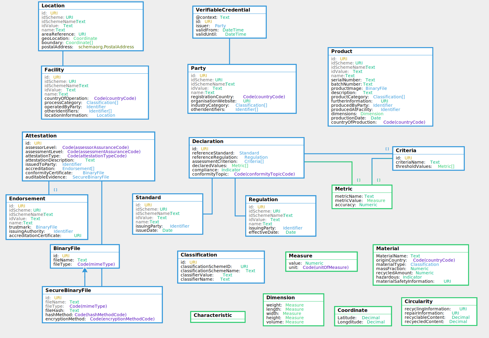

import Disclaimer from '../\_disclaimer.mdx';

<Disclaimer />

## Artifacts 

Are maintained at https://test.uncefact.org/vocabulary/untp/core/0/about

### Stable Releases For Implementation

Version 1.0 stable release for production implementation is due Jan 2025

### Release for Pilot Testing

UNTP Core Vocabulary version 0.5.0 release artifacts can be used for pilot testing.  

* [JSON-LD @context](https://test.uncefact.org/vocabulary/untp/core/0.5.0/)
* [JSON-LD Vocabulary](https://test.uncefact.org/vocabulary/untp/core/0/about)

Note that the vocabulary is accessible either in human readable form or machine readable form via the same URL - but with different accept header:

curl https://test.uncefact.org/vocabulary/untp/core/0/ -H 'Accept: application/ld+json'

### Latest Development Version

Latest development versions are used to reflect lessons learned from pilots but should not be used for either pilot testing or production purposes. 

### Version History

History of releases is available from the **[Version history](https://test.uncefact.org/vocabulary/untp/core/0/versions)** page.


## Overview

Web **vocabularies** are a means to bring consistent understanding of **meaning** to ESG claims and assessments throughout transparent value chains based on UNTP. There are hundreds of ESG standards and regulations around the world, each with dozens or hundreds of specific conformity **criteria**. Any given value chain from raw materials to finished product is likely to include dozens of passports and conformity credentials issued against any of thousands of ESG criteria. Without a consistent means to make sense of this data, UNTP would provide a means to discover a lot of data but no easy way to make sense of it. This specification describes a consistent way to structure sustainability claims (in product passports and facility records) as well as sustainability assessments (in conformity credentials). It also provides guidance to scheme owners about how to make their sustainability standards compatible with linked data digitalisation. 

## Conceptual Model

The diagram shows how the sustainability vocabulary catalog works with UNTP credentials such as product passports, facility records, and conformity credentials to bring unambiguous meaning to sustainability claims and assessments. 

* Schemes (Grey): There are thousands of national regulations and industry standards that address sustainability of products, facilities, and organisations. Each one typically contains multiple auditable criteria. These are governed by the the government or industry authorities that define them.  UNTP does not seek to create any new schemes or regulations but rather to provide a means to ensure that these standards and regulations can be unambiguously referenced by digital credentials. This requires each individual criteria to have a globally unique identifier (a URI). 
* DPP / DFR (green): The UNTP digital product passport (DPP) provides a means for a manufacturer or brand owner to list multiple sustainability claims for a given identified product. Similarly a UNTP digital facility record (DFR) provides the same capability but for facilities such as farms, mine-sites, processing plants, or manufacturing sites. Each claim may reference a sustainability criteria defined by a regulator or an industry standard.  
* DCC (brown): The UNTP digital conformity credential (DCC) provides a means for a second or third party to list independent assessments of specific products or facilities against the same conformity criteria. For a DCC to verifiably support a claim in a DPP, the identifier of the criteria and supporting regulation / standard must match. Therefore it is important that both the manufacturer issuing the DPP and the auditor issuing the DCC use the same identifier for the sustainability criteria.  


The purpose of the sustainability vocabulary catalog (SVC) is to reduce the risk of misalignment between claims in DPPs and assessments in DCCs and also to provide a way to group similar criteria across different schemes. The SVC has three components

* A catalog of schemes with relevant metadata including geographic coverage, industry sector, and governance type.
* A recommended naming convention for criteria URIs that may be used by scheme owners to define their criteria identifiers (URIs).
* A sustainability typology that can be used to classify criteria from different schemes. 


## Claims and Assessments

The UNTP core vocabulary defines the uniquely identified linked data entities such as Product, Location, Facility, Party, Standard, Regulation, Criteria, Declaration, Attestation, Endorsement. These entities provide the building blocks for construction of Digital Product Passports and Digital Conformity Credentials.

* A [Digital Product Passport](DigitalProductPassport.md) is a set of declarations (claims) against sustainability criteria defined in regulations or standards - made by a manufacturer party about a given product that is manufactured at a facility in a defined location.
* A [Digital Conformity Credential](ConformityCredential.md) is an attestation made by an endorsed conformity assessment body - which includes one or more assessments of a list of identified products or facilities against specific criteria.

Although these two credential types have different structures, they are assembled from the same core vocabulary building blocks. This allows a supply chain transparency system to easily construct a linked data graph (a.k.a "transparency graph") from a stream of DPPs and DCCs. Claims about a product found in a DPP can be linked to assessment of the same product in DCC when both credentials have matching product and criteria identifiers.  



The core vocabulary [data model and browsable documentation](https://jargon.sh/user/unece/untp-core/v/0.5.0/artefacts/readme/render)

## Declarations Structure

The declarations structure defined in the core vocabulary is re-used by both the Digital Product Passport (as manufacturer self-assessments) and the Digital Conformity Credential (as third party conformity assessments). The declarations structure is defined here and referenced by both the DPP and DCC pages.


The conformity Information structure in the DPP is an array of UNTP `Declaration` types that carry product conformity or sustainability claims made by the manufacturer. The key properties are

* The `id` which must be globally unique and may be either a UUID or a URI in the DPP issuer's domain.
* The `referenceStandard` against which the conformity claims are made. This is a UNTP `Standard` object
* The `referenceRegulation` against which the conformity claims are made. In most cases a conformity claim will reference either a `Standard` or a `Regulation` but in some circumstances both will apply.
* The `assessmentCritieria` is an array of UNTP `Criterion` objects that define the specific rule(s) within the standard or regulation against which this conformity claim is made.
* The `thresholdValues` are an array of UNTP `Metric` objects that define the minimum or maximum values that are required to be met.  For example, a construction steel standard might specify 300 MPa as the minimum tensile strength threshold.
* The `declaredValues` property defines the actual specified values for the DPP product. For example, a minimum tensile strength of 350 Mpa within a 5% confidence range. In many cases this may be sensitive data and can be replaced by a simple `compliance` assertion.
* The `conformance` boolean is a declaration by the product manufacturer that the product meets the conformity criteria specified.
* The `conformityTopic` is a high level UNTP classification scheme for safety and environmental and social sustainability. 
* `benchmarkValue` (eg 10 Tons per Ton carbon intensity) is used in cases where a `declaredValue`(eg 5 Tons per Ton) is usefully compared to an industry average performance (benchmark) value.  When a `benchmarkValue` is provided, a `benchmarkReference` link MUST also be provided and should provide a link to an authoritative reference to support the benchmark value.
* `conformityEvidence` is a `Link` to a second or third party attestation such as a UNTP [Digital Conformity Credential](ConformityCredential.md) that provides independent verification of the claims made. Note that this property may also link to a PDF or a website or some other format of conformity evidence.


```json
 "conformityDeclaration": [
      {
        "type": [
          "Declaration"
        ],
        "id": "https://files.example-company.com/declarations/90664869327/",
        "referenceStandard": {
          "type": [
            "Standard"
          ],
          "id": "https://www.globalbattery.org/media/publications/gba-rulebook-v2.0-master.pdf",
          "name": "GBA Battery Passport Greenhouse Gas Rulebook - V.2.0",
          "issuingParty": {
            "type": [
              "Entity"
            ],
            "id": "https://kbopub.economie.fgov.be/kbopub/toonondernemingps.html?ondernemingsnummer=786222414",
            "name": "Global Battery Alliance",
            "registeredId": "786222414",
            "idScheme": {
              "type": [
                "IdentifierScheme"
              ],
              "id": "https://kbopub.economie.fgov.be/",
              "name": "Belgian business register"
            }
          },
          "issueDate": 2023
        },
        "referenceRegulation": {
          "type": [
            "Regulation"
          ],
          "id": "https://www.legislation.gov.au/F2008L02309/latest/versions",
          "name": "National Greenhouse and Energy Reporting (Measurement) Determination",
          "jurisdictionCountry": "AU",
          "administeredBy": {
            "type": [
              "Entity"
            ],
            "id": "https://abr.business.gov.au/ABN/View?abn=72321984210",
            "name": "Clean Energy Regulator",
            "registeredId": "72321984210",
            "idScheme": {
              "type": [
                "IdentifierScheme"
              ],
              "id": "https://abr.business.gov.au/ABN/",
              "name": "Australian Business Number"
            }
          },
          "effectiveDate": 2024
        },
        "assessmentCriteria": [
          {
            "type": [
              "Criterion"
            ],
            "id": "https://www.globalbattery.org/media/publications/gba-rulebook-v2.0-master.pdf",
            "name": "GBA Battery rule book v2.0 battery assembly guidelines.",
            "thresholdValue": [
              {
                "metricName": "Industry Average emissions intensity",
                "metricValue": {
                  "value": 1.8,
                  "unit": "NIL"
                },
              }
            ]
          }
        ],
        "declaredValue": [
          {
            "metricName": "GHG emissions intensity",
            "metricValue": {
              "value": 1.5,
              "unit": "NIL"
            },
            "accuracy": 0.05
          },
          {
            "metricName": "GHG emissions footprint",
            "metricValue": {
              "value": 15,
              "unit": "KGM"
            },
            "accuracy": 0.05
          }
        ],
        "conformance": true,
        "conformityTopic": "environment.energy",
        "conformityEvidence": {
          "linkURL": "https://files.example-certifier.com/1234567.json",
          "linkName": "GBA rule book conformity certificate",
          "linkType": "https://test.uncefact.org/vocabulary/linkTypes/dcc",
          "hashDigest": "6239119",
          "hashMethod": "SHA-256",
          "encryptionMethod": "AES"
        }
      }
    ],
```


## Sustainability Vocabulary Catalog

The sustainability vocabulary catalog is designed to provide a reference-able digital library of sustainability conformity standards, regulations, and criteria that can be used as an allowed set of terms to use in conformity declarations. 

TBD


