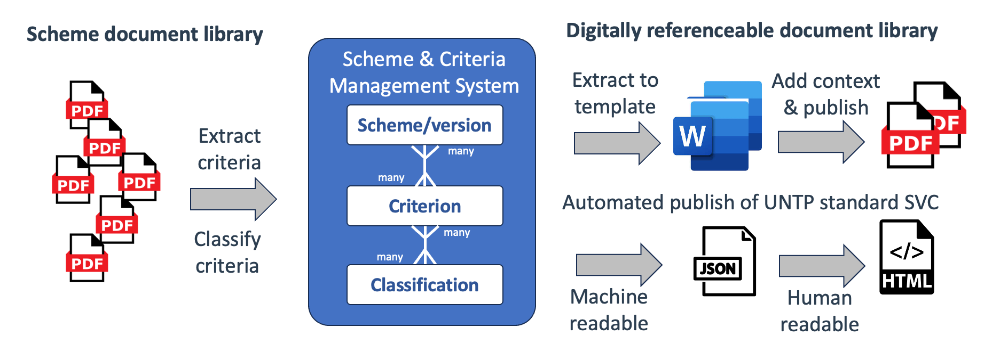
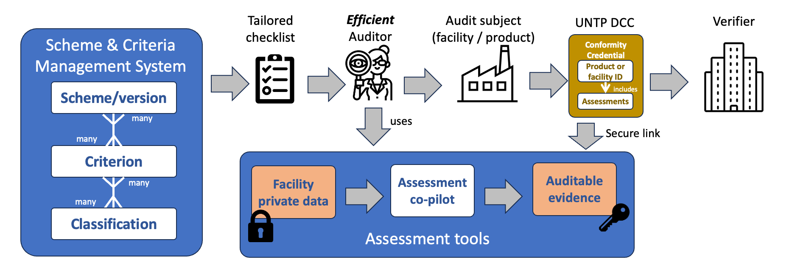
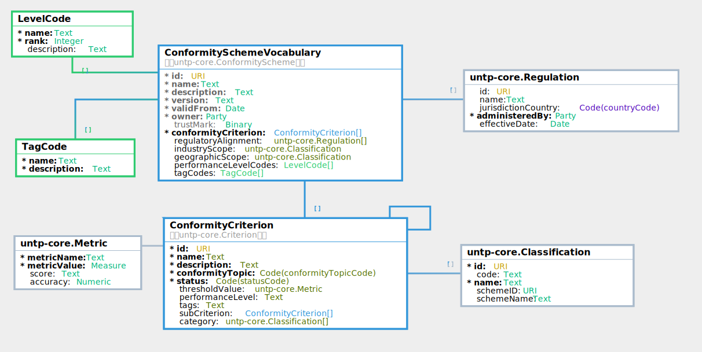

import Disclaimer from '../\_disclaimer.mdx';

<Disclaimer />

## Artefacts

Are maintained at https://test.uncefact.org/vocabulary/untp/svc/0/about

### Stable Releases For Implementation

Version 1.0 stable release for production implementation is due Jun 2025

### Release for Pilot Testing

Version 0.6.1 release artifacts can be used for pilot testing.

* [JSON-LD @context](https://test.uncefact.org/vocabulary/untp/svc/0.6.1/context/)
* [JSON Schema](https://test.uncefact.org/vocabulary/untp/svc/untp-svc-schema-0.6.1.json)
* [Sample JSON Instance](https://test.uncefact.org/vocabulary/untp/svc/untp-svc-instance-0.6.1.json)
* Conformity Scheme [Register](../implementations/SchemeOwners) (simple web page for now)

Note that the vocabulary schema depends on definitions in [UNTP core vocabulary](https://test.uncefact.org/vocabulary/untp/core/0/about)

### Latest Development Version

Latest development versions are used to reflect lessons learned from pilots but should not be used for either pilot testing or production purposes.

### Version History

First release.

### Sample Conformity Vocabulary

Will be published by early implementers and discoverable via the [scheme owner register](../implementations/SchemeOwners.md)

## Overview

Web **vocabularies** are a means to bring consistent understanding of **meaning** to ESG claims and assessments throughout transparent value chains based on UNTP. There are hundreds of ESG standards and regulations around the world, each with dozens or hundreds of specific conformity **criteria**. Any given value chain from raw materials to finished product is likely to include dozens of passports and conformity credentials issued against any of thousands of ESG criteria. Without a consistent means to make sense of this data, UNTP would provide a means to discover a lot of data but no easy way to understand it. This specification provides guidance to scheme owners about how to publish their sustainability standards in a way that allows the conformity criteria defined by the standards to be unambiguously referenced when making claims and assessments.

## Conceptual Model

The diagram shows how the sustainability vocabulary catalog works with UNTP credentials such as product passports, facility records, and conformity credentials to bring unambiguous meaning to sustainability claims and assessments.

* Schemes (Grey): There are hundreds of national regulations and industry standards that address sustainability of products, facilities, and organisations. Each one typically contains multiple auditable criteria. These are governed by the the government or industry authorities that define them.  UNTP does not seek to create any new schemes or regulations but rather to provide a means to ensure that these standards and regulations can be unambiguously referenced by digital credentials. This requires each individual criteria to have a globally unique identifier (a URI).
* DPP / DFR (green): The UNTP digital product passport (DPP) provides a means for a manufacturer or brand owner to list multiple sustainability claims for a given identified product. Similarly a UNTP digital facility record (DFR) provides the same capability but for facilities such as farms, mine-sites, processing plants, or manufacturing sites. Each claim may reference a sustainability criteria defined by a regulator or an industry standard.
* DCC (brown): The UNTP digital conformity credential (DCC) provides a means for a second or third party to list independent assessments of specific products or facilities against the same conformity criteria. For a DCC to verifiably support a claim in a DPP, the identifier of the criteria and supporting regulation / standard must match. Therefore it is important that both the manufacturer issuing the DPP and the auditor issuing the DCC use the same identifier for the sustainability criteria.


The purpose of the sustainability vocabulary catalog (SVC) is to reduce the risk of misalignment between claims in DPPs and assessments in DCCs and also to provide a way to group similar criteria across different schemes. The SVC has three components

* [A standard structure (schema)](#conformity-vocabulary-schema) for scheme owners to publish their vocabularies of conformity criteria. This makes sure that the criterion URI is **correct**.
* [A catalog of schemes](#conformity-scheme-register) that can be used as the entry point to discover scheme-specific criteria. This makes sure that the criterion URI is **discoverable**.
* [A conformity topic taxonomy](#conformity-topic-classification) that can be used to classify criteria from different schemes. This makes sure that different criterion URI are **comparable**.

## Requirements

|ID|Requirement Statement|Solution Mapping|
|--|--|--|
|SVC-01|As a scheme owner, I need to publish the granular conformity criteria defined by my scheme in such a way that each conformity criteria in a multi-level hierarchy can be unambiguously referenced by issuers of conformity credentials, facility records, and product passports |[Conformity Vocabulary Schema](#conformity-vocabulary-schema)|
|SVC-02|As a scheme owner, I need to manage versions of schemes to reflect changes in the criteria within a scheme so that claims and assessments can be understood within a specific version context|[Conformity Vocabulary Schema](#conformity-vocabulary-schema)|
|SVC-03|As a scheme owner, I need to be able to group criteria according to performance levels so that auditors and subjects can clearly understand which criteria must be met in order to reach a given performance level (score)| [Conformity Vocabulary Publishing Guide](#conformity-vocabulary-schema)|
|SVC-04|As a scheme owner, I need to be able to tag criteria with context labels such as commodity type or facility type so that a relevant subset of assessment criteria are easily identified for a given audit context.| [Conformity Vocabulary Schema](#conformity-vocabulary-schema)|
|SVC-05|As a Conformity Assessment Body (CAB) I need to be able to easily find criteria URI for any scheme so that I can correctly reference them in the assessments recorded in digital conformity credentials that I issue| [Conformity Scheme Register](#conformity-scheme-register) |
|SVC-06|As a product owner or facility operator, I need to be able to easily find criteria URI for any scheme so that I can correctly reference them in the claims lists in the product passports and facility records that I issue.|[Conformity Scheme Register](#conformity-scheme-register) |
|SVC-07|Given that there are hundreds of schemes each with hundreds of criteria, as consumer of any digital credentials I need the criteria from different schemes to be classified using a simple taxonomy so that I can more easily compare similar criteria (eg emissions intensity) across different schemes.|[Conformity Criteria Topic Classification](#conformity-topic-classification) |


## Conformity Vocabulary Schema

The sustainability vocabulary publishing guide provides scheme owners with a best practice framework that can be used to publish their schemes as a hierarchy of  criteria, each with a unique identifier (URI). This is a critical activity so that issuers of product passports, conformity credentials, and facility records, can unambiguously reference a conformity criterion. In the example above the key reference criterion is `"id": id": "https://www.globalbattery.org/GHGRulebook/2.0/GHG_Calculation` indicating that the claim is made following GHG Calculation guidance in the GBA v2.0 rulebook.

### Minimum Implementation

At a minimum, scheme owners need to specify a URL for each conformity criterion that will be referenced by a claim or assessment. Scheme owners that already publish schemes and assessment criterion as a website with stable links may register their schemes with no further action. Scheme owners without reference-able criteria URIs (or who wish to upgrade their digital publishing) should follow the guidance below.

### Implementation Guidance

To publish a UNTP SVC compliant vocabulary, scheme owners will need to published conformity criteria as a web vocabulary alongside existing publishing formats (typically PDF documents).  For some scheme owners that already operate a system to manage scheme and criteria in a structured way, this could be just a simple publishing step from existing structured data. Other may choose to implement a "scheme management system" so that criteria are managed in one place and can be published in different formats. The diagram below shows a conceptual implementation model for any scheme owner.



The implementation model proposes that scheme owners

* Create a lightweight system to maintain scheme versions, the conformity criteria within the scheme, and the classification of the criteria.
* Populate the system from existing scheme documentation, possibly with the assistance of some automation tools.
* Publish both the UNTP standard vocabulary catalog and relevant document content from the same system.

Once scheme and criteria are managed in a more structured way, scheme owners can potentially leverage the system to realise further benefits.

* Tailored auditor checklists are easily generated, reflecting the specific criteria applicable to the context of a specific product or facility subject.
* Automated assistants can more easily make initial assessments based on documentary evidence from the subject product or facility.
* The structured assessment together with secure links to evidence is already available, making the job of issuing a UNTP digital conformity credential very straightforward.



### Logical Model

This section describes the logical data model of the scheme and criteria in more detail.



[Model Documentation](https://jargon.sh/user/unece/SustainabilityVocabulary/v/working/artefacts/readme/render)

The key ideas in the logical model of a published conformity vocabulary are

* A conformity scheme has a unique ID, a version, validity period, an owner, and contains a structured hierarchy of conformity criteria.
* The conformity scheme may define performance levels against which criteria can be categorised.  It may also define an allowed set of tags which can be assigned to criteria for the purposes of filtering or sorting.
* A conformity scheme may reference any regulations that it is designed to support.
* Each criterion has a unique ID (a URI) which is the key reference for any claims or assessments of product or facilities made in product passports or conformity credentials.
* Each criterion must be classified according to the UNTP [Conformity Topic Classification](#conformity-topic-classification).
* A criterion may specify a threshold value as a numeric (eg 300Mpa tensile strength) or a score (eg "B") which an assessed product or facility much achieve in order to be considered conformant.
* A criterion may be classified according to formal classification schemes (eg applicable industry sector or commodity type).
* Criterion may list sub-criterion that specify more granular conformity requirements.
* A given criterion ID may be re-used by multiple Scheme ID (for example a Scheme version increments but most of the conformity criteria don't change from one version to the next).

### Sample Scheme Vocabulary

The JSON snippet below shows an example of a Scheme and criteria as a UNTP compliant digital vocabulary. Such data structures should be simple to generate from a scheme management system. An HTMl rendering template can present the same data as a human browsable website where there is a dedicated web page for each criteria ID (eg `https://sample-scheme.org/ESGStandard/S11`) that represents the detailed information about that criteria.

```json
{
  "@context": {
    "untp-svc": "https://test.uncefact.org/vocabulary/untp/svc/working/",
    "untp-core": "https://test.uncefact.org/vocabulary/untp/core/0/",
    "xsd": "http://www.w3.org/2001/XMLSchema#"
  },
  "@id": "https://sample-scheme.org/ESGStandard/v4.0",
  "@type": "untp-svc:ConformitySchemeVocabulary",
  "name": "Sample ESG Standard",
  "description": "The Sample ESG Standard provides a framework for assessing and enhancing environmental, social, and governance performance across supply chains, ensuring compliance with best practices through validated assessments.",
  "version": "1.0.0",
  "validFrom": "2025-01-01",
  "owner": {
    "@id": "https://sample-scheme.org",
    "@type": "untp-core:Party",
    "registeredId": "SAMPLE-987654321",
    "idScheme": "https://www.example.org/registry",
    "registrationCountry": "US",
    "organisationWebsite": "https://www.sample-scheme.org"
  },
  "trustMark": "Sample ESG Certified",
  "conformityCriterion": [
    {
      "@id": "https://sample-scheme.org/ESGStandard/S1",
      "@type": "untp-svc:ConformityCriterion",
      "name": "Forced labour",
      "description": "Organizations shall ensure that all labor is voluntary, prohibiting any form of coerced or involuntary work, and shall not impose restrictions on employees' freedom of movement within or outside work premises.",
      "conformityTopic": "social.labour",
      "status": "active",
      "subCriterion": [
        {
          "@id": "https://sample-scheme.org/ESGStandard/S1.1",
          "@type": "untp-svc:ConformityCriterion",
          "name":"Voluntary agreements",
          "description": "Employment must be based on voluntary agreements, allowing employees to terminate their contracts with reasonable notice not exceeding one month.",
          "conformityTopic": "social.labour",
          "status": "active"
        },
        {
          "@id": "https://sample-scheme.org/ESGStandard/S1.2",
          "@type": "untp-svc:ConformityCriterion",
          "name":"Unrestricted access",
          "description": "Employees shall have unrestricted access to essential facilities such as restrooms and drinking water during working hours.",
          "conformityTopic": "social.labour",
          "status": "active"
        }
      ]
    },
    {
      "@id": "https://sample-scheme.org/ESGStandard/S2",
      "@type": "untp-svc:ConformityCriterion",
      "name":"Workplace safety",
      "description": "Organizations shall identify and mitigate workplace hazards to ensure a safe working environment, providing necessary protective equipment to employees at no cost.",
      "conformityTopic": "social.safety",
      "status": "active"
    },
    {
      "@id": "https://sample-scheme.org/ESGStandard/E1",
      "@type": "untp-svc:ConformityCriterion",
      "name":"Environmental permits",
      "description": "Organizations shall secure and maintain all necessary environmental permits and adhere to reporting obligations to minimize environmental impact.",
      "conformityTopic": "environment.waste",
      "status": "active"
    },
    {
      "@id": "https://sample-scheme.org/ESGStandard/G1",
      "@type": "untp-svc:ConformityCriterion",
      "name":"Ethical governance",
      "description": "Organizations shall maintain high ethical standards, prohibiting bribery, corruption, or any unethical advantages in business dealings.",
      "conformityTopic": "governance.ethics",
      "status": "active"
    },
    {
      "@id": "https://sample-scheme.org/ESGStandard/G2",
      "@type": "untp-svc:ConformityCriterion",
      "description": "Organizations shall implement due diligence processes to ensure responsible sourcing of critical raw materials, aligning with international guidelines.",
      "name":"Supply chain due diligence",
      "conformityTopic": "governance.compliance",
      "status": "active",
      "thresholdValue": {
        "metricName": "Percentage of Critical Materials with Due Diligence",
        "metricValue": {
          "value": 75,
          "unit": "P1"  // UNECE code for percentage
        }
      }
    }
  ],
  "regulatoryAlignment": [
    {
      "@id": "https://www.ilo.org/dyn/normlex/en/f?p=NORMLEXPUB:12100:0::NO::P12100_ILO_CODE:C029",
      "@type": "untp-core:Regulation",
      "jurisdictionCountry": "UN",
      "administeredBy": {
        "@id": "https://www.ilo.org",
        "@type": "untp-core:Party",
        "registeredId": "ILO-UN",
        "idScheme": "https://www.un.org/en/about-us/un-system"
      },
      "effectiveDate": "1932-05-01"
    },
    {
      "@id": "https://www.oecd.org/daf/inv/mne/OECD-Due-Diligence-Guidance-Minerals",
      "@type": "untp-core:Regulation",
      "jurisdictionCountry": "OECD",
      "administeredBy": {
        "@id": "https://www.oecd.org",
        "@type": "untp-core:Party",
        "registeredId": "OECD-INT",
        "idScheme": "https://www.oecd.org/about/"
      },
      "effectiveDate": "2011-05-25"
    }
  ],
  "performanceLevelCodes": [
    {
      "@type": "untp-svc:performanceLevelCodes",
      "name": "Critical",
      "rank": 1,
      "description": "Indicates a severe non-conformance requiring immediate action and follow-up assessment."
    },
    {
      "@type": "untp-svc:performanceLevelCodes",
      "name": "Significant",
      "rank": 2,
      "description": "Indicates a notable non-conformance requiring corrective measures within a defined period."
    },
    {
      "@type": "untp-svc:performanceLevelCodes",
      "name": "Minor",
      "rank": 3,
      "description": "Indicates a less critical non-conformance requiring improvement but not urgent action."
    }
  ],
  "tagCodes": [
    {
      "@type": "untp-svc:tagCodes",
      "name": "Manufacturing",
      "description": "Criteria applicable to manufacturing industries."
    },
    {
      "@type": "untp-svc:tagCodes",
      "name": "SupplyChain",
      "description": "Criteria targeting supply chain stakeholders."
    }
  ]
}
```


## Conformity Scheme Register

The conformity scheme register is essentially a catalog of schemes that are registered with UNTP by scheme owners.  The register will evolve from a simple list to a rich criteria search capability as UNTP matures.

* The first (current) version is the current [Scheme Owners](../implementations/SchemeOwners.md) registration page.
* The next version will add a structured data version of register and include more meta-data about each scheme and links to each scheme's published vocabulary catalog. Essentially a navigable and searchable version of registered schemes and their detailed criterion. When schemes are published by scheme owners in a structured way and criteria are classified [by conformity topic](#conformity-topic-classification), the register will support cross-scheme queries such as "show me all criterion in the water conservation category"
* Future versions may include capabilities to define relationships between schemes and their criteria such as mutual recognition.

## Conformity Topic Classification

Below is a **very early draft** of a 2-level ESG classification scheme for sustainability criteria and including references to the **EU Ecodesign for Sustainable Products Regulation (ESPR)**, **UN Sustainable Development Goals (SDGs)**, and **OECD Guidelines for Multinational Enterprises**. The taxonomy includes 8 top-level categories, each with 8-12 second-level categories, ensuring coverage of quality, safety, and sustainability criteria.

This classification is an early draft for discussion **only**. It is likely to evolve considerably until consensus is reached.

### Machine Readable Versions

* [JSON Structure](../../schema/SustainabilityCriteriaTaxonomy_v0.1.json)
* [JSON-LD vocabulary](../../schema/SustainabilityCriteriaTaxonomy_v0.1.jsonld)

### Human Readable Version

#### Top-Level Category 1: Ecological Resilience
- **Description**: Emphasizes environmental protection, resource conservation, and climate resilience.
- **Mappings**: UN SDGs (6, 7, 12, 13, 14, 15); OECD Guidelines (Chapter VI: Environment).
- **Second-Level Categories**:
  1. **Carbon Footprint Reduction** (SDG 13) - Minimizing greenhouse gas emissions (e.g., EU ESPR Art. 5 - Environmental Sustainability, UNTP environment.emissions).
  2. **Renewable Energy Use** (SDG 7) - Transition to sustainable energy sources (e.g., EU ESPR Art. 7 - Energy Efficiency, UNTP environment.energy).
  3. **Water Conservation** (SDG 6) - Sustainable water management (e.g., EU ESPR Annex I - Water Use, UNTP environment.water).
  4. **Waste Minimization** (SDG 12) - Reducing waste generation (e.g., EU ESPR Art. 6 - Waste Prevention, UNTP environment.waste).
  5. **Ecosystem Preservation** (SDG 15) - Protecting biodiversity (e.g., EU ESPR Annex I - Biodiversity Impact, UNTP environment.biodiversity).
  6. **Forest Conservation** (SDG 15) - Preventing deforestation (e.g., EU ESPR Art. 5 - Resource Use, UNTP environment.deforestation).
  7. **Recycled Material Integration** (SDG 12) - Use of secondary materials (e.g., EU ESPR Art. 8 - Recycled Content, UNTP circularity.content).
  8. **Sustainable Product Design** (SDG 12) - Design for circularity (e.g., EU ESPR Art. 5 - Durability and Recyclability, UNTP circularity.design).
  9. **Chemical Safety** (SDG 12) - Restriction of hazardous substances (e.g., EU ESPR Annex I - Substance Restrictions).

#### Top-Level Category 2: Human Equity and Welfare
- **Description**: Focuses on human rights, fair labor, and community support.
- **Mappings**: UN SDGs (1, 3, 4, 5, 8, 10); OECD Guidelines (Chapter IV: Human Rights, Chapter V: Employment and Industrial Relations).
- **Second-Level Categories**:
  1. **Rights and Equality** (SDG 10) - Ensuring non-discrimination (e.g., EU ESPR Art. 10 - Social Sustainability, UNTP social.rights).
  2. **Decent Work Conditions** (SDG 8) - Fair wages and hours (e.g., EU ESPR Annex I - Supply Chain Due Diligence, UNTP social.labour).
  3. **Workplace Safety** (SDG 3) - Protecting worker health (e.g., EU ESPR Art. 10 - Social Impact, UNTP social.safety).
  4. **Community Empowerment** (SDG 1) - Supporting local development (e.g., EU ESPR Art. 10 - Stakeholder Engagement, UNTP social.community).
  5. **Worker Representation** (SDG 8) - Freedom of association (e.g., EU ESPR Annex I - Labor Rights).
  6. **Forced Labor Elimination** (SDG 8) - Preventing exploitation (e.g., EU ESPR Art. 10 - Human Rights Due Diligence).
  7. **Youth Protection** (SDG 8) - Safeguarding young workers (e.g., EU ESPR Annex I - Child Labor Ban).
  8. **Gender Equity** (SDG 5) - Promoting diversity (e.g., EU ESPR Art. 10 - Social Sustainability).

#### Top-Level Category 3: Ethical Governance
- **Description**: Promotes integrity, accountability, and transparent practices.
- **Mappings**: UN SDGs (16); OECD Guidelines (Chapter II: General Policies, Chapter VII: Combating Bribery).
- **Second-Level Categories**:
  1. **Anti-Corruption Measures** (SDG 16) - Preventing bribery (e.g., EU ESPR Art. 11 - Governance Requirements, UNTP governance.ethics).
  2. **Open Reporting** (SDG 16) - Transparent ESG disclosures (e.g., EU ESPR Art. 12 - Information Requirements, UNTP governance.transparency).
  3. **Legal Compliance** (SDG 16) - Adhering to regulations (e.g., EU ESPR Art. 4 - Compliance Obligations, UNTP governance.compliance).
  4. **Responsible Procurement** (SDG 16) - Ethical supply chains (e.g., EU ESPR Art. 10 - Supply Chain Responsibility).
  5. **Stakeholder Inclusion** (SDG 16) - Engaging affected parties (e.g., EU ESPR Art. 10 - Stakeholder Dialogue).
  6. **Data Privacy** (SDG 16) - Protecting personal information (e.g., EU ESPR Art. 12 - Digital Product Passport).
  7. **IP Protection** (SDG 16) - Respecting intellectual property (e.g., EU ESPR Art. 11 - Governance Standards).
  8. **Competitive Fairness** (SDG 16) - Ensuring fair market practices (e.g., EU ESPR Art. 11 - Governance).

#### Top-Level Category 4: Product Integrity
- **Description**: Ensures products are safe, reliable, and sustainable.
- **Mappings**: UN SDGs (9, 12); OECD Guidelines (Chapter VIII: Consumer Interests).
- **Second-Level Categories**:
  1. **Product Safety Standards** (SDG 12) - Ensuring consumer safety (e.g., EU ESPR Art. 5 - Safety Requirements, UNTP social.safety).
  2. **Quality Performance** (SDG 9) - Meeting performance specs (e.g., EU ESPR Art. 5 - Performance Standards).
  3. **Substance Control** (SDG 12) - Banning harmful materials (e.g., EU ESPR Annex I - Substance Restrictions).
  4. **Product Longevity** (SDG 12) - Enhancing durability (e.g., EU ESPR Art. 5 - Durability, UNTP circularity.design).
  5. **Standards Adherence** (SDG 9) - Compliance with certifications (e.g., EU ESPR Art. 4 - Ecodesign Requirements).
  6. **Supply Chain Traceability** (SDG 12) - Tracking origins (e.g., EU ESPR Art. 12 - Digital Product Passport, UNTP governance.transparency).
  7. **Consumer Information** (SDG 12) - Clear labeling (e.g., EU ESPR Art. 7 - Information Obligations).
  8. **End-of-Life Management** (SDG 12) - Effective recycling processes (e.g., EU ESPR Art. 6 - End-of-Life Requirements).

#### Top-Level Category 5: Circular Value Chains
- **Description**: Advances sustainability throughout supply and production networks.
- **Mappings**: UN SDGs (8, 12, 17); OECD Guidelines (Chapter II: General Policies, Chapter VI: Environment).
- **Second-Level Categories**:
  1. **Ethical Material Sourcing** (SDG 12) - Sustainable raw materials (e.g., EU ESPR Art. 10 - Supply Chain Due Diligence, UNTP governance.transparency).
  2. **Supplier Sustainability** (SDG 17) - ESG compliance in supply (e.g., EU ESPR Art. 10 - Supply Chain Responsibility).
  3. **Resource Circularity** (SDG 12) - Reuse and recycling (e.g., EU ESPR Art. 8 - Recycled Content, UNTP circularity.content).
  4. **Energy Optimization** (SDG 7) - Efficient supply chain energy use (e.g., EU ESPR Art. 7 - Energy Efficiency).
  5. **Supply Chain Labor Rights** (SDG 8) - Fair worker treatment (e.g., EU ESPR Annex I - Labor Standards).
  6. **Origin Tracking** (SDG 12) - Transparent supply chains (e.g., EU ESPR Art. 12 - Digital Product Passport).
  7. **Supplier Development** (SDG 17) - Building supplier capacity (e.g., EU ESPR Art. 10 - Supply Chain Support).
  8. **Supply Chain Risk Reduction** (SDG 12) - Mitigating vulnerabilities (e.g., EU ESPR Art. 10 - Risk Management).

#### Top-Level Category 6: Economic Sustainability
- **Description**: Balances profitability with sustainable economic impact.
- **Mappings**: UN SDGs (8, 9); OECD Guidelines (Chapter II: General Policies).
- **Second-Level Categories**:
  1. **Business Resilience** (SDG 8) - Long-term profitability (e.g., EU ESPR Art. 11 - Governance for Sustainability).
  2. **Sustainable Investment** (SDG 9) - Funding green initiatives (e.g., EU ESPR Art. 5 - Resource Efficiency).
  3. **Green Innovation** (SDG 9) - Developing sustainable tech (e.g., EU ESPR Art. 5 - Innovation Requirements).
  4. **Employment Opportunities** (SDG 8) - Job creation (e.g., EU ESPR Art. 10 - Social Impact).
  5. **Regional Economic Growth** (SDG 8) - Supporting local economies (e.g., EU ESPR Art. 10 - Community Benefits, UNTP social.community).
  6. **Resource Efficiency** (SDG 8) - Cost-effective resource use (e.g., EU ESPR Art. 7 - Efficiency Standards).
  7. **Economic Risk Management** (SDG 8) - Assessing financial risks (e.g., EU ESPR Art. 11 - Governance).
  8. **Supply Network Strength** (SDG 9) - Enhancing value chain stability (e.g., EU ESPR Art. 10 - Supply Chain Resilience).

#### Top-Level Category 7: Health and Safety Assurance
- **Description**: Prioritizes health and safety for workers and communities.
- **Mappings**: UN SDGs (3); OECD Guidelines (Chapter V: Employment and Industrial Relations).
- **Second-Level Categories**:
  1. **Workplace Hazard Control** (SDG 3) - Reducing risks (e.g., EU ESPR Art. 10 - Social Sustainability, UNTP social.safety).
  2. **Emergency Readiness** (SDG 3) - Preparedness plans (e.g., EU ESPR Annex I - Safety Measures).
  3. **Exposure Management** (SDG 3) - Controlling harmful agents (e.g., EU ESPR Annex I - Substance Safety).
  4. **Living Conditions** (SDG 3) - Safe worker accommodations (e.g., EU ESPR Art. 10 - Worker Welfare).
  5. **Healthcare Access** (SDG 3) - Providing medical support (e.g., EU ESPR Art. 10 - Health Provisions).
  6. **Well-Being Support** (SDG 3) - Addressing mental health (e.g., EU ESPR Art. 10 - Social Impact).
  7. **Nutrition Standards** (SDG 3) - Ensuring safe food provisions (e.g., EU ESPR Art. 10 - Worker Welfare).
  8. **Ergonomic Design** (SDG 3) - Safe physical work environments (e.g., EU ESPR Art. 5 - Product Safety).

#### Top-Level Category 8: Systemic Sustainability
- **Description**: Establishes frameworks for managing and improving ESG outcomes.
- **Mappings**: UN SDGs (12, 16); OECD Guidelines (Chapter II: General Policies).
- **Second-Level Categories**:
  1. **Sustainability Policies** (SDG 16) - Formal ESG commitments (e.g., EU ESPR Art. 11 - Governance Framework).
  2. **Risk Identification** (SDG 12) - Assessing ESG risks (e.g., EU ESPR Art. 10 - Due Diligence).
  3. **Outcome Tracking** (SDG 12) - Monitoring performance (e.g., EU ESPR Art. 12 - Reporting Requirements).
  4. **Capacity Building** (SDG 12) - Training stakeholders (e.g., EU ESPR Art. 10 - Stakeholder Support).
  5. **Process Enhancement** (SDG 12) - Continuous improvement (e.g., EU ESPR Art. 5 - Performance Improvement).
  6. **Feedback Channels** (SDG 16) - Grievance mechanisms (e.g., EU ESPR Art. 10 - Stakeholder Engagement).
  7. **Compliance Verification** (SDG 16) - Audits and checks (e.g., EU ESPR Art. 4 - Compliance Monitoring).
  8. **Transparent Communication** (SDG 16) - Public ESG reporting (e.g., EU ESPR Art. 12 - Information Disclosure, UNTP governance.transparency).
