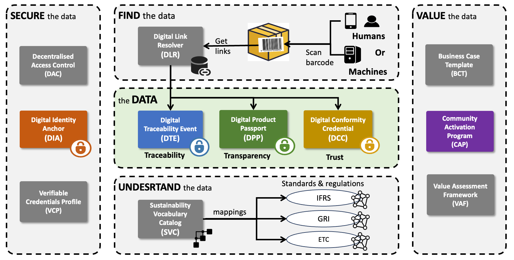

import Disclaimer from '../\_disclaimer.mdx';

<Disclaimer />

The specification is the heart of UNTP.  It defines the detailed specifications for interoperable implementations.

## Architecture

The architecture is the blueprint for all the components of the specification and how they work together. It defines the **design principles** which underpin the UNTP and shows the components working together from the perspective of a **single actor** and across the **entire value-chain**. The UNTP is a fundamentally **decentralised architecture** with no central store of data.

Please refer to the [Architecture](Architecture.md) page for more details on each of the UNTP components shown in the diagram above.

## Specifications

UNTP is broken into several distinct and separately implementable components so that each actor can implement only what is relevant for their role. 

* The [Sustainability Vocabulary Catalog](SustainabilityVocabularyCatalog.md) is for scheme owners and regulators to publish their rules and criteria so that they can be unambiguously referenced by conformity claims about products or facilities.
* The [Identity Resolver](IdentityResolver.md) and [Digital Identity Anchor](DigitalIdentityAnchor.md) are for operators of authoritative registers of businesses, facilities, trademarks, and products so that their members can prove their idenitty and link their identifiers to rich data like products passports and facility records.  
* The [Digital Product Passport](DigitalProductPassport.md) and [Digital Facility Record](DigitalFacilityRecord.md) is for supply chain actors to securely publish discoverable imformation about their products and facilities, including sustainability claims.
* The [Digital Conformity Credential](ConformityCredential.md) is for conmformity assessment bodies to issue third party assessments of products and facilites so that greater trust can be associated to the claims made by producty and facility owners. 
* The [Digital Traceability Event](DigitalTraceabilityEvents.md) provides a means for supply chain actors to map the output products to inpit materials as well as logisitics providers and service centres to record post sale events about products.
* The [Verifiable Credentials Profile](VerifiableCredentials.md) and [Decentralised Access Control](DecentralisedAccessControl.md) specifications are underlying techncial capabilites that would be supported by any software system that is used by supply chain actors that implement UNTP.

Please refer to the [Implementation Guidance](../tools-and-support) section for more information on how to build and test your UNTP implementations.

## Best Practices

Although each UNTP specification is an independently implementable component, the greatest value is released when multiple different actors each play their role. The [Best Practices](../design-patterns) section describes how UNTP components work together across complex value chains.

* [Transparency Graphs](../design-patterns/TrustGraphs.md) describes the picture of the entire value chain that emerges as more and more actors imnplement UNTP. It uses the example of critical minerals as raw materials that are eventually consumed by electronics and automotive sectors through a complex web of intermediate fabricators and component manufacturers. Although each information component such as product passports and facility records are independently verifiable, the message of the transparency graphs section is that it is really the "graph" of connected and related data elements that is the key to validation of high integrity transparent supply chains. 
* [Anti-Counterfeiting](../design-patterns/Counterfeiting.md) describes how actors that implement UNTP to provide high integrity product transparency information can also leverage the same integrity measures as a powerful anti-counterfeiting measure. Particilarly when trademark registers provide their members with UNTP Digital Identity Anchor credentials that can be used to cryptographically connect genuine products to their trademark ownership.
* [Chain of Custody](../design-patterns/ChainOfCustody.md) is focussed on one of the most important challenges of supply chain traceability and transparency - which is how to manage the accurate and verifable mass-balance allocation of sustainabity performance when there are mixed batches of bulk materials with different characteristics using in manufacturing processes.  

