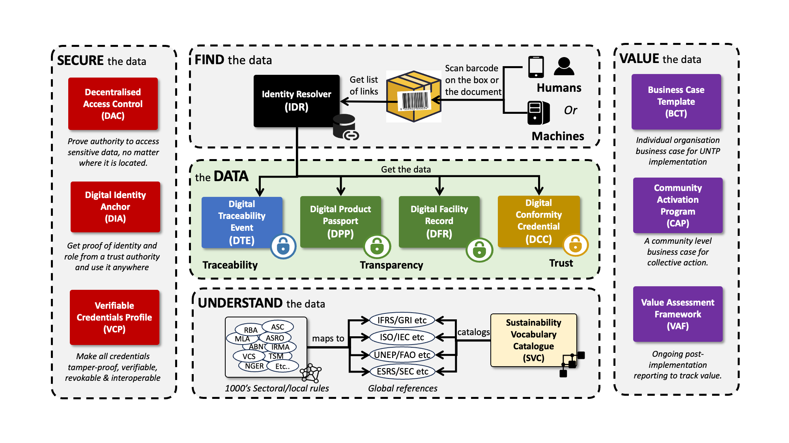

import Disclaimer from '../\_disclaimer.mdx';

<Disclaimer />

The specification is the heart of UNTP.  It defines the detailed specifications for interoperable implementations. This page provides an outline of the purpose and scope of each component of the specification.

## Architecture

The architecture is the blueprint for all the components of the specification and how they work together. It defines the **design principles** which underpin the UNTP and shows the components working together from the perspective of a **single actor** and across the **entire value-chain**. The UNTP is a fundamentally **decentralised architecture** with no central store of data.

## Verifiable Credentials Profile (VCP)

The World-Wide-Web Consortium (W3C) has defined a standard called [Verifiable Credentials (VCs)](https://www.w3.org/TR/vc-data-model/). A VC is a portable digital version of everyday credentials like education certificates, permits, licenses, registrations, and so on. VCs are digitally signed by the issuing party and are tamper proof, privacy preserving, revokable, and digitally verifiable. The UN has previously assessed this standard and has recommended it's use for a variety of cross border trade use cases in a recent [white paper](https://unece.org/trade/documents/2023/10/white-paper-edata-verifiable-credentials-cross-border-trade). VCs are inherently decentralised and so are an excellent fit for UNTP which recommends that passports, credentials, and traceability events are all issued as W3C VCs. A related W3C standard called [Decentralised Identifiers (DIDs)](https://www.w3.org/TR/did-core/) provides a mechanism to manage the cryptographic keys used by verifiable credentials and also to link multiple credentials into verifiable trust graphs. DIDs are not the same as the business / product / location identifiers maintained by authoritative agencies - but can be linked to them. 

## Digital Product Passport (DPP)

The digital product passport (DPP) is issued by the shipper of goods and is the carrier of **product and sustainability information** for every serialised product item (or product batch) that is shipped between actors in the value chain. It is deliberately **simple and lightweight** and is designed to carry the minimum necessary data at the **granularity** needed by the receiver of goods - such as the scope 3 emissions in a product shipment. The passport contains links to **conformity credentials** which add trust to the ESG claims in the passport. The passport also contains links to **traceability events** which provide the "glue" to follow the linked-data trail (subject to confidentiality constraints) from finished product back to raw materials. The UNTP DPP does not conflict with national regulations such as the EU DPP.  In fact, it can usefully be conceptualised as the **upstream B2B feedstock** that provides the data and evidence needed for the issuing of high quality national level product passports.

## Digital Conformity Credential (DCC)

Conformity credentials are usually issued by independent third parties and provide a **trusted assessment** of product ESG performance against credible **standards or regulations**. As such the credential provides trusted verification of the ESG claims in the passport. Since the passport may make several independent claims (eg emissions intensity, deforestation free, fair work, etc) there may be many linked conformity credentials referenced by one passport. As an additional trust layer, the conformity credential may reference an **accreditation** credential that attests to the authority of the third party to perform the specific ESG assessments. The conformity credential data model has been developed by a separate UN/CEFACT project on digital conformity that has expert membership from accreditation authorities and conformity assessment bodies.

## Digital Traceability Events (DTE)

Traceability events are very lightweights collections of identifiers that specify the “what, when, where, why and how” of the products and facilities that constitute a value chain. The UNTP is based on the [GS1 EPCIS](https://www.gs1.org/standards/epcis) standard for this purpose because it is an existing and proven mechanism for supply chain traceability. Note that UNTP supports but does not require the use of GS1 identifiers. The basic idea behind the traceability event structure is that any supply chain of any complexity can always be accurately modelled using a combination of four basic event types. An **object** event describes an action on specific product(s) such as an inspection. A **transaction** event describes the exchange of product(s) between two actors such as sale of goods between seller and buyer. An **aggregation** event describes that consolidation or de-consolidation of products such as stacking bales of cotton on a pallet for transportation. Finally, a **transformation** event describes a manufacturing process that consumes input product(s) to create new output product(s). The UNTP uses these events in a decentralised architecture as the means to traverse the linked-data "graph" that represents the entire value-chain.

## Digital Identity Anchor (DIA)

UNTP credentials will include identifiers of products, locations or businesses.  UNTP credentials will also include ESG performance claims like emissions intensity values. But how can a verifier of these identifiers or ESG claims be confident that the claims are true and that they are made by the genuine party at a verifiable location? Trust anchors are national or international authorities that typically run existing business or product registration, certification, accreditation, or other high integrity processes. Examples of trust anchors include national regulators that govern things like land ownership or business registrations. Another example are the national accreditation bodies that audit and accredit certifiers to issue third party assessments. UNTP depends on trust anchors to add digital integrity to ESG claims and identities by linking them to the authority under which they are made. In essence, UNTP defines a protocol for existing trust anchors to continue doing what they have always done, but in a digitally verifiable way.

## Identity Resolver (IDR)

Identifiers of **businesses** (eg tax registration numbers), of **locations** (eg google pins, cadastral/lot numbers, GS1 [GLN](https://www.gs1.org/standards/id-keys/gln)s), and of **products** (eg GS1 [GTIN](https://www.gs1.org/standards/id-keys/gtin)s or other schemes) are ubiquitous throughout supply chains and underpin the integrity of the system. UNTP builds upon existing identifier schemes without precluding the use of new schemes so that existing investments and high integrity registers can be leveraged. UNTP requires four key features of the identifiers and, for those that don't already embody these features, provides a framework to uplift the identifier scheme to meet UNTP requirements. Identifiers used in UNTP implementations should be **discoverable** (ie easily read by scanning a barcode, QR code, or RFID), **globally unique** (ie by adding a domain prefix to local schemes), **resolvable** (ie given an identifier, there is a standard way to find more data about the identified thing), and **verifiable** (ie ownership of the identifier can be verified so that actors cannot make claims about identifiers they don't own). 

## Decentralised Access Control (DAC)

There is a balance between the demands of transparency (more supply chain visibility means it's harder to hide greenwshing) and confidentiality (share too much data and you risk expososing commercial secrets). A key UNTP principle is that every supply chain actor should be able to choose their own balance between transparency and confidentiality. To achieve this, UNTP defines six data confidentiality patterns with different degrees of data protection so that they can be appropriately combined to meet the confidentiality goals of each party. This includes the ability to selectively redact data from credentials received from upstream suppliers before passing them on to downstream buyers - without affecting the cryptographic integrity of the data. 

## Sustainability Vocabulary Catalog (SVC)

Web **vocabularies** are a means to bring consistent understanding of **meaning** to ESG claims and assessments throughout transparent value chains based on UNTP. There are hundreds of ESG standards and regulations around the world, each with dozens or hundreds of specific conformity **criteria**. Any given value chain from raw materials to finished product is likely to include dozens of passports and conformity credentials issued against any of thousands of ESG criteria. Without a consistent means to make sense of this data, UNTP would provide a means to discover a lot of data but no easy way to make sense of it. The UNTP defines a standard and extensible topic map (taxonomy) of ESG criteria and provides a mechanism for any standards authority, or national regulator, or industry association to map their specific terminology to the UNTP vocabulary.

