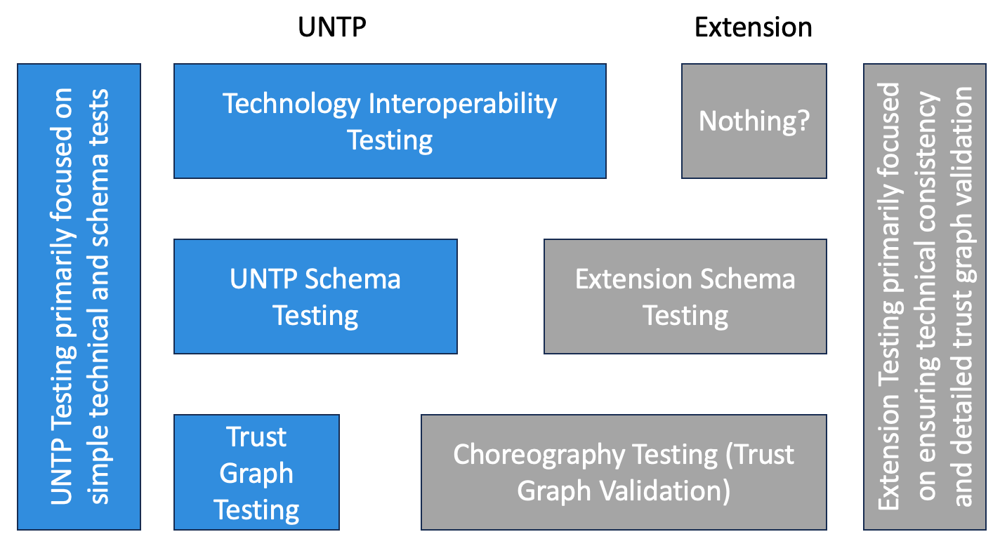

import Disclaimer from '../\_disclaimer.mdx';

<Disclaimer />

# 3 Tier Test Architecture

There is a 3 tier testing architecture to help implementors ensure that they are issuing UNTP interoperable digital product passports.  This architecture also ensures that as implementors 'extend' the UN Transparecy Protocol they do that in a non-breaking fashion.

At each tier we articulate the specific testing for UNTP and for an extension.

## UNTP Testing (the blue sections in the diagram)

The UNTP testing is intended to provide implenentors the ability to validate that they have a complete valid reference implementation of UNTP.  This testing gives a starting point so that implenters know that their implemenation is starting as UNTP compliant and that any externsions that they make need to have validations added to ensure continued UNTP interoperability.

### Tier 1: UNTP Test: Technology Interoperability Testing

This testing is intended to provide implementers confidence that the technical implementation is correct.  It is primarily focused on W3C verifiable credential compliance.

### Tier 2: UNTP Test: UNTP Schema Testing

This tests that the schema that are being used to issue credentials are a valid UNTP schema.  This will enable an implementor to validate that they are starting with a valid UNTP set of schema.

### Tier 3: UNTP Test: Trust Graph Testing

This validates that the links between the different components of the UNTP schema (DPP, DTE, DCC) are validated.  It is anticipated that this is relatively simple at generic UNTP level, but will get more involved for each extension.

## Extension Testing (grey boxes)

UNTP has been designed so that each industry and jurisdicton can extend UNTP to meet their specific busines, governance and community needs.  In order to ensure that supply chain customers downstream can consume details from their upstream supply chain partners - it is important that extensions maintain UNTP compliance.  Extension testing is intended to provide that confidence to implementors.

### Tier 1: Extension Test: Nothing?

It is expected that there won't be changes at Tier 1 of the testing architecture for extensions.  This is because we are using W3C standards and if there are requirements for extenisons it is beyond the scope of UNTP to manage.  We are including it in the architecture to faciliate future unforeseen needs.

### Tier 2: Extension Test:  Extension Schema Testing

This testing is designed to ensure that as implementors are extending UNTP schema (DPP, DTE, DCC) to meet their specific needs that they are not breaking compatibility with UNTP and that they are able to provide the implementors of their extensions with confidence that their extension is correct.

### Tier 3: Extension Test:  Choreography Testing (Trust Graph Validation)

This provides the ability for extendors to map the different credentials together to validate specific industry or regional scenarios.  In Australia NATA is the national accrecditor for laboratories - so the link from NATA to an accredited laboratory to a specific accreditation would be validated by a test in this component.
