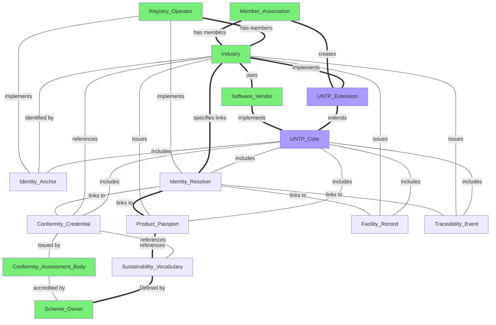

import Disclaimer from '../\_disclaimer.mdx';

<Disclaimer />

## Implementation Of UNTP

Implementation of UNTP will be a very different experience for organisations of different size, industry/geography sector, and stakeholder type. The purpose of this page is to help potential implementers navigate quickly and simply to the relevant scope of work.

## Has Five Simple Steps

At a macro-level, there are just five steps for any UNTP implementer to follow.

|Step|Action|Outcome|
|--|--|--|
|1|Review the [business case](../business-case/) section to confirm that UNTP implementation is likely to deliver value for your organisation. Establish key performance measures to track costs and benefits.|Positive business case|
|2|Review the UNTP and/or UNTP extensions pages relevant to your [organisation type](#organisation-type) and to determine which credentials you should be issuing. Register your (non-binding) intent to implement so that you gain access to community support.|Implementation intent [registered](../implementations)|
|3|Choose a [software product](implementations/Software.md) or request your existing software system provider to implement UNTP. Test your implementation using the [UNTP test service](TestService.md). Use [support channels](HelpAndSupport.md) as needed.|Update implementation [register](../implementations/) with positive test results|
|4|Run a pilot with any other registered implementer(s) that has completed testing to confirm interoperability and value. Contact [support](HelpAndSupport.md) to facilitate coordination of pilot activities|Successful pilot|
|5|Ramp up to full production volumes, routinely issuing and verifying UNTP credentials. Measure cost and benefit performance indicators to track ongoing value|Consider publishing your story as an UNTP [case study](../business-case/CaseStudies)|

## Details Vary With Your Context

### Organisation Size

* **Small businesses** (under 20 employees) are likely to find themselves using UNTP simply because their commercial off the shelf (COTS) business software system has implemented UNTP to support transparent digitalised supply chains. Just as small businesses make international payments without knowing anything about ISO-20022, so they would issue and verify digital product passports without knowing about UNTP. 
* **Medium businesses** (20 to 200 employees) will also be using commercial off the shelf software but are likely to have developed some customized solutions and internal integrations that mean UNTP implementation is not simply a case of just using compliant software. Some implementation and testing costs will be incurred.
* **Large enterprise** (over 200 employees) will usually have a complex ICT landscape with multiple systems and will usually need to engage their ICT department for a UNTP implementation. 

### Organisation Type

|Stakeholder|Implementation Scope|
|--|--|
|**[Producers, Manufacturers, and Brands](ImplementationPlans#for-producers-manufacturers-and-brands)** - produce raw materials, manufacture goods, own brands.  |**Implement UNTP Extensions** *Issue [Product Passports](../specification/DigitalProductPassport.md), [Facility Records](../specification/DigitalFacilityRecord.md), and [Traceability Events](../specification/DigitalTraceabilityEvents.md) according to guidelines specified in [industry extensions](../Extensions) so that your customers can easily verify your compliance and meet their due diligence obligations* |
|**[Registry Operators](ImplementationPlans#for-registry-operators)** - Maintain authoritative registers of products, assets, facilities, and businesses. |**Implement UNTP Core** *Implement [Identity Resolver](../specification/IdentityResolver.md) and [Identity Anchor](../specification/DigitalIdentityAnchor.md) so that your registered members can prove their identity and link discoverable credentials such as [Product Passports](../specification/DigitalProductPassport.md), [Facility Records](../specification/DigitalFacilityRecord.md) to their product or facility identifiers.* |
|**[Conformity Assessment Bodies](ImplementationPlans#for-conformity-assessment-bodies)** - Provide test and certification services to certify compliance with recognised schemes and regulations|**Implement UNTP Extensions** *Issue [Digital Conformity Credentials](../specification/ConformityCredential.md) according to extensions defined by the relevant [Scheme owners](ImplementationPlans#for-scheme-owners) or [Regulators](ImplementationPlans#for-regulators)* |
|**[Member Associations](ImplementationPlans#for-member-associations)** - Represent and advocate for industry interests |**Create UNTP Extensions** *[Activate communities](../business-case/CommunityActivationProgram) to participate in transparent and traceable value chains by governing the design and maintenance of UNTP [industry extensions](../extensions).*|
|**[Regulators](ImplementationPlans#for-regulators)** - Enforce compliance with laws and regulations. |**Implement UNTP Core** *Issue regulatory permits, licenses, and certificates as [Digital Conformity Credentials](../specification/ConformityCredential.md) so that exporters can prove their compliance to customers and other authorities. Also automate border compliance and risk assessments by verifying [Product Passports](../specification/DigitalProductPassport.md), [ Conformity Credentials](../specification/ConformityCredential.md) and [Identity Anchors](../specification/DigitalIdentityAnchor.md) that accompany imports*|
|**[Software Vendors](ImplementationPlans#for-sofware-vendors)** - Develop software solutions that underpin business operations and facilitate participation in transparent value chains. |**Implement UNTP Core** *Add support for [Verifiable Credentials](../specification/VerifiableCredentials.md) and [Decentralised Access Control](../specification/DecentralisedAccessControl.md) to software products and, depending on your target market, the ability to issue all UNTP credential types (DPP, DFR, DCC, DTE, DIA) including relevant industry specific [extensions](../extensions).*|
|**[Scheme Owners](ImplementationPlans#for-scheme-owners)** - Develop sustainability standards and associated assessment criteria |**Create Sustainability Vocabularies** *Describe your existing schemes and criteria as a digital [Sustainability Vocabulary Catalog](../specification/SustainabilityVocabularyCatalog) so that your conformity criteria can be referenced by issuers of claims in [Product Passports](../specification/DigitalProductPassport.md) and assessments in [ Conformity Credentials](../specification/ConformityCredential.md).|
|**[Consumers](ImplementationPlans#for-consumers)** - Choose, purchase and use products. |**Verify Sustainability Claims** *Scan data carriers, view digital product passports, make purchase decisions*|

### Industry and Geographic Sector

UNTP has been designed as an industry and geography agnostic standard - with a framework for multiple industry and/or geography specific extensions. This raises the question for implementers - whether to implement support for UNTP core or for specific industry extensions. The answer depends on your role.

* UNTP Core specifications are targeted at [Software Vendors](ImplementationPlans#for-sofware-vendors), [Registry Operators](ImplementationPlans#for-registry-operators), [Regulators](ImplementationPlans#for-regulators) and [Scheme Owners](ImplementationPlans#for-scheme-owners).
* UNTP [industry extensions](../extensions) are created by [Industry Associations](ImplementationPlans#for-industry-associations) and implemented by [Producers, Manufacturers, and Brands](ImplementationPlans#for-producers-manufacturers-and-brands) that are members of the association using UNTP compliant software.

## And Some Key Dependencies

Whilst any individual industry actor can choose to implement UNTP in isolation, there are some important economies of scale that make implementation at scale far more feasible. The dependency map below shows UNTP specification elements in purple and stakeholder type in green with dependencies between them described by the arrows. The most important dependencies are highlighted in bold:

* A **UNTP Extension** adds industry specific needs to the generic **UNTP Core** specification and is best coordinated by a **Member Association** that creates the extension once for use by all members. 
* A **Software Vendor** such as a production management system implements UNTP within their software package once and it becomes available for use by all their **Industry** customers.
* A **Registry Operator** implements the UNTP **Identity Resolver** and **Identity Anchor** specification so that every identifier (of a product or facility) issued to any of their **Industry** members can be used as a pointer to the **Product Passport**
* A **Scheme Owner** specifies their rules as a **Sustainability Vocabulary** so that claims in **Product Passports** and assessments in **Conformity Credentials** can unambiguously reference the sustainability criteria. 

The focal point for coordinating the participation of Industry, Software Vendors, Registry Operators and Scheme Owners is the Member Association that creates a UNTP Extension

