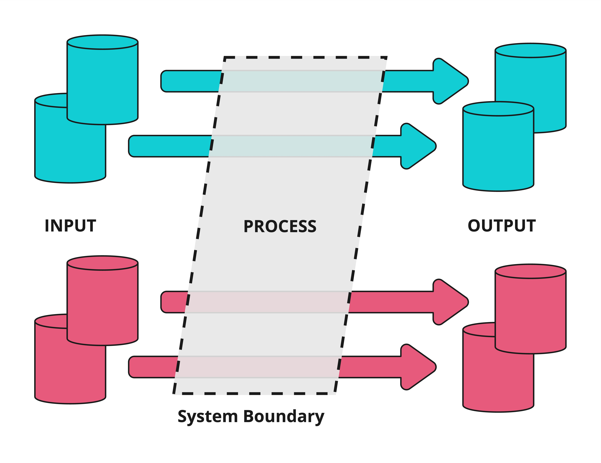
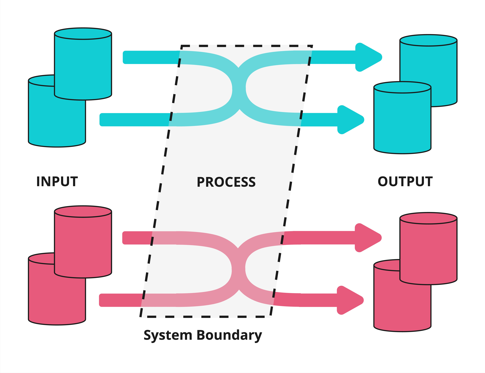
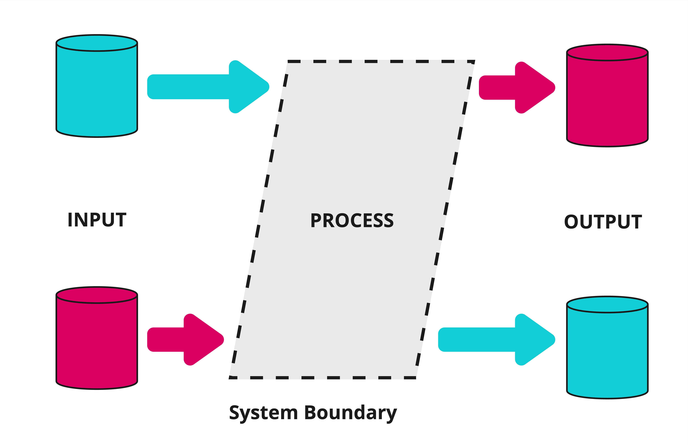
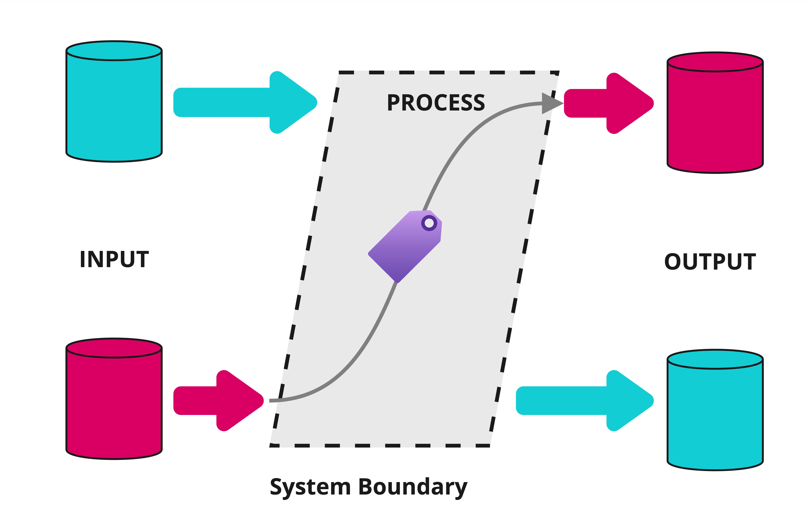
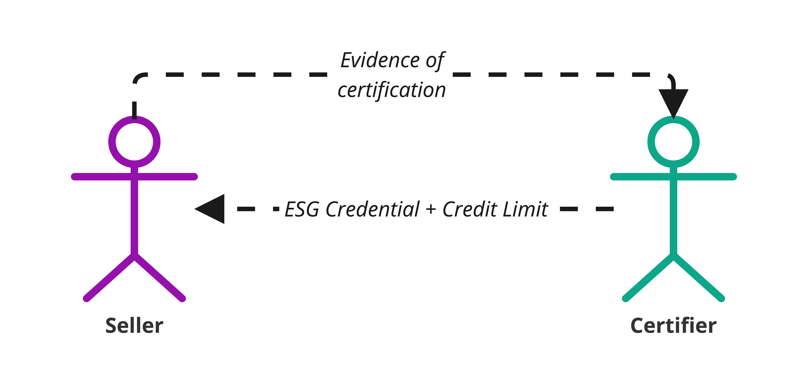
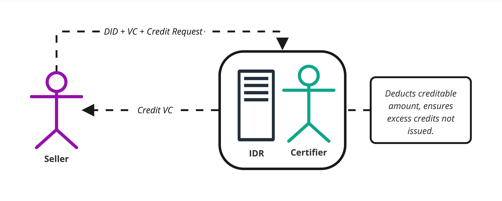
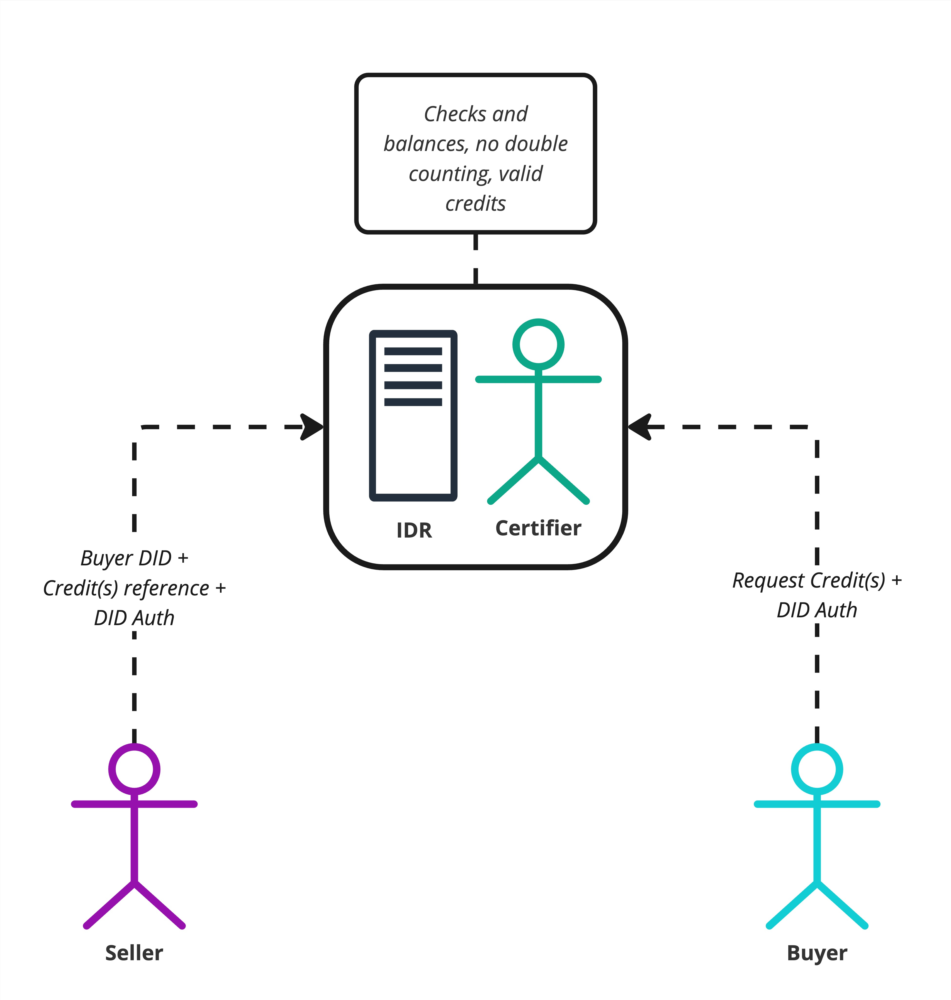
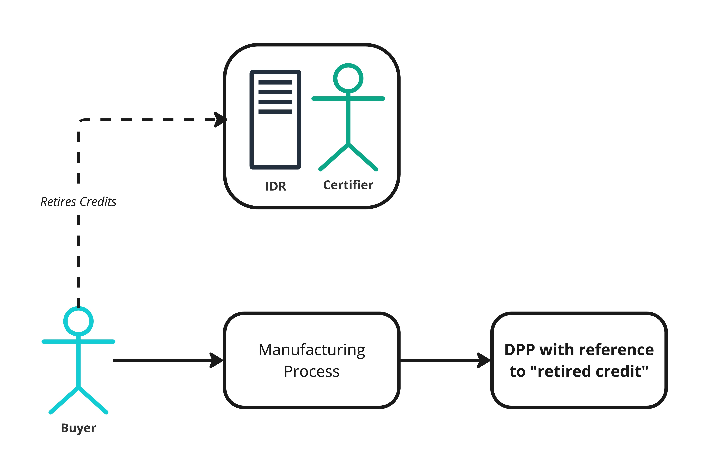

import Disclaimer from '../_disclaimer.mdx';

<Disclaimer />

## Overview

Mass balance fraud is a particularly challenging greenwashing vector. It happens when a fraudulent actor buys a small quantity of high ESG integrity inputs (e.g., genuine carbon neutral, organic, deforestation-free cotton) and mixes that input with lower quality alternatives and then sells the full volume of manufactured product (e.g., woven cotton fabric) as sustainable product, re-using the valid credentials from the niche supply. 

The UNTP solution to this problem involves trusted third parties (certifiers or industry associations) to act as *quota managers* that issue "guarantee of origin" credentials (a type of conformity credential). In this model, the guarantee of origin certificate for, say, 10 Tons of cotton fabric can only be issued when the third party has evidence of the purchase of at least 10 Tons of sustainable input materials. The third party will also mark the input batch as consumed (similar to the anti-counterfeiting protocol) so that the valid sustainable input cannot be re-presented to a different third party.

## Chain of Custody Categorizations

Below are four categorizations of supply chain custody with aims of defining how sustainability claims and certified products are managed across supply chains. 

Each categorization balances operational practicalities and assurance in different ways. 


### 1. Identity Preserved (IP)

Under **Identity Preserved**, the exact certified source of the product remains unchanged and unblended throughout the supply chain. Every step, from producer to end-user, tracks and segregates the qualifying quantity so it is never mixed with non-qualifying quantities (or even other qualifying goods from a different source).



#### Benefits

This approach achieves maximum traceability, the strongest assurance, and a direct link back to a specific manufacturer, farm or origin. Its presence within a supply chain facilitates additional sustainability conformance requirements with minimal additional effort.

#### Challenges

Identity Preserved is among the most costly and complex approaches to implement, as it requires physical or instance-level identification and segregation at every stage of the supply chain.

#### Example

A bag of coffee beans labeled "single-origin" from a specific farm, and remains separate from other coffee beans (qualifying or non-qualifying) throughout processing and transport.

Two production batches of coffee beans, from different origins, cannot be mixed. Even if both batches have identical ESG claims about them.

### 2. Segregated (SG)

In the **Segregated** model, qualifying quantities and non-qualifying quantities are never mixed. However, qualifying quantities from different certified sources (all meeting the same standard) may be combined. The final product is still 100% qualifying, but it is not guaranteed to come from a single farm, manufacturer, or origin.



#### Benefits

This scheme guarantees that the final product contains only qualifying material while allowing flexibility to pool multiple certified batches.

#### Challenges

Still requires physical separation from non-qualifying quantities, which can increase logistics and storage costs.

#### Example

A chocolate manufacturer mixes cocoa beans from several accredited farms or origins, without adding any non-qualifying beans. The resulting cocoa batch is 100% qualifying but is not linked to a single farm, but many.

### 3. Mass Balance (MB)

In a **Mass Balance** system, controlled commingling of qualifying quantities and non-qualifying quantities is allowed, as long as the overall volume of qualifying outputs does not exceed the volume of qualifying inputs. Facilities and manufacturers track quantities over time to ensure that the percentage (or total amount) of "sustainable" outputs matches the actual qualifying inputs in the system.




#### Benefits

Mass Balance allows for the mixing of qualifying and non-qualifying goods at any stage in the supply chain. When such mixing occurs, only the equivalent quantities of qualifying goods can be sold or claimed to be "Mass Balanced" products.

This approach is well-suited for complex supply chains and provides flexibility for manufacturers to source goods sustainably, even when certain constraints exist, such as:

- Facilities unable to keep products separate during transportation or storage.
- Minimum quantities required for manufacturing or production not being fully met by qualifying quantities.
- The cost of keeping qualifying and non-qualifying materials separate leading to non-competitive pricing and hindering market development of certified materials.
  
#### Challenges

Dilution occurs at the physical level, meaning end-users and buyers cannot be certain that their specific product is made from qualifying materials—only that an equivalent volume of qualifying material was used elsewhere in the process.

#### Example

A flour mill receives both certified organic wheat (40%) and conventional wheat (60%). During processing, these grains are mixed together. Under Mass Balance, the mill can sell up to 40% of its total flour output as "organic" since this matches the proportion of organic input wheat. The remaining 60% must be sold as conventional flour.

If the mill processes 100 tons of wheat in total (40 tons organic, 60 tons conventional), they can sell up to 40 tons of the resulting flour as organic, regardless of which specific flour particles came from which wheat source. This allows efficient processing while maintaining accurate sustainability claims based on input ratios.

### 4. Book-and-Claim (BC)

In **Book-and-Claim** models, sustainability attributes (e.g., "deforestation-free," "carbon-neutral") are fully ***decoupled entirely from the physical flow of goods***. A producer meeting the standard "books" or issues credits into a registry, and a buyer can purchase (or "claim") those credits even if the physical product they receive is not the certified batch or instance. 



#### Benefits

Book-and-Claim simplifies sustainable sourcing in complex supply chains where full traceability across all actors is prohibitively expensive. It provides a pathway for small and medium enterprises (SMEs), smallholder farmers, and similar entities to participate in sustainability initiatives without requiring their local procurers (e.g., mills, aggregators, or intermediaries) to adopt traceability or compliance practices.

**For producers**:

- SMEs or smallholder farmers can "book" credits for certified production and sell their goods into local, uncertified supply chains as usual. These credits can be transacted globally, overcoming geographic limitations and enabling access to new markets and potential premium pricing.

**For buyers**:

- When uncertified inputs are used in the production of final goods, purchasing or "claiming" credits allows buyers to offset the environmental or social impact of those uncertified inputs.

The number of credits a producer can sell is strictly governed by the certification standard backing the credits they "book." This enables sustainable production to extend its reach even in supply chains lacking comprehensive traceability infrastructure.

#### Challenges

A trusted registry is essential to ensure that no double-counting or over-issuance of credits occurs, as the decoupled nature of this model requires robust governance and verification mechanisms.

#### Example

A palm oil producer in Indonesia receives certification that their production methods are deforestation-free. They sell their physical palm oil to local processors (who may not track sustainability credentials), but can separately sell "deforestation-free credits" to global manufacturers.

A soap manufacturer in Europe, unable to source certified deforestation-free palm oil directly, can purchase these credits to offset their use of conventional palm oil. For every ton of conventional palm oil they use, they purchase and retire one ton of deforestation-free credits. This allows them to claim their soap products support deforestation-free palm oil production, even though the physical palm oil in their products may not be from certified sources.

The credits ensure that for every ton of conventional palm oil used in Europe, an equivalent ton of certified deforestation-free palm oil was produced somewhere in the world.

## Transparency and Evidence 

As always, a balance between the demands for transparency (more supply chain visibility means it is easier to prove either IP, SG, MB, or BC) and confidentiality (share too much data, and risk exposing commercial secrets) is required. As always a key UNTP principle is allowing all supply chain actors to be able to choose their own balance between transparency and confidentiality. 

The following address the three of the four models proposed against varying levels of transparency. "Book-and-Claim" due to it's unique nature of being decoupled from physical products is outlined separately [here](#book-and-claim). 

### Third Party Attestations 

Commercial sensitivities or purchasing requirements from the buyer are likely to introduce the need of a third party making a attestation. This protects the sellers commercial interests of procured volumes and sources, it also appeases the buyers concerns of the seller double counting, or performing fraudulent activities. 

The trusted third party collects evidence to support either IP, SG, or MB chain of custody, are issues a credential to the seller attesting their compliance.


#### Identity Preserved (IP)

The credential issued by the third party attests that:
- Identity Preserved practices have occurred. 
- The credential schema of the "original" sustainability credential for the qualifying goods. 

```json 
{
    "category": "identityPreserved", 
    "credentials": [{ 
        "schema": "...",
        "hashOfSource": "..."
     }]
}
```

- `schema` is a reference to the original sustainabilities credential schema, allowing the verifier/buyer to know what claims are being attested.
- `hashOfSource` is a hash of the original sustainability credential, in case of a audit. 

#### Segregated (SG)

The credential issued by the third party attests that:

- Segregation practices have occurred. 
- The credential schema of the "original" sustainability credential for the qualifying goods. 

```json
{
    "category": "segregated",
    "credentials": [
        {
            "schema": "...",
            "hashOfSource": "..."
        }
    ]
}
```

- `schema` is a reference to the original sustainabilities credential schema, allowing the verifier/buyer to know what claims are being attested.
- `hashOfSource` is a hash of the original sustainability credential, in case of a audit. 

#### Mass Balance (MB)

The credential issued by the third party attests that:

- Mass balance evidence has been collected
- The credential schema of the "original" sustainability credential for the qualifying quantities 
- The percentage of output quantities that can be claimed against the schema


```json
{
    "method": "massBalance",
    "credentials": [
        {
            "schema": "...",
            "hashOfSource": "...",
            "startDateTime": "...",
            "endDateTime": "..."
        }
    ]
}
```

In the schema above,

- `schema` is a reference to the original sustainabilities credential schema, allowing the verifier/buyer to know what claims are being attested.
- `hashOfSource` is a hash of the original sustainability credential, in case of a audit. 
- `startDateTime` and `endDateTime` are the audit period mass balance was determined over. 


### Discoverable Evidence

Specification will be outlined on the feasibility, and practicalities on data discoverability within a transparency graph to support different chain of custody models, without relying on a third party making an assessment.


## Book-and-Claim 

Due to nature of **Book-and-Claim** in that the sustainability credential is entirely decoupled from the physical goods, different challenges arise. 

1. Credentials holders need a method to "book" quantities of certified goods that they eligible for.
2. Credential holders need to be able to "transfer" these credits to buyers globally. 
3. Credential holders cannot "book" the same quantity multiple times, or "transfer" the same credit to multiple buyers. 
4. Buyers of these credits must be able to subsequently transfer to future buyers, without the original party who created the credential knowing. 
4. Holders of credits must be able to "retire" when a quantity associated with the credit is used in the manufacturing process. 
   - Example, a credit represents 1kg of carbon-neutral wheat, and a miller consumes 1kg of non-qualifying wheat. The credit is retired, and the miller can claim the sustainability credential for 1kg of the flour produced.
5. Manufactures consuming credits can provide evidence to their buyers of credit ownership, and retirement in their manufacturing process.
   - Example, the miller producing the flour can show evidence to buyers that equivalent credits were purchased for it's production, and also retired.

### Implementation 

Below is a potential implementation and workflow using generic actor names - representative of any supply chain, commodity, product, or ESG credential.

Each section is appended with a rolling use case of a wheat producer receiving a carbon-neutral certification from a trust anchor, **tokenizing** that credential against a specific quantity of wheat produced, transferring ownership of that credit to a miller outside their supply chain or geographic region. And finally, the miller subsequently retiring the credit(s) after milling milled an equivalent of non-qualifying wheat and presenting evidence to buyers of their flour that appropriate credits were used. 

#### 1. Credential issuance 

A certifier makes an assessment against a ESG criteria and issued sustainability credential to the seller. The credential also specifies the allowable production quantities that can be "booked" (converted into credits) under the claim.

The issuer could make the assessment of the upper limit of credits that can be booked based on volume prediction models, looking at historical averages, or comparable industry bench marks for the seller.




**Example**: The wheat producer provides sufficient evidence that their farming enterprise is carbon-neutral and receives a credential confirming attesting this. The certifier, using wheat production averages for the region, an understanding of the production area size of the farm, and satellite imagery assesses that a production volume of 1000t of wheat for the upcoming harvest period is feasible for this particular producer.

The wheat producer now has the ESG credential, and the ability to "book" up to 1000t of wheat produced from their farm.


#### 2. "Booking" Credits

The seller performs their production/manufacturing activities, and when a quantity of product is produced, they can then tokenize the ESG credential as a credit.

The seller tokenizes credits against the certifiers register (potentially an IDR operated by, or on behalf of, the certifier). By doing so, the seller receives a credential from the certifier for the qualifying quantity.

```json 
{
    
    "credentialSubject": {
        "id": "did:example:seller",
        "quantity": {
            "quantity": 1,
            "uom": "KGM"
        },
        "schema": "https://.../schema.json",
    },
    "proof": { ... }
}
```

This VC enables the seller to present evidence of their certified claim to potential buyers. Buyers can independently verify the credential's authenticity and confirm that the credit is genuinely held by the seller via the certifiers IDR.



**Example**: The wheat producer has harvest 75t of wheat, and receives 75 1t carbon-neutral credits from the certifier. The wheat producer now has 75 credits to sell to a potential buyer somewhere in the world. 

Potential buyers are able to verify the VC attesting the credit to ensure it is valid, not revoked, in date, and is in fact owned by the wheat producer as well as the ESG schema the token reflects.

The wheat producer is free to sell any allotment of these 75 credits to any number of buyers. 


#### 3. Transferring (selling) credits

The seller wishes to sell the credit to a buyer in a different geographic region. 

To initiate the transfer:

1. The seller submits a transfer request to the certifier register operator (e.g., the IDR system), providing:
   1. The buyer's DID.
   2. A reference to the specific credit(s) being transferred.
   3. A digital signature generated using the sellers private key.

2. The register operator verifies the transfer request by:
   1. Authenticating the seller and buyer DIDs.
   2. Confirming the validity of the credit(s) referenced in the request.
   
3. Upon approval:
   1. Ownership of the credit is transferred to the buyer.
   2. The original credential held by the seller is revoked.
   3. The buyer receives a new credential representing the transferred credit.

The buyer can receive this credential for the credit purchased by making a request using did authentication.

The register operator is able to ensure no double counting is occurring, and any other verification requirements for their industry.




**Example**: The wheat producer and a miller have come in agreement to transfer 10 1t credits of carbon-neutral wheat. The wheat producer initiates the transfer with the certifier by providing information about the buyer, and the 10 credits to be transferred.

The register operator for the carbon-neutral credits can verify the credits are legitimate, no double counting is occurring, the credits are not in escrow in another concurrent transaction, and any other industry requirements pertaining to carbon-neutral wheat credits.

The buyer can then request the register operator for these 10 credits, and the register operator can issue a new set of 10 credits to the buyer, and revoke the previous 10 held by the seller. 

The buyer is then free to then transfer these 10 credits, or provide as evidence, to other actors in the supply chain, without the *original* seller knowing. 

#### 4. Retiring credits

Once the buyer performs a manufacturing process and uses non-qualifying quantities of the product their process. They retire the equivalent quantities of credit to ensure its sustainability attributes are appropriately accounted for.

Steps to retire the credit:

1. The buyer submits a retirement request to the certifier register, authenticated using their DID. The request references the specific credit(s) being retired.
2. The certifier register processes the request, marking the credit as retired and preventing it from being reused or double-counted, or transferred in the future.
3. The buyer receives evidence of retirement, potentially in the form of another Verifiable Credential that references the original credit - forming a link of evidence of retirement, evidence of credit purchase, and reference to the underling ESG schema from the credential from the original seller.

This retirement evidence can then be linked to the Digital Product Passport (DPP) for the manufactured products, enabling downstream buyers to verify:
- The schema associated with the original credit.
- The identity of the certifier who issued the initial credential to the seller.
- The integrity of the credit lifecycle, including its transfer and retirement, validated by the certifier registor operator to prevent double counting.



**Example**: The miller has purchase 10 1t carbon-neutral wheat credits from the farmer. The miller mills 10t of non-qualifying wheat as they have no practical and physical access to certified carbon-neutral wheat. The miller, however, wants to claim 10t of output flour as carbon-neutral. 

The miller retires the 10 credits with the certifier register operator, and receives evidence of credit retirement. The miller, in a Digital Product Passport for the flour, can reference this evidence as proof to buyers. 

The buyer of the flour can be confident that 10t of production of carbon-neutral wheat occurred somewhere globally, under a framework that they trust as per the credential schema, and that this 10t has not been double counted elsewhere in the supply chain. 


### Outcomes

- Producers are incentivized to receive ESG credentials, even if their local supply chain does not demand it.
- Producers are able to sell these credits to buyers globally, and receive a premium for their sustainable practices.
- The Book-and-Claim model is not dependent on a single technology choice, or platform.
- The certifier register operator can ensure credit quotas are not exceeded, double counting did not occur, and proper transfer of credits.
- Manufacturers are able to retire purchased credits, and provide evidence their buyers that credits have been purchased against the ESG schema of interest.

