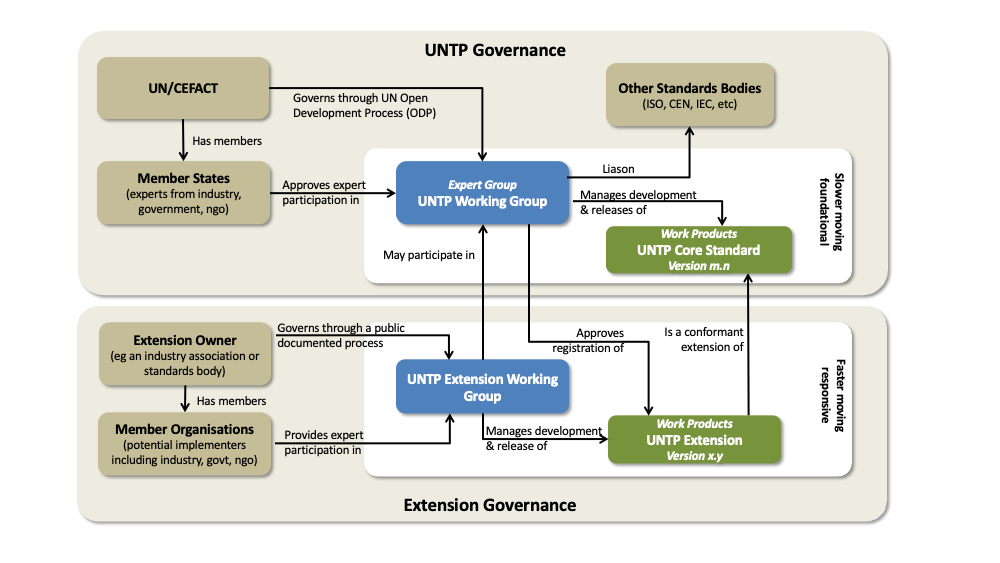
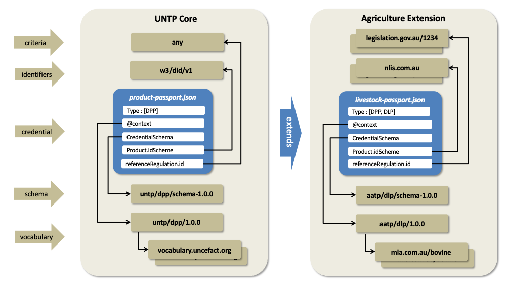

import Disclaimer from '../\_disclaimer.mdx';

<Disclaimer />

## Overview

UNTP is designed as a common core that is usable by any industry sector or in any regulatory jurisdiction. This extensions methodology describes how to extend UNTP to meet the specific needs of any industry sector or regulated market in such a way that the extension maintains core interoperability with any other extension.  This cross-industry and cross-border interoperability is a core value of UNTP because almost every value chain will cross industry and/or national borders. 

In some cases, UNTP extensions are themselves UN projects - such as the extensions defined by the [UN critical raw materials traceability and transparency project](https://uncefact.github.io/project-crm/). In most cases however, industry sectors and/or national projects will govern their own extensions. 

Anyone can take UNTP and extend it for any purpose. But for the extension to be registered as UNTP conformant, an extension MUST remain interoperable with UNTP. This is achieved by following the governance, methodology, and testing processes described below.

## Extension Governance

As shown in the diagram below, UNTP development follows the UN/CEFACT Open Development Process (ODP) and is maintained by a group of experts that are approved by their member state delegate. UNTP Intellectual Property is owned by the UN and the standard is available free for anyone to use. There are formal liaisons with other standards bodies including ISO so that UNTP remains aligned with similar initiatives.

Registered UNTP extensions 

* MUST follow an open and transparent development process that is open to participation from representative persons and organisations.
* MUST be freely available under a permissive or creative commons license.
* MUST be version managed (major.minor) and each extension version MUST state which UNTP major version from which it is derived.
* MUST be documented as a public website with reference-able URI for each specification component.

Since registered extensions have a clear vested interest in the ongoing development of UNTP, extension working groups SHOULD nominate at least one member as a participant in the UNTP working group.

## Extension Methodology

UNTP extensions must be interoperable with UNTP core. This means that a credential that conforms to a UNTP extension is also conformant with UNTP core. This requirement ensures that credentials issued in a specific industry or geographical context are still understandable across industry or geographic boundaries.

### Schema Extensions

UNTP credential JSON schema allow additional properties in most objects to provide flexibility to accommodate industry extensions. 

* UNTP extensions MAY define any number of variants to UNTP schema.  For example an agriculture extension my define both a livestock passport and a horticulture passport as extensions of the UNTP digital product passport.
* UNTP extension schema MUST NOT redefine any properties in UNTP schema.  
* UNTP extension instances MUST validate against both the extension schema and the corresponding UNTP core schema.

### Vocabulary Extensions

Industry extensions will often leverage existing industry specific vocabularies. For example an agriculture extension may reference terms from [Codex Alimentarius](https://www.fao.org/fao-who-codexalimentarius/en/). This is achieved through JSON-LD @context files.

* Each credential defined by a UNTP extension MUST reference a JSON-LD @context file that defines all additional terms. 
* JSON-LD @context files defined by a UNTP extension MUST NOT redefine terms in the corresponding UNTP @context file.
* External vocabularies referenced by UNTP extensions SHOULD be stable, version managed, and should not delete terms.

### Identifier Schemes

UNTP and it's extensions have a dependency on resolvable and verifiable identifiers. Industry extension will typically define specific identifier schemes (for products, facilities, and organisations) that are relevant for the specific industry and/or geography. For example, Australian livestock are identified by a [National Livestock Identifier](https://www.nlis.com.au/) that is carried as an RFID tag in the animal's ear.  

* All identifier schemes used by registered UNTP extensions MUST be registered in the UNTP identifier scheme register.
* Identifiers used by UNTP extensions SHOULD be resolvable and verifiable as defined by the UNTP Identity Resolver specification.  

### Conformity Criteria

UNTP is deliberately agnostic of specific standards and regulations. The generic `Declaration` object that is used by DPP, DFR, and DCC credentials is designed to support any conformity criteria defined by any standard or regulation. UNTP extensions, however, will normally agree a specific set of standards and regulations that are applicable in the extension context. 

* UNTP extensions MUST list all relevant standards and regulations on the extension specification website.
* The specific conformity criteria within Standards and Regulations referenced by UNTP extensions SHOULD be reference-able as stable URIs.  

## Extension Conformity Testing

TBC

