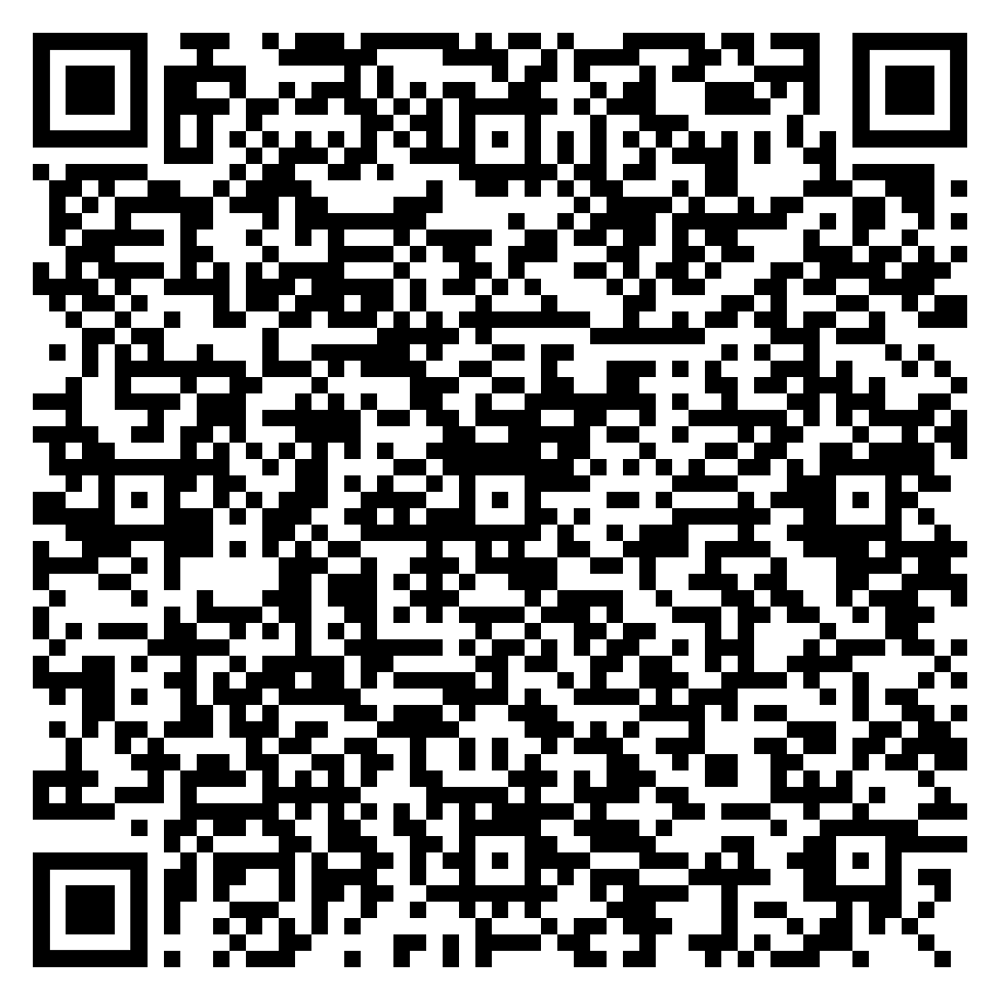
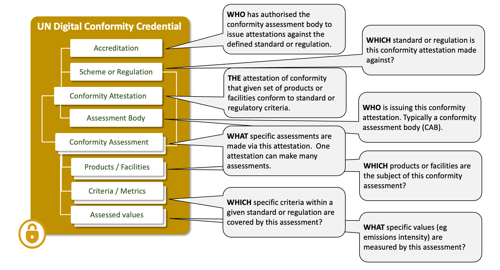
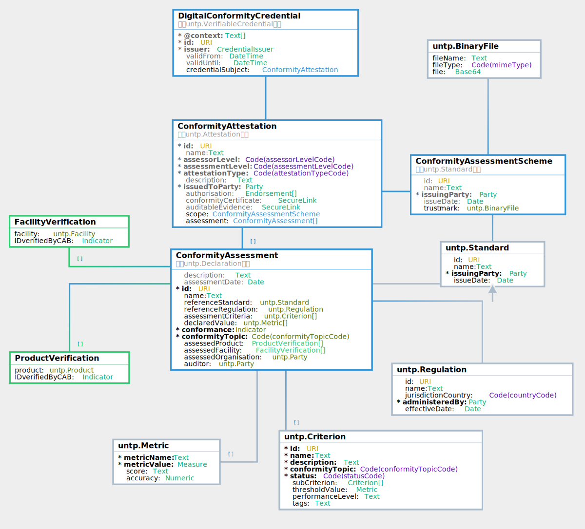

import Disclaimer from '../\_disclaimer.mdx';

<Disclaimer />

## Artifacts 

Are maintained at https://test.uncefact.org/vocabulary/untp/dcc/0/about

### Stable Releases For Implementation

Version 1.0 stable release for production implementation is due in June 2025 after formal public review 

### Release for Pilot Testing

Digital Conformity Credential version 0.6.0 release artifacts can be used for pilot testing.  

* [JSON-LD @context](https://test.uncefact.org/vocabulary/untp/dcc/0.6.0/)
* [JSON Schema](https://test.uncefact.org/vocabulary/untp/dcc/untp-dcc-schema-0.6.0.json)
* [Sample Instance](https://test.uncefact.org/vocabulary/untp/dcc/untp-dcc-instance-0.6.0.json)

### Latest Development Version

Latest development versions are used to reflect lessons learned from pilots but should not be used for either pilot testing or production purposes. 

### Ontology 
The ontology for the Digital Conformity Credential is available in JSON-LD format and can be retrieved via content negotiation from:

[https://test.uncefact.org/vocabulary/untp/dcc/0/](https://test.uncefact.org/vocabulary/untp/dcc/0/)

  Example:
  ```bash
  curl https://test.uncefact.org/vocabulary/untp/dcc/0/ -H 'Accept: application/ld+json'
  ```

### Version History

History of releases is available from the **[Version history](https://test.uncefact.org/vocabulary/untp/dcc/0/versions)** page.


### Default Render Template

A UNTP digital product passport may be rendered in any format desired by the issuer. However a default **[Template Design](../assets/images/DigitalConformityCredentialRender.png)** is provided here and includes mapping of visual rendering elements to the [Logical Data Model](#logical-model).

### Sample Credential

|URL|QR|Description|
|--|--|--|
|[Sample Battery Performance and Safety Certificate](https://untp.showthething.com/verify/?q={"payload"%3A{"uri"%3A"https%3A%2F%2Funtp-verifiable-credentials.s3.amazonaws.com%2F12615fb1-1e15-4389-92ba-b031fa42d265.json"}})||A sample digital conformity credential as a JWT envelope signed Verifiable Credential. The URL (or QR scan) resolved to a hosted verifier that displays a human readable version. Raw JSON data can be viewed via the `JSON` tab and the full credential can be downloaded via the download button.|

## Overview

Conformity credentials are usually issued by independent parties and provide a **trusted assessment** of product ESG performance against credible **standards or regulations**. As such the credential provides trusted verification of the ESG claims in the passport. Since the passport may make several independent claims (eg emissions intensity, deforestation free, fair work, etc) there may be many linked conformity credentials referenced by one passport. As an additional trust layer, the conformity credential may reference an **accreditation** credential that attests to the authority of the party to perform the specific ESG assessments. The conformity credential data model has been developed by a separate UN/CEFACT project on digital conformity that has expert membership from accreditation authorities and conformity assessment bodies.

## Conceptual Model



## Requirements

The digital conformity credential (DCC) is designed to meet the following detailed requirements as well as the more general [UNTP Requirements](https://uncefact.github.io/spec-untp/docs/about/Requirements).

|ID|Name|Requirement Statement|Solution Mapping|
|--|--|--|--|
|DCC-01|Authorised|The DCC MUST be verifiable as issued by an authorised body, typically a conformity assessment body (CAB) |DCC MUST be issued as a digital [verifiable credential](VerifiableCredentials.md) signed by the CAB|
|DCC-02|Assurance level|The DCC MUST identify the nature of any authority or support for attestation, such as formal recognition by a Governmental authority or an Accreditation Body| Attestation.authorisation property|
|DCC-03|Object of conformity|The DCC MUST unambiguously identify the object of the conformity assessment, whether a product, facility or organisation.|ConformityAssessment.assessedProduct, ConformityAssessment.assessedFacility, ConformityAssessment.assessedOrganisation|
|DCC-04|Reference standard or regulation|The DCC MUST identify the reference standard(s) and/or regulation(s) that specify the criteria against which the conformity assessment is made. If appropriate this must include specific measurable thresholds (eg minimum tensile strength)| ConformityAssessment.referenceStandard, ConformityAssessment.referenceRegulation, ConformityAssessment.assessmentCriteria|
|DCC-05|Conformity Attestation|The DCC MUST unambiguously state whether or not the object of the assessment is conformant to the reference standard or regulation criteria|ConformityAssessment.conformance|
|DCC-06|Measured metrics|The DCC SHOULD include actual measured values (eg emissions intensity, tensile strength, etc) with the conformity assessment|ConformityAssessment.declaredValue|
|DCC-07|Evidence|The DCC MAY include references to audit-able evidence (eg instrument recordings, satellite images, etc) to support the assessment. If so then the hash of the evidence file-set SHOULD be included (so that an auditor can be sure that the evidence data has not changed).  The evidence data MAY be encrypted with decryption keys provided on request|Attestation.auditableEvidence|


## Logical Model

The Digital Conformity Credential is an assembly of re-usable components from the UNTP core vocabulary.




### Core Vocabulary

The [UNTP core types vocabulary](https://jargon.sh/user/unece/untp-core/v/0.6.0/artefacts/readme/render) defines the uniquely identified Linked Data entities such as Product, Location, Facility, Party, Standard, Regulation, Criteria, Declaration, Attestation, Endorsement. These entities provide the building blocks for construction of Digital Product Passports and Digital Conformity Credentials.

### DCC Documentation

The [DCC class & property definitions](https://jargon.sh/user/unece/ConformityCredential/v/0.6.0/artefacts/readme/render) provide a technology-neutral definition of classes, properties and code lists in the DCC model.

## Implementation Guidance


### Verifiable Credential

Digital Conformity Credentials are issued as W3C Verifiable Credentials. Please refer to [DPP VC Guidance](DigitalProductPassport.md#verifiable-credential) for information about the use of the verifiable credentials data model for UNTP. 

### Conformity Attestation

The `ConformityAttestation` type is the root content of the `credentialSubject` of the DCC. It is best thought of as the digital version of the paper product or facility conformity certificate.

* The `type` property is mandatory and must be populated with the value `ConformityAttestation, Attestation` indicating the JSON-LD type of the data.
* The `id` MUST be a globally unique identifier (URI) for the attestation. Typically a certificate number with the CAB web domain as a prefix. 
* The `name` property should contain a human readable text string that describes the attestation.
* `assessorLevel` (how assured is the party doing the assessment?), `assessmentLevel` (“how assured is the process by which the object product/facility is being assessed?) and `attestationType` (is this a test report, a certificate, or some other type?) are coded values that help to classify the type and integrity of the attestation.
* `description` is a human-readable explanation of the attestation being made.
* `issuedToParty` identifies the entity to who the conformity attestation is issued - usually the product manufacturer or facility operator.
* `authorisation` describes a list of accreditations that a competent authority (such as a government agency or a national accreditation authority or a trusted global standards body) has issued to the conformity assessment body that is issuing this attestation. It provides trust that the certifier is properly accredited to issue certificates. 
* `conformityCertificate` is a secure link to the full version (eg a PDF document) of this attestation. 
* `auditableEvidence` is a secure link to an unstructured collection of files which provided the original evidence basis for the conformity assessments made by this DCC. The evidence files are usually commercially sensitive and encrypted but are an important information source for audits.
* `scope` defines the conformity scheme under which this attestation is issued. A scheme is a high level framework describing the context for the entire attestation. Each individual assessment included in this attestation will usually reference more fine grained criteria within any standards or regulations that are part of the scheme. 
* `assessment` is an array of detailed conformity assessments made about an identified product or facility - against a specific criteria contained in a standard or regulation.  


```json
 "credentialSubject": {
    "type": ["ConformityAttestation", "Attestation"],
    "id": "https://exampleCAB.com/38f73303-a39e-45a7-b8b7-e73517548f27",
    "name": "Carbon Lifecycle assessment 12345567",
    "assessorLevel": "3rdParty",
    "assessmentLevel": "Accredited",
    "attestationType": "certification",
    "description": "Assessment of battery products against the GHG Protocol.",
    "issuedToParty": {..},
    "authorisation": [{..}],
    "conformityCertificate": {..},
    "auditableEvidence": {..},
    "scope": {..},
    "assessment": [{..},{..}]
 }
```


### Authorisations (Endorsements)

Authorisations are endorsements or accreditations issued by a competent authority (such as a government agency or a national accreditation authority or a trusted global standards body) has issued to the conformity assessment body that is issuing this attestation. It provides trust that the certifier is properly accredited to issue certificates. 

* The `id` is a URI providing a unique ID of the endorsement / accreditation.
* The `name` is the name of the accreditation.
* `trustmark` is a base64 binary file that is typically shown on paper accreditations or endorsements. 
* The `issuingAuthority` object defines the identity details of the competent authority that issued the endorsement. For example, in Australia the accreditation authority for conformity test labs is [NATA](https://nata.com.au/).
* `endorsementEvidence` is a link to the actual accreditation details. This link SHOULD point to a trusted source of evidence such as a web page on the accreditation authority site ([example](https://nata.com.au/accredited-organisation/sydney-steel-mill-laboratory-279-272/?highlight=infrabuild)) or a digital verifiable credential.

It should be noted that this `authorisations` structure is part of the attestation issued by the conformity assessment body. As such it is only an unverified claim until confirmed via the `endorsementEvidence` link.


```json
    "authorisation": [
      {
        "type": [
          "Endorsement"
        ],
        "id": "https://authority.gov/schemeABC/123456789",
        "name": "Accreditation of certifiers.com under the Australian National Greenhouse and Energy Reporting scheme (NGER).",
        "trustmark": {
          "fileName": "NGER Accreditation",
          "fileType": "image/png",
          "file": "iVBORw0KGgoAAAANSUhEUgAAADkAAAA2CAYAAAB9TjFQAAAABGdBTUEAAi/9H3pWy6vI9uFdAAAAAElFTkSuQmCC"
        },
        "issuingAuthority": {
          "id": "https://abr.business.gov.au/ABN/View?abn=72321984210",
          "name": "Clean Energy Regulator",
          "registeredId": "72321984210",
          "idScheme": {
            "type": [
              "IdentifierScheme"
            ],
             "id": "https://business.gov.au/ABN/",
             "name": "Australian Business Number"
          }
        },
        "endorsementEvidence": {
          "linkURL": "https://files.example-authority.com/1234567.json",
          "linkName": "NGER conformity certificate",
          "linkType": "https://test.uncefact.org/vocabulary/linkTypes/dcc"
        }
      }
    ]
```


### Conformity Certificate and Auditable Evidence (Secure Link)

The `conformityCertificate` and `auditableEvidence` objects are both the same `SecureLink` type. The purpose is to provide a verifiable link to further details about the attestation (the certificate) or the auditable evidence (eg test results) that informed the attestation.  

* `linkURL` points to the external certificate or evidence described by `linkName`.
* `linkType` is an optional identifier that, if present, should be drawn from a controlled vocabulary of link types ([example](https://idr.untp.showthething.com/api/1.0.0/voc?show=linktypes)).  
* `hashDigest` should equal the hash of the target. This provides an integrity measure to ensure that the external certificate or evidence has not been tampered since the DCC was issued. 
* `hashMethod` code defines which hash algorithm to use.
* `encryptionMethod` defines whether the target is encrypted and, if so, using which algorithm.  This provides a privacy/confidentiality mechanism to protect more sensitive content. The decryption key is assumed to be passed out of bounds. 

```json
    "conformityCertificate": {
      "linkURL": "https://files.example-certifier.com/1234567.json",
      "linkName": "GBA rule book conformity certificate",
      "linkType": "https://test.uncefact.org/vocabulary/linkTypes/dcc",
      "hashDigest": "7d294dd556fc7c5c7ee1123fbd18a59686b74e9697fee2299906e00f80ec1dc8",
      "hashMethod": "SHA-256",
      "encryptionMethod": "AES"
    },
    "auditableEvidence": {
      "linkURL": "https://files.example-certifier.com/1234567.json",
      "linkName": "GBA rule book conformity certificate",
      "linkType": "https://test.uncefact.org/vocabulary/linkTypes/dcc",
      "hashDigest": "73af1e7404283545909e9714e51e4b1653ff168ecfbe69dddcf4feece01e0c87",
      "hashMethod": "SHA-256",
      "encryptionMethod": "AES"
    },
```

### Scope (Conformity Assessment Scheme)

`scope` defines the conformity scheme under which this attestation is issued. A scheme is a high level framework describing the context for the entire attestation. many individual assessments can be made under one scheme, and each may reference different standards or regulations. 

* the `id` and `name` identifies the scheme. `issuingParty` identifies the scheme owner.  
* the `issueDate` defines when the scheme was created and the `trustMark` is a binary file representing the mark or logo of the scheme.

```json
    "scope": {
      "type": [
        "ConformityAssessmentScheme",
        "Standard"
      ],
      "id": "https://www.globalbattery.org/media/publications/gba-rulebook-v2.0-master.pdf",
      "name": "GBA Battery Passport Greenhouse Gas Rulebook - V.2.0",
      "issuingParty": {
        "id": "https://kbopub.economie.fgov.be/kbopub/toonondernemingps.html?ondernemingsnummer=786222414",
        "name": "Global Battery Alliance",
        "registeredId": "786222414",
        "idScheme": {
          "type": [
             "IdentifierScheme"
           ],
          "id": "https://kbopub.economie.fgov.be/",
          "name": "Belgian business register"
        }
      },
      "issueDate": "2023-12-05",
      "trustmark": {
        "fileName": "GHG protocol trust mark",
        "fileType": "image/png",
        "file": "iVBORw0KGgoAAAANSUhEUgAAADkAAAA2CAYAAAB9TjFQAAAABGdBTUEAAi/9H3pWy6vI9uFdAAAAAElFTkSuQmCC"
      }
    }
```

### Assessment (Conformity Assessment)

One conformity credential may include many assessments. Each assessment includes:
* a unique `id` and human-readable `name` for the assessment
* a textual `description` of the assessment’s purpose or scope
* subjects of the assessment (ie what was assessed) which may reference one or more products, facilities, or organisations. For example a 300Ah Lithium battery.
* a reference standard and/or regulation against which the assessment was made. For example the global battery alliance rulebook.
* one or more specific criteria within the referenced standard or regulation which may include benchmark or threshold values. For example the industry benchmark carbon intensity of lithium batteries 
* one or more actual declared values. For example the actual carbon intensity of the assessed battery.
* an indicator of `conformance` against the regulation or standard. For example, the battery conforms to the GBA rulebook.
* a category classifying the assessment’s sustainability or compliance focus. e.g. environment.emissions
* the date when the assessment was conducted
* the ID and name of the auditor if different to the issuer of the conformity credential.

```json
    "assessment": [
      {
        "type": [
          "ConformityAssessment",
          "Declaration"
        ],
        "assessmentDate": "2024-03-15",
        "id": "https://exampleCAB.com/38f73303-a39e-45a7-b8b7-e73517548f27/01",
        "name": "GHG Emissions Intensity Assessment",
        "description": "A standardised disclosure of the battery's greenhouse gas emissions intensity, calculated in accordance with the Global Battery Alliance Battery Passport Greenhouse Gas Rulebook V.2.0.",
        "referenceStandard": {
          "type": [
            "Standard"
          ],
          "id": "https://www.globalbattery.org/media/publications/gba-rulebook-v2.0-master.pdf",
          "name": "GBA Battery Passport Greenhouse Gas Rulebook - V.2.0",
          "issuingParty": {...},
          "issueDate": "2023-12-05"
        },
        "referenceRegulation": {...},
        "assessmentCriteria": [
          {
            "type": [
              "Criterion"
            ],
            "id": "https://www.globalbattery.org/media/publications/gba-rulebook-v2.0-master.pdf#GHGEmissions",
            "name": "GBA GHG Emissions Intensity Calculation",
            "description": "Calculation of greenhouse gas emissions intensity for battery production, expressed in kg CO2e per kWh.",
            "conformityTopic": "environment.emissions",
            "status": "active",
            "subCriterion": [],
            "thresholdValue": {
              "metricName": "GHG emissions intensity",
              "metricValue": {
                "value": 10,
                "unit": "KGM"
              },
              "score": "BB",
              "accuracy": 0.05
            },
            "performanceLevel": "\"Category 3 recyclable with 73% recyclability\"",
            "tags": ""
          }
        ],
        "declaredValue": [
          {
            "metricName": "GHG emissions intensity",
            "metricValue": {
              "value": 10,
              "unit": "KGM"
            },
            "score": "BB",
            "accuracy": 0.05
          }
        ],
        "conformance": true,
        "conformityTopic": "environment.emissions",
        "assessedProduct": [
          {
            "product": {
              "id": "https://example.com/id/9520123456788",
              "name": "EV battery 300Ah",
              "registeredId": "9520123456788",
              "serialNumber": "12345"
            },
            "IDverifiedByCAB": true
          }
        ],
        "assessedFacility": [...],
        "assessedOrganisation": {...},
        "auditor": {...}
      }
    ]
```

To help understand the difference between a `Scheme` that defines the scope of the overall attestation and the `Criterion` that defines the rules for a specific conformity assessment, an example can help.

* ACRS operates a structural steel [product certification scheme](https://steelcertification.com/product-certification) which will include a specific assessment assessment criteria for many different steel product types. For example on criteria could be about minimum tensile strength of a concrete reinforcing steel bar under criteria define by standard [AS/NZS 4671: 2019](https://store.standards.org.au/product/as-nzs-4671-2019).  


## Sample


