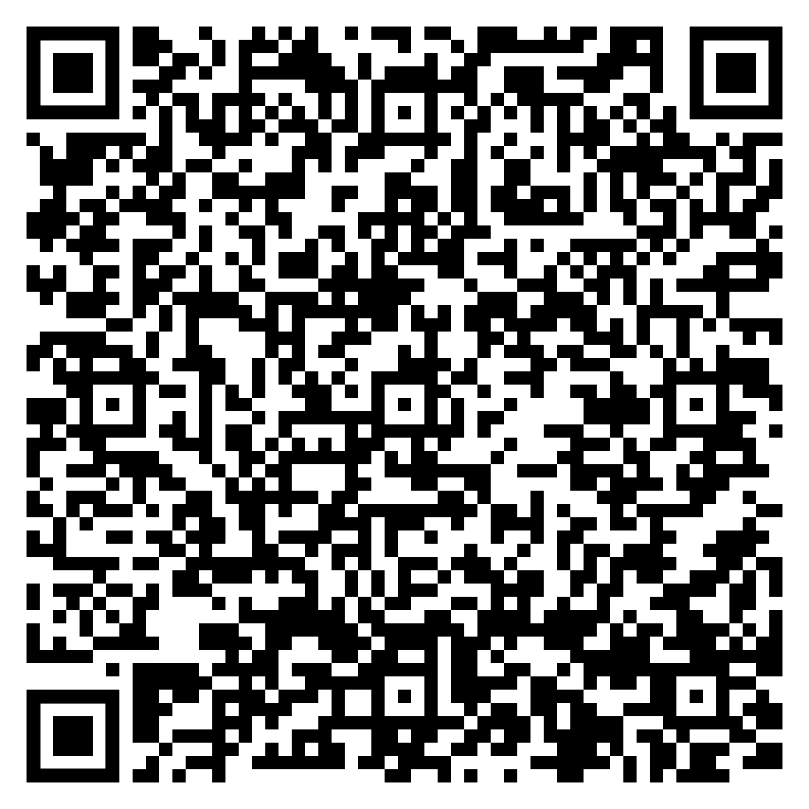
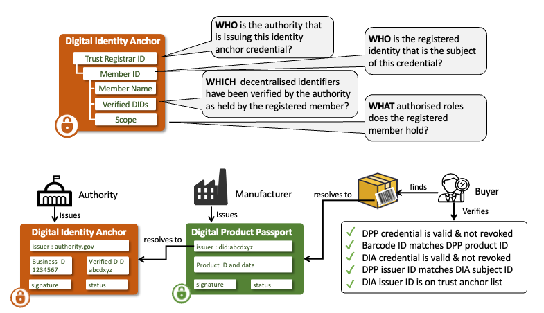
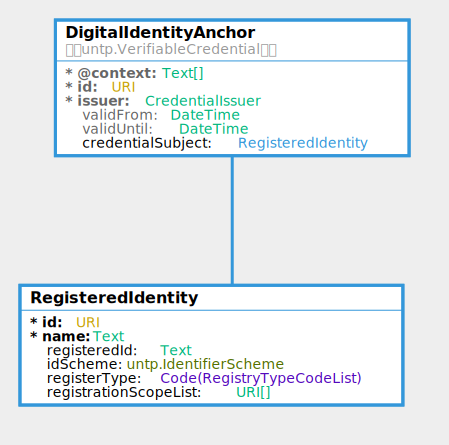

import Disclaimer from '../\_disclaimer.mdx';

<Disclaimer />

## Artifacts 

Are maintained at - https://test.uncefact.org/vocabulary/untp/dia/0/about

### Stable Releases For Implementation

Version 1.0 stable release for production implementation is due in June 2025 after formal public review 

### Release for Pilot Testing

Version 0.6.0 release artifacts can be used for pilot testing.

### Latest Development Version

Latest development versions are used to reflect lessons learned from pilots but should not be used for either pilot testing or production purposes. 

* [JSON-LD @context](https://test.uncefact.org/vocabulary/untp/dia/0.6.0/)
* [JSON Schema](https://test.uncefact.org/vocabulary/untp/dia/untp-dia-schema-0.6.0.json)
* [Sample JSON Instance](https://test.uncefact.org/vocabulary/untp/dia/untp-dia-instance-0.6.0.json)

### Ontology
The ontology for the Digital Identity Anchor is available in JSON-LD format and can be retrieved via content negotiation from:

[https://test.uncefact.org/vocabulary/untp/dia/0/](https://test.uncefact.org/vocabulary/untp/dia/0/)

  Example:
  ```bash
  curl https://test.uncefact.org/vocabulary/untp/dia/0/ -H 'Accept: application/ld+json'
  ```

### Sample Credential 

|URL|QR|Description|
|--|--|--|
|[Sample Digital Identity Anchor](https://untp.showthething.com/verify/?q=%7B%22payload%22%3A%7B%22uri%22%3A%22https%3A%2F%2Funtp-verifiable-credentials.s3.amazonaws.com%2F67aea5a9-e895-4c1e-b263-861dfddf63aa.json%22%7D%7D)||A sample digital identity anchor as a JWT envelope signed Verifiable Credential. The URL (or QR scan) resolved to a hosted verifier that displays a human readable version. Raw JSON data can be viewed via the `JSON` tab and the full credential can be downloaded via the download button.|

### Version History

History of releases is available from the [Version history](https://test.uncefact.org/vocabulary/untp/dia/0/versions) page.


## Overview

The Digital Identity Anchor (DIA) credential provides a simple means to verify the identity of UNTP credential issuers. The `issuer.id` property of all UNTP credentials is defined as a W3C decentralized identifier (DID) so that credentials like product passports can be cryptographically verified as genuinely issued by the issuer of the DID. But, as a self-issued identity, the DID does not provide confidence that the issuer is really who they claim to be. Authoritative identity registers such as national business registers, trademark registers, and land registers exist in most countries and have well established and trusted registration and maintenance processes. Unfortunately, most authoritative registers only issue paper or PDF registration certificates that are easily faked and are not usable for digitally verifiable proof of identity. The UNTP DIA is essentially a digitally verifiable version of a registration certificate. It is issued by the authoritative register to authenticated members when the member proves ownership of their DID to the register. When a DIA accompanies a UNTP credential such as a DPP, a verifier can confirm not only that the DPP was issued by the holder of the DID, but also that the controller of the DID is also the holder of the authoritative registered identity.  


## Conceptual Model

The Digital Identity Anchor (DIA) is a very simple credential that is issued by a trusted authority and asserts an equivalence between a member identity as known to the authority (eg a VAT number) and one or more decentralised identifiers (DIDs) held by the member. Before issuing the DIA, the authority should verify DID ownership (eg using [DID Auth](https://w3c-ccg.github.io/vp-request-spec/#did-authentication)).



The outcome is that the subject of the DIA (eg the VAT registered business) can prove that they are the registered identity to any other party. In the UNTP context the DIA provides assurance that a DPP (or DCC/DFR/DTE) issuer really is who they say they are. The verification workflow is as follows

* A verifier (eg buyer of an identified product) discovers a DPP for the product and verifies the credential - confirming that the DPP has not been tampered-with, is genuinely issued by party identified by the issuer DID.
* The DID is resolvable to the DID document which contains a link to the DIA in the DID document `service` end point.
* Verify the DIA credential and confirm that the DPP issuer DID is the `credentialSubject.id` of the DIA.
* Confirm that the issuer `did:web` of the DIA (the authoritative register) is on the white list of trust anchors.  

The DIA can also be used for similar trust anchoring purposes such as:

* Accreditation authorities issue DIA to assert that a conformity assessment body is accredited against a given scheme.  
* IP Offices issue DIA to assert that a registered party is the genuine owner of a trademark. 
* Land registers issue DIA to assert that a regulated party is the owner of a geo-located property.


## Requirements

The digital identity anchor is designed to meet the following detailed requirements as well as the more general [UNTP Requirements](https://uncefact.github.io/spec-untp/docs/about/Requirements)

| ID | Name  | Requirement Statement   | Solution Mapping  |
| ------ | ---- | --------- | ---------- |
| DIA-01 | DID Verification | The DIA issuer (registrar) MUST confirm that the registered member (subject) is the legitimate controller of a DID before issuing a DIA credential so that the registrar is protected against members falsely claiming ownership of well known DIDs| MAY use the [DID Auth](https://w3c-ccg.github.io/vp-request-spec/#did-authentication) protocol for this purpose. |
| DIA-02 | DIA Issuer DID | The DIA issuer MUST use did:web as the DIA issuer and the web domain MUST match the well known domain of the issuing authority so that verifiers can confirm authority identity via public web records.| DIA issuer specification|
| DIA-03 | Scheme registration | The DIA issuing authority SHOULD register the identity scheme (including the trusted issuer DIDs) with the UN/CEFACT identifier scheme registry so that verifiers can leverage UN maintained scheme metadata to simplify DIA discovery and verification.| See UNTP [Identity Resolver](IdentityResolver.md)|
| DIA-04 | Multiple DIDs | A registered member may need to link multiple DIDs to one registered ID, either because there is a need to transition between DID service providers or because an organisation may choose to use different DIDs for different purposes. | Issue multiple DIAs |
| DIA-05 | Scope List| The DIA MUST include a list of scope URIs that unambiguously define the authorised role(s) of the member in the register so that verifiers can confirm the scope of the membership. | `registrationScopeList` property |
| DIA-06 | Register Type| The DIA MUST specify the register type so that verifiers can understand the context of the `registrationScopeList`| `registerType` property|
| DIA-07 | DIA Discovery| The DIA SHOULD be discoverable given either the DID or the registeredID| [DIA Discovery](#dia-discovery)|
| DIA-08 | White list | The DIA should include a mechanism to avoid malicious actors who are not the registrar from issuing DIAs that claim links to authoritative registered IDs| Maintain white list of trusted issuer DIDs on UN/CEFACT identifer scheme registry|

The examples below help to clarify the application of DIA-05 and DIA-06.

## Logical Model

The Digital Identity Anchor logical model.



### Core Vocabulary Documentation

The [UNTP core types vocabulary](https://jargon.sh/user/unece/untp-core/v/0.6.0/artefacts/readme/render) defines the uniquely identified Linked Data entities such as Product, Location, Facility, Party, Standard, Regulation, Criteria, Declaration, Attestation, Endorsement. The Digital Identity Anchor only re-uses the UNTP core `VerifiableCredential` and `IdentifierScheme` classes.


### DIA Documentation

The [DIA documentation](https://jargon.sh/user/unece/DigitalIdentityAnchor/v/0.6.0/artefacts/readme/render) provides a technology-neutral definition of classes, properties and code lists in the DIA model.

## Implementation Guidance

This section provides sample JSON-LD snippets for each DIA component.

### Digital Identity Anchor

The Digital Identity Anchors is a Verifiable credential. Please refer to [DPP VC Guidance](DigitalProductPassport.md#verifiable-credential) for information about the use of the verifiable credentials data model for UNTP.  The credential issuer of the VC MUST be the authority that owns or operates the identity register. 

### Registered Identity

The registered identity class represents the registry member. For example, in a national business register, the registered identity would be one of the registered businesses.

* `type` MUST contain constant value array `["RegisteredIdentity"]` which declares to linked data processors that this is a registered identity.
* the `id` MUST contain DID of the registered member that is linked to the `registeredId` and for which the registrar has verified is controlled by the subject.
* `name` is the human readable registered entity name and SHOULD match the registered name as it appears in the authoritative register.
* `registeredId` contains the simple identifier value that is unique within the register (but may not be globally unique) for example the VAT registration number.
* `idScheme` identifies the authoritative register.  If the identity scheme is registered with UN/CEFACT then the `idScheme.id` MUST match the `identityRegister.id` in the UN/CEFACT scheme register.
* `registerType` is a coded value that allows verifiers to distinguish between different DIA [use cases](#dia-use-cases)
* `registrationScopeList` contains a list of URIs that define the scope of the member registration. The values are very specific to the register. For example a national business register would typically have a controlled vocabulary of entity types (eg [Australian Entity Types](https://abr.business.gov.au/Help/EntityTypeList))


```json
  "credentialSubject": {
    "type": [
      "RegisteredIdentity",
    ],
    "id": "did:web:samplecompany.com/123456789",
    "name": "Sample business Ltd",
    "registeredId": "90664869327",
    "idScheme": {
      "type": [
        "IdentifierScheme"
      ],
      "id": "https://sample-register.gov",
      "name": "Sample National Business Register"
    },
    "registerType": "Business",
    "registrationScopeList": [
      "https://sample-register.gov/EntityType?Id=00019"
    ]
  }
```
## DIA Trust Anchors

The integrity of the DIA depends on verifiers knowing the authoritative list of authoritative registry issuer DIDs. Whilst it is possible for each verifier to maintain their own whitelist of trusted issuers, scalable global uptake would be facilitated if there is a UN maintained and trusted whitelist. 

The data model for a UN maintained identifier scheme register is defined in the [Identity Resolver](IdentityResolver.md) specification and a prototype will be implemented for UNTP testing. A production implementation will require a new UN/CEFACT project proposal which will be submitted in due course.

## DIA Discovery

DIA credentials SHOULD be discoverable from either identifier:

* Given a DID (eg as the issuer of a DPP) via DID document `service` endpoint.
* Given a registered identifier (eg a VAT registration number) via the ID scheme resolver service.

### Via DID Service Endpoint

As described in the [W3C Decentralized Identifiers](https://www.w3.org/TR/did-core/) specification, DIDs are resolvable to a DID document. The `service` property of a DID document contains an array of typed `serviceEndpoint` which can point to services or credentials relevant to the DID. A DID document may also contain an "alsoKownAs" property which is typically used to reference other identifiers. Controllers of DIDs that are linked to authoritative register SHOULD

* Add the ID URI from the authoritative register to the `alsoKnownAs` list. In the snippet below `https://sample-register.gov/90664869327` has been added.
* Add proof that the relationship is reciprocal by adding a `service` object that references the DIA credential. In the example below, the DIA credential URL is `https://sample-credential-store.com/credentials/dia-90664869327.json`

```json
{
  "id": "did:web:sample-business.com:123456789",
  "authentication": [{..}],
  ..
  "alsoKnownAs": ["https://sample-register.gov/90664869327"],
  "service": [{
    "id":"did:web:sample-business.com:123456789#90664869327",
    "type":"untp:dia"
    "serviceEndpoint": {
        "href":"https://sample-credential-store.com/credentials/dia-90664869327.json",
        "title":"Digital Identity Anchor",
        "type": "application/vc+jwt"
    }
  }]
}
```

### Via Identity Resolver 

As described in the UNTP [Identity Resolver](IdentityResolver.md) specification, existing identity registers are encouraged to make their registered identities *resolvable* and *verifiable*. 

* Identifiers are made *resolvable* by implementing [ISO-18975](https://www.iso.org/standard/85540.html) to encode IDs as URLs and returning an IETF [rfc-9264](https://datatracker.ietf.org/doc/rfc9264/) link-set with links to relevant further data about the ID.
* Identifiers are made *verifiable* by issuing DIAs per this specification. 

This presents the opportunity to make the DIA discoverable by returning an appropriate link in the link-set. For example, given a VAT registration number `90664869327` issued under scheme `https://sample-register.gov` and applying the scheme resolver template may yield a resolver service URL of `https://resolver.sample-register.gov/vatNumber/90664869327` 

The resolver service may be called with parameters that define which link-types to return. `https://resolver.sample-register.gov/vatNumber/90664869327?linkType=all` will return a linkset that SHOULD contain the DIA credential link (among other links such as the registration history) as follows. 

```json
{
    "linkset": [
        {
            "anchor": "https://resolver.sample-register.gov/vatNumber/90664869327",
            "untp:dia": [
                {
                    "href": "https://sample-credential-store.com/credentials/dia-90664869327.json",
                    "title": "Digital Identity Anchor",
                    "type": "application/vc+jwt"
                 }
            ]
        },
        {
            "anchor": "https://resolver.sample-register.gov/vatNumber/90664869327",
            "about": [
                {
                    "href": "https://sample-register.gov/registrationHistory?id=90664869327",
                    "title": "Registration History",
                    "type": "text/html"
                 }
            ]
        },
    ]
} 
```

Alternatively, invoking the resolver service with the DIA specific link type `https://resolver.sample-register.gov/vatNumber/90664869327?linkType=untp:digitalIdentityAnchor` would redirect directly to the matching link

```json
   https://sample-credential-store.com/credentials/dia-90664869327.json
```

## DIA Use Cases

This section provides some example use cases for the UNTP DIA credential for different authoritative registr types

### Business Registers

TBC 

### Facility Registers

TBC 

### Trademark Registers

TBC 

### Accreditation Registers

TBC 

### Land Registers

TBC 

### Product Registers

TBC 


